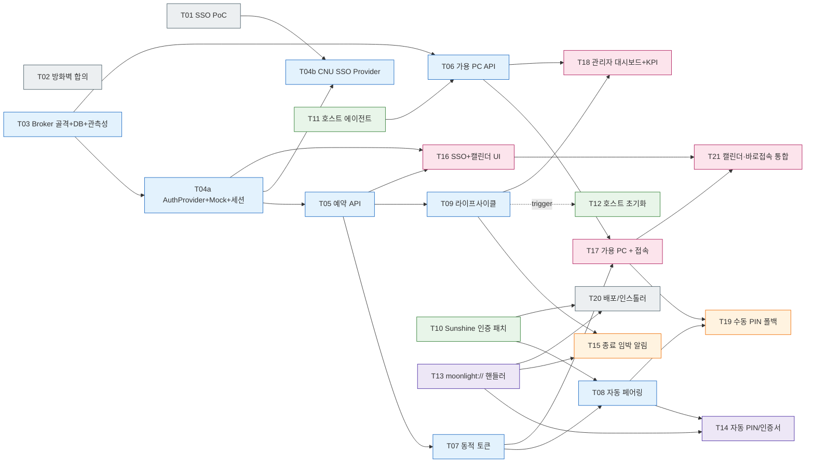

# EXP: SmartClassroom 실행 계획 v0.1

> 입력: PRD.md (v0.1, 2026-05-09) / EXP-instruction.md / PRD-instruction.md
> 작성: ABC社 PM
> 작성일: 2026-05-09
> 분해 기준: (1) 백엔드/프런트엔드/풀스택/기타 분류, (2) 영역 비침범, (3) 의존성 명시, (4) 단일 200K 컨텍스트 내 완료 가능

---

## 0. 분해 결과 한눈에 보기

- 총 22개 태스크. 카테고리: 백엔드 8 / 프런트엔드 4 / 풀스택 2 / 기타(Host·Client·인증·인프라·운영) 8.
- PRD Feature 매핑: F1=T04a·T16(개발) + T01·T04b(운영 전환), F2=T08·T13·T14·T17, F3=T07, F4=T09·T12·T15, F5=T06·T11·T17·T18.
- 크리티컬 패스(개발 트랙): **T03 → T04a → T05 → T07 → T08 → T14 → T17** — Mock 인증 위에서 "원클릭 접속(입력 0개)" KPI 달성까지의 최단 경로. 외부 행정 의존 없음. 진행률 5/7 (T03/T04a/T05/T07/T17 완료, T08·T14 대기). 비크리티컬 백엔드 T06·T11·T16 추가 완료(2026-05-15).
- 운영 전환 트랙: **T01 → T04b** — CNU SSO 프로토콜 확정 + Provider 통합. T04a 머지 이후 별도 트랙으로 병행, 운영 출시 전 머지 필수.

### 0-1. PRD-instruction.md MVP 요구사항 ↔ 태스크

| MVP 요구사항 | 담당 태스크 |
| --- | --- |
| 포털 연동 예약 페이지(추가 로그인 불필요) | T04a, T04b, T16 (T04b 머지 전까지 Mock 운영, T01은 행정 트랙으로 병행) |
| 동적 접속 토큰 발급 | T07 |
| 세션 관리 및 자동 차단(10분 전 알림 + 강제 종료) | T09, T15 |
| 호스트 상태 모니터링 대시보드 | T18 |
| 원클릭 접속 버튼 | T13, T14, T17 |
| 백그라운드 인증 연동(서버단 자동 PIN) | T08, T10, T14 |
| 실시간 PC 상태 체커(가용 호스트만 노출) | T06, T11 |
| 세션 강제 종료 및 초기화 | T09, T12 |

### 0-2. PRD KPI ↔ 측정 책임

| KPI | 측정 책임 |
| --- | --- |
| 사용자 입력 값 0개 | T17 (자동 측정 hook) + T14 (자동 페어링 회귀 테스트) |
| 입력 지연 20–50ms | T18 KPI 위젯 (T11 에이전트의 RTT/프레임 메트릭 집계) |
| 자원 점유 +40% / 가동률 균등화 | T18 KPI 위젯 (T05 예약 데이터 + T11 사용 시간 집계) |

---

## 1. 기타 · 인증/인프라 사전작업

### T01. 포털 SSO 연동 사양 조사 + PoC
- 카테고리: 기타 (인증)
- 의존성: 없음
- 사전 발견 (2026-05-11): `NetworkLog.md`(portal.cnu.ac.kr → cnuit.cnu.ac.kr SSO 트래픽 캡처) 분석 결과 충남대 SSO는 **Penta Security PMI-SSO2** 자체 프로토콜로 확정. 근거 — URL 파라미터 `pmi-sso2` / `pmi-sso-return2`, SP 식별자 `from=gid_*`, 글로벌 세션 쿠키 `kalogin` 및 `_SSO_Global_Logout_url`(둘 다 `Domain=.cnu.ac.kr`). **표준 SAML/OIDC/CAS 클라이언트 라이브러리로는 연동 불가 — Penta 에이전트 키트(JAR/JSP) 수령 필수.**
- 완료 조건
  - [ ] 충남대 정보화본부에 외부 SP 등록 신청 (담당 부서, 필요 서류, 소요 일정 — 통상 2–4주)
  - [ ] **SP 식별자 수령** — `from=gid_<우리시스템>` 값 + SP 등록 증명
  - [ ] **PMI-SSO 에이전트 키트 수령** — Penta 클라이언트 라이브러리(JAR/WAR 또는 JSP 에이전트) + 연동 가이드 PDF + PMI-SSO 버전(v1/v2/v3) 확정
  - [ ] **암호화 자료 수령** — SP 인증서/공개키 또는 PFX, AES 키 등 `pmi-sso2`/`pmi-sso-return2` 암복호화에 필요한 일체
  - [ ] **REST 검증 API 제공 여부 확인** — 있으면 Python에서 직접 호출 → Java 사이드카 생략 가능. 없으면 사이드카 확정
  - [ ] **테스트 IdP 접근권** (`devportal.cnu.ac.kr` 등) + 테스트 계정 2종 이상 수령
  - [ ] **사용자 식별 필드 매핑 명세 수령** — 학번/이름/메일/소속의 키 이름 및 값 포맷(`users.external_id` 매핑 결정 근거)
  - [ ] **Global Logout 체인 등록 절차 확인** — `_SSO_Global_Logout_url` 쿠키에 우리 logout URL 등록 필요 여부 + 절차
  - [ ] **SP 도메인 정책 확인** — 우리 도메인이 `.cnu.ac.kr` 하위가 아닐 경우의 동작 차이(쿠키 자동 공유 X, redirect 흐름은 정상)
  - [ ] **PoC 성공** — Java 사이드카 또는 REST API로 `pmi-sso2` 발급 + 콜백 `pmi-sso-return2` 복호화 → 사용자 식별 정보 획득 1회 통과
  - [ ] R1 위험에 대한 폴백 인증(학내 메일 OAuth 등) 전략 결정
- 산출물: SSO 연동 사양서(PMI-SSO 버전·키트 인벤토리·키 보관 위치), PoC 스크립트(Java 사이드카 또는 REST 직접 호출), 폴백 결정 문서

### T02. 네트워크 경로 및 방화벽 정책 합의
- 카테고리: 기타 (인프라)
- 의존성: 없음
- 완료 조건
  - [ ] 외부 클라이언트 → 학내 호스트(47984/47989/RTSP 21/UDP 47998-48010) 접근 정책 합의
  - [ ] Broker(공인망) → Sunshine 호스트(학내망) 제어 채널 합의
  - [ ] Broker ↔ `sso.cnu.ac.kr` / `portal.cnu.ac.kr` HTTPS 양방향 합의 — 학교 IdP의 SP 화이트리스트에 우리 callback URL(`returl`) 등록 가능 여부 사전 확인 (T01과 동기화)
  - [ ] Broker 서비스 도메인 결정 — `.cnu.ac.kr` 하위 vs 외부 도메인. 외부 도메인이면 `kalogin`/`_SSO_Global_Logout_url` 자동 공유 불가, 표준 SP 흐름은 정상 동작
  - [ ] WoL 또는 IPMI 등 원격 전원 제어 가능 여부 확정 (A5 가정 검증)
  - [ ] 방화벽 룰셋 문서화 + 운영팀 서명
- 산출물: 네트워크 다이어그램, 방화벽 룰셋 문서

---

## 2. 백엔드 — Broker

### T03. Broker 서비스 골격 + DB 스키마 + 관측성
- 카테고리: 백엔드
- 의존성: 없음
- 상태: **완료 (2026-05-12)** — pytest 9 green, ruff + mypy strict pass
- 완료 조건
  - [x] 언어/프레임워크 결정 (Python 3.12 + FastAPI) 및 레포 초기화 (`broker/`)
  - [x] 핵심 엔티티 스키마: User, Host, Reservation, Token, AuditLog (Session은 도메인 컨셉 — `tokens.purpose='session'`로 동일 테이블 재사용)
  - [x] Alembic 도입 (`0001_initial`) + GitHub Actions CI 워크플로(`.github/workflows/ci.yml`) — lint + mypy + pytest
  - [x] OpenAPI 자동 생성 (`EXPOSE_DOCS=true` 게이트, `/docs`·`/openapi.json`)
  - [x] Healthcheck `/healthz`, `/readyz` (`readyz`는 DB ping)
  - [x] 구조적 로깅(structlog JSON + request-id contextvar) + Prometheus `/metrics` 노출 (`ENABLE_METRICS=true`)
- 산출물: 레포 부트스트랩, Alembic 마이그레이션, OpenAPI 초안, 로깅/메트릭 가이드

### T04a. AuthProvider 인터페이스 + Mock 구현 + 세션 미들웨어
- 카테고리: 백엔드
- 의존성: T03 (T01과 무관 — 개발 트랙 unblock 목적)
- 상태: **완료 (2026-05-12)** — pytest 14 green (mock flow 7 + SLO 3 + factory guard 4), ruff + mypy strict pass
- 세션 방식 결정: **서버사이드 opaque 세션** 채택 (JWT 후보 기각). 이유 — SLO(Portal→우리) 즉시 무효화 요구사항. raw cookie는 `secrets.token_urlsafe(32)`로 발급, DB에는 `sha256(raw)`만 `tokens.purpose='session'`로 저장(덤프 유출 시 세션 재현 불가). T03 `tokens` 테이블 재사용을 위해 마이그레이션 `0002_token_host_nullable` 추가(`host_id` NULL 허용).
- 미인증 응답 분기: `/api/*` 경로는 Accept 무관 401 JSON(SPA 친화), 그 외 보호 라우트는 Accept `text/html`이면 302 redirect — T16 캘린더 페이지가 이 분기에 의존.
- 완료 조건
  - [x] `AuthProvider` 인터페이스 정의 (메서드: `initiate_login()`, `verify_callback()`, `fetch_user_identity(token)`) — `broker/app/core/auth.py`
  - [x] `MockAuthProvider` 구현 — Jinja2 폼(`/api/v1/auth/mock/login`) + JSON/form 양쪽 callback. 부팅 가드: `APP_ENV=production` + `AUTH_PROVIDER=mock` → `RuntimeError`
  - [x] Broker 자체 세션 토큰 — 서버사이드 opaque 세션(`broker_session` 쿠키, HttpOnly+SameSite=Lax, TTL 8h)
  - [x] 인증 데코레이터/가드 — `get_current_user` / `get_optional_user` / `require_admin` (`broker/app/api/deps.py`)
  - [x] 미인증 요청 처리 — `UnauthenticatedError` → Accept 분기 핸들러(`/api/*`은 401 JSON, 외부는 302). Provider의 `initiate_login()` 결과를 `login_url`로 전달
  - [x] 단위 테스트 — 유효/만료/회수/위조 4종 + Accept 분기 + production 가드 3종 회귀
  - [x] 감사 로그 훅 — `login_success` / `logout` / (`logout_no_session`) 이벤트, `auth_provider` 식별자 모든 레코드 기록
  - [x] SLO 헬퍼 `revoke_all_sessions_for_user(user_id)` — `broker/app/core/auth_session.py`. T04b의 PMI Global Logout 수신 엔드포인트에서만 호출. audit `slo_triggered` 이벤트 슬롯 예약(T04b 본구현 시 발화)
  - [x] 추가 production 부팅 가드 — ① mock provider 차단, ② `SESSION_SECRET` 약한 값 차단, ③ `SESSION_COOKIE_SECURE=true` 강제 (3종 모두 lifespan에서 `RuntimeError`)
- 산출물: 인증 코어 모듈(`auth.py`/`auth_session.py`/`auth_responses.py`), MockProvider, Jinja 템플릿, AuthSessionMiddleware, 통합 테스트 14건, 개발자 가이드(`docs/auth.md`)

### T04b. CNU SSO Provider 통합 (PMI-SSO2)
- 카테고리: 백엔드
- 의존성: T04a, T01
- 전제: T01에서 식별된 **Penta Security PMI-SSO2** — 표준 라이브러리 연동 불가. Penta 에이전트 키트(JAR) + Java 사이드카(`pmi-sso-bridge`) 사용을 기본 전제로 함. T01에서 REST 검증 API 제공이 확인되면 사이드카는 생략 가능.
- 완료 조건
  - [ ] **`pmi-sso-bridge` 사이드카 서비스 구현** — Spring Boot 컨테이너에 Penta JAR 적재. 2개 엔드포인트만 외부 비노출 내부망에 제공:
    - `POST /pmi/encode-request` → `pmi-sso2` 토큰 + `sinfo` 발급 (SP→IdP 방향)
    - `POST /pmi/decode-callback` → `pmi-sso-return2` 복호화 → user identity JSON (IdP→SP 방향)
    - healthcheck `/healthz` + 구조적 로깅(JSON, request_id 전달) + Prometheus `/metrics`
  - [ ] **`CnuSsoProvider` 구현** — `AuthProvider` 인터페이스 준수, 내부에서 사이드카 HTTP 호출
    - `initiate_login()`: 사이드카 `encode-request` → `https://sso.cnu.ac.kr/sso/pmi-sso2.jsp?pmi-sso2=...&returl=<broker callback>&from=<SP ID>`로 302
    - `verify_callback()`: 콜백 쿼리 `pmi-sso-return2`를 사이드카 `decode-callback`에 전달 → user identity 획득
    - `fetch_user_identity()`: T01 매핑 명세에 따라 `(provider='cnu_sso', external_id=<학번>, display_name, email)`로 정규화
  - [ ] **사이드카 인프라**: docker-compose에 `pmi-sso-bridge` 서비스 추가, Broker → bridge는 컴포즈 내부망 통신, 외부 비노출, healthcheck 포함
  - [ ] **Penta JAR 라이센스/배포** 관리 절차 문서화 — 재배포 범위, 키/인증서 회전 절차, 비밀값(.env) 비커밋
  - [ ] **콜백 라우트** `/auth/cnu-sso/callback` 구현 — `pmi-sso-return2` 수신 + 사이드카 호출 + `users` upsert + Broker 세션 쿠키 발급
  - [ ] **Provider 선택 설정** (`AUTH_PROVIDER=cnu_sso|mock`) 운영 환경 강제값 — T03 부팅 가드(production + mock 차단) 위에 사이드카 헬스체크 게이트 추가
  - [ ] **Global Logout 체인 연동** — `_SSO_Global_Logout_url` 쿠키 정책 준수, 우리 logout URL 학교 등록(T01 절차 결과 반영)
  - [ ] **사용자 upsert 정책** — `users(provider='cnu_sso', external_id=<학번>)` UNIQUE 활용. 우리 도메인이 `.cnu.ac.kr` 외부면 자동 SSO 영향 평가 및 UX 노트
  - [ ] **폴백 인증** 채택 시 `CnuMailOauthProvider`도 동일 `AuthProvider` 인터페이스로 추가 — T01 폴백 결정 결과 따름
  - [ ] **통합 테스트**: 테스트 IdP(devportal.cnu.ac.kr)에서 발급 → 복호화 → 사용자 식별 → Broker 세션 발급까지 e2e 1회. 만료 토큰/위조/키 불일치 회귀 케이스 포함
  - [ ] **운영 전환 체크리스트**: Mock → CNU SSO 스위치, 사이드카 기동 확인, 감사 로그 연속성 검증, Provider 식별자(`auth_provider=cnu_sso`)가 모든 로그에 기록됨
- 산출물: `pmi-sso-bridge` Spring Boot 프로젝트 + 컨테이너 이미지, CnuSsoProvider 패치, docker-compose 업데이트, 운영 전환 런북(PMI-SSO 키 회전 절차 포함)

### T05. 예약 도메인 API
- 카테고리: 백엔드
- 의존성: T03, T04a
- 상태: **완료 (2026-05-12)** — pytest 49 green (T05 신규 26 + 기존 23), ruff + mypy strict pass, 수동 e2e 9단계 검증 완료
- 결정 사항:
  - **슬롯 단위 = 30분 그리드**: `starts_at`/`ends_at`가 `:00` 또는 `:30` boundary가 아니면 422. 캘린더 매트릭스 셀 = 30분.
  - **한도 정책 = env settings**: `config.py`에 5개 키(`reservation_slot_minutes=30`, `max_concurrent_reservations=5`, `max_reservation_hours_per_day=8`, `max_reservation_duration_minutes=240`, `reservation_lookahead_days=14`). DB 정책 테이블·admin API는 후속.
  - **충돌은 DB가 잡고 서비스는 catch**: 0001 마이그레이션의 EXCLUDE GIST 제약(`reservations_no_overlap`)이 `host_id + time_range` overlap을 차단. 서비스는 `IntegrityError → ReservationConflictError(409)`. **user_id 무관 — 같은 host·시간이면 누가 잡았든 차단**(강의실 PC = 단일 자원).
  - **Soft delete**: cancel = `status='CANCELED' + canceled_at=now`. EXCLUDE 제약이 CANCELED 행을 자동 제외하므로 동일 슬롯 재예약은 그냥 됨.
  - **권한 분기 = 404**: 본인 예약이 아니면 404 반환(존재 노출 방지). admin은 모두 200/204 + `user_id` 필터로 임의 사용자 조회 가능.
  - **Host 시드 = pytest fixture만**: T05 자체는 Host 조회만 수행. 운영 등록은 T06/T11/T20으로 위임(§11 A2 참조).
- 완료 조건
  - [x] CRUD: `POST/GET/DELETE /reservations`, `GET /reservations?from=&to=&host_id=` — admin은 `user_id` 필터 추가 노출
  - [x] 슬롯 충돌 검증 — PG EXCLUDE GIST → 409 (수동 e2e 단계 4 + `test_reservation_conflict.py` 4건)
  - [x] 사용자별 동시·일일 한도 정책 적용 가능 구조 — env settings + `_validate_quota` 헬퍼, 429 응답
  - [x] 캘린더 뷰 집계 — `GET /reservations/calendar?from=&to=&host_id=` 30분 grid 매트릭스, 외부 사용자는 `user_id` 마스킹
  - [x] 단위/통합 테스트 26건 — 충돌 4 / 권한 5 / boundary 8 / quota 2 / CRUD 3 / 캘린더 4
- 산출물: `broker/app/services/reservation.py` + `broker/app/api/v1/reservations.py` + `broker/app/api/schemas/reservation.py` + 테스트 6파일 + 도메인 예외 3종(`ReservationConflictError(409)`/`ReservationQuotaError(429)`/`InvalidReservationWindowError(422)`) + audit log 이벤트 `reservation_create`/`reservation_cancel`

### T06. 호스트 상태 집계 + 가용 PC 노출 API
- 카테고리: 백엔드
- 의존성: T03, T11
- 상태: **완료 (2026-05-15)** — broker pytest 122 green (T06 신규 39: evaluator 17 + monitor 6 + heartbeat status 5 + available 5 + sse 5 + metrics 1 + 기존 83), ruff + mypy strict 모두 pass. T11 ingest 위에 상태 머신 + `/hosts/available` + 관리자 SSE + Prometheus gauge 흡수. §A7/A8 잔존 영역 일괄 해소.
- e2e 검증 (2026-05-15): 사용자 환경(Windows + Docker Desktop + RTX 4070 Ti SUPER + Sunshine 실행)에서 doctor → OFFLINE → IDLE 전이 + audit `host_status_change` 1행 / `GET /hosts/available` IDLE host 노출 / 관리자 SSE `event: ready` + 2s ping + status 변화 라이브 푸시 / agent Ctrl+C → ~50초 안에 monitor가 OFFLINE 자동 전이 + SSE event(reason=heartbeat_stale) / psql INSERT로 NOW 덮는 예약 + doctor → **IN_USE** 전이 (사용자 환경 Sunshine 실행 중) + Prometheus `broker_host_status_info{status="IN_USE"} 1.0` / `broker_host_cpu/mem/gpu_percent` gauge 정상 노출 확인. 가이드 보강 5건: ① `.env.example` → `.env` 복사 누락(`if not exist .env copy .env.example .env`) ② `DATABASE_URL`이 컴포즈 내부 호스트명 `postgres`라 host 직접 실행 시 `socket.gaierror` → `localhost` 치환 필요 ③ cmd `>>` 리다이렉트의 `숫자>>` 함정(`echo X=15>> .env`가 fd 15 redirect로 파싱) — 메모장 / 괄호 / caret 우회 ④ T05의 "starts_at < now 거부" 정책과 T06 IN_USE의 "NOW 덮는 예약 필요" 충돌 — psql INSERT로 정책 우회 (자동 테스트 패턴 동일) ⑤ `prometheus-fastapi-instrumentator`가 `os.environ`을 직접 검사 — pydantic-settings는 `.env`를 Settings 필드로만 로드하고 `os.environ`엔 안 반영 → `set ENABLE_METRICS=true` 등 cmd 명시 주입 필요(아니면 `/metrics` 404). 또한 권장 설정: `agent.yaml`의 30s 주기를 견디려면 `HOST_OFFLINE_AFTER_SECONDS≥45` (15면 status flapping).
- 결정 사항 (2026-05-15):
  - **전이 평가 = Hybrid** — heartbeat 도달 시 즉시 IDLE/IN_USE/DEGRADED 평가(`evaluate_host_status` 순수 함수) + `host_status_monitor` background task(60s tick)가 stale heartbeat → OFFLINE. SSE 푸시는 status 변화 시점에만 트리거. lifespan에서 `asyncio.create_task` 기동 + shutdown에서 stop_event 동기화.
  - **전이 규칙 5행 표** — ① `now - last_heartbeat_at > host_offline_after_seconds` → OFFLINE / ② 활성 예약 + sunshine_running → IN_USE / ③ 활성 예약 + sunshine 미실행 → DEGRADED(예약자 못 접속) / ④ cpu≥`host_degraded_cpu_pct` OR mem≥`host_degraded_mem_pct` → DEGRADED / ⑤ 그 외 → IDLE. 우선순위 OFFLINE > IN_USE > DEGRADED > IDLE.
  - **1m/5m 집계 = Prometheus gauge 위임** — `core/metrics.py`에 `HOST_CPU_PERCENT` / `HOST_MEM_PERCENT` / `HOST_GPU_PERCENT` / `HOST_STATUS_INFO` 4종(label=hostname). heartbeat 수신 시 set, OFFLINE 전이 시 `clear_host_metrics`로 stale 라벨 제거. broker DB는 latest만(`host_metadata.metrics`), 평균 윈도우는 PromQL `avg_over_time`. T18은 Grafana embed 또는 PromQL.
  - **SSE = `sse-starlette` + 단일 broker 인스턴스** — `HostEventBroker`(asyncio.Queue per subscriber, slow consumer drop) + `GET /api/v1/events/hosts` (admin only, EventSourceResponse). 멀티 인스턴스 스케일아웃은 §11 A10(후속 Redis pubsub).
  - **`GET /hosts/available` 시그니처** — 단순 `status='IDLE'` + 옵션 `?from=&to=` 슬롯 모드(반열림 [from, to), 30분 그리드). 슬롯 모드에서는 활성 CONFIRMED 예약 호스트 제외 — T17 가용 PC 화면이 미리 활용. 둘 중 하나만 → 422.
  - **HostEventBroker는 `app.state` 라이프사이클에 묶임** — `get_host_event_broker` 의존성이 lifespan에서 만든 인스턴스 주입. `auth_client`처럼 lifespan 없이 `create_app()`만 부르는 테스트는 `dependency_overrides`로 broker 주입 필요. SSE HTTP 통합은 ASGITransport 스트리밍 한계로 broker 단위 테스트로만 검증.
  - **transition은 순수 함수 + 부수효과 헬퍼 분리** — `evaluate_host_status`(순수, DB I/O 없음, 단위 테스트 17건)와 `transition_host`(UPDATE + audit + SSE publish, 동일 status면 noop). 새 룰 추가는 순수 함수 + 단위 테스트로 시작.
  - **Settings 4종 추가** — `host_offline_after_seconds=90`, `host_degraded_cpu_pct=90.0`, `host_degraded_mem_pct=95.0`, `host_status_monitor_interval_seconds=60`. tests/conftest.py는 짧게(10s/2s) 주입.
  - **마이그레이션 불필요** — 0001_initial의 `hosts.status` / `last_heartbeat_at` / `host_metadata` 컬럼을 그대로 사용. `audit_logs.action='host_status_change'`도 기존 스키마 그대로.
- 완료 조건
  - [x] T11 에이전트 보고를 받는 ingest 엔드포인트 (`POST /agents/heartbeat`) — T11이 raw ingest 부분 선행, T06이 status 전이 통합 흡수
  - [x] 상태 머신: OFFLINE / IDLE / IN_USE / DEGRADED — `evaluate_host_status` + heartbeat 라우터 통합 + monitor task
  - [x] `GET /hosts/available` — '접속 가능' 호스트만 필터링 (F5 AC) + 옵션 슬롯 모드
  - [x] SSE 채널로 관리자용 실시간 푸시 — `GET /api/v1/events/hosts` (`sse-starlette`)
  - [x] 부하 메트릭 (CPU/GPU/네트워크) 집계 윈도우 (1m/5m) — Prometheus gauge + PromQL `avg_over_time` 위임
- 산출물: `services/host_status.py` + `host_status_monitor.py` + `host_events.py`(broker), `api/v1/host_events.py` + `api/v1/agents.py`(heartbeat 통합) + `api/v1/hosts.py`(/available), `api/schemas/host.py::HostAvailable`, `api/deps.py::get_host_event_broker`, `core/metrics.py`(Gauge 4종 + helper), `core/config.py`(Settings 4종), `services/reservation.py::get_active_reservation_for_host` 헬퍼, `main.py` lifespan(broker init/dispose + monitor task), 테스트 5파일(evaluator 17 + monitor 6 + available 5 + sse 5 + metrics 1) + 기존 `test_agents_heartbeat.py` 5건 보강

### T07. 동적 접속 토큰 발급/검증
- 카테고리: 백엔드
- 의존성: T04a, T05
- 상태: **완료 (2026-05-12)** — pytest 63 green (T07 신규 14건 + 기존 49), ruff + mypy strict pass, 수동 e2e 핵심 흐름 확인 (예약 → connect 발급 201 + token/host 임베딩 + DB jti=sha256 적재 / admin verify consume 200). 시간 게이트(too_early·expired_window)·재발급 시 이전 토큰 자동 revoke·audit 종합 조회는 pytest 14건이 회귀 보장.
- 결정 사항:
  - **토큰 모델 = 서버사이드 opaque + sha256(raw)**: 신규 마이그레이션 없음 — 0001/0002 tokens 테이블 + ix_tokens_active_expires 부분 인덱스 재사용. purpose='connect'로 세션과 분리. JWT 후보 기각 (§11 A1″ 일관).
  - **재사용성 = 1회 소비 + 재발급 허용**: consumed_at으로 1회 소비 마킹, 재발급 시 같은 reservation의 활성 connect 토큰을 일괄 revoke (replay 차단 강화).
  - **발급 게이트 = starts_at - 60s ~ ends_at**: 60s grace는 `Settings.connect_token_grace_seconds` (env-driven, T05 reservation_* 5종과 일관). expires_at = reservation.ends_at으로 박아 예약 종료 = 토큰 자동 무효.
  - **응답 페이로드 = 토큰 + HostConnectionInfo 임베딩**: T17 한 번의 API call로 moonlight URL 조립 완결.
  - **검증 API 인증 = admin 임시**: T08 구현 시 X-Internal-Token 헤더 또는 mTLS로 교체 예정 (§11 A6).
- 완료 조건
  - [x] 토큰 = (사용자, 호스트, 시간 윈도우) 바인딩 — Token.user_id/host_id/reservation_id + expires_at = ends_at
  - [x] POST /reservations/{id}/connect → ConnectTokenResponse (token + host 접속정보)
  - [x] 시간 윈도우 종료 자동 무효화 (expires_at 컬럼) + 1회 사용 후 무효화 (consumed_at)
  - [x] 위·변조 방지 = sha256(raw) + jti UNIQUE; replay 방지 = 재발급 시 이전 활성 토큰 일괄 revoke
  - [x] 검증 API POST /tokens/verify (Broker 내부, 일단 require_admin)
- 산출물: token_service.py + tokens.py 라우터 + token 스키마 + audit 이벤트 4종(token_issue/consume/verify_failure/revoke_previous) + Settings.connect_token_grace_seconds + 테스트 3파일 + 도메인 예외 InvalidConnectWindowError(422)

### T08. 자동 페어링 Broker 모듈
- 카테고리: 백엔드
- 의존성: T07, T10
- 완료 조건
  - [ ] Sunshine `/api/pin` 호출로 4자리 PIN 자동 입력 (T10 토큰 인증 사용)
  - [ ] 클라이언트에 전달할 페어링 컨텍스트(IP, PIN, 인증서) 패키징
  - [ ] 실패 시 재시도(지수 백오프) + 최종 실패 시 T19 폴백 트리거
  - [ ] 모든 호출 audit log
- 산출물: 자동 페어링 서비스, 통합 테스트(실 호스트)

### T09. 세션 라이프사이클 매니저
- 카테고리: 백엔드
- 의존성: T05, T08
- 완료 조건
  - [ ] 예약 시작 시각 도래 → 세션 ACTIVE 전환, T08 호출
  - [ ] 종료 10분 전 / 1분 전 알림 디스패치 큐 등록 (T15 채널 사용)
  - [ ] 종료 시각 도래 → 세션 강제 종료 (Sunshine API `/api/apps/close` 또는 RTSP 종료) + T12 초기화 트리거
  - [ ] 잡 스케줄러 (Celery/Quartz/cron) 구성
  - [ ] 단위 테스트: 정시 종료, 조기 종료, 사용자 재접속
- 산출물: 라이프사이클 워커, 운영 런북

---

## 3. 기타 — Sunshine Host 측 커스터마이징

### T10. Sunshine 인증 확장 (Token + 자동 PIN 모드)
- 카테고리: 기타 (Host)
- 의존성: 없음
- 완료 조건
  - [ ] `src/confighttp.cpp` 의 Basic Auth 외에 Bearer Token 인증 경로 추가
  - [ ] Broker 발급 토큰을 검증하는 옵션 (`sunshine.conf` 의 신규 키)
  - [ ] PIN 자동 입력 흐름: 외부에서 `POST /api/pin` 호출 시 사용자 GUI 개입 없이 처리되도록 검증
  - [ ] 업스트림 버전 핀(pinned tag) 명시 + fork 차이를 패치 시리즈로 관리, Win/Linux 빌드 검증
- 산출물: Sunshine 패치셋 + 빌드 산출물(Win/Linux)

### T11. 호스트 상태 보고 에이전트
- 카테고리: 기타 (Host)
- 의존성: 없음
- 상태: **완료 (2026-05-14)** — `agent/` 디렉터리 신설(Python 3.12 + uv, 자체 루트), broker 측 부분 선행(§11 A7 패턴): `POST /api/v1/hosts` admin enrollment + `POST /api/v1/hosts/{id}/agent-token` 회전 + `POST /api/v1/agents/heartbeat` ingest. broker pytest 83 green(T11 신규 16 + 기존 67), agent pytest 34 green, ruff + mypy strict 양쪽 모두 pass. 마이그레이션 불필요 — `tokens.purpose='agent'`로 T07 패턴 재사용 + `hosts.last_heartbeat_at`/`host_metadata` JSONB는 0001_initial에 이미 존재. CI `agent` job 신규 등록.
- e2e 검증 (2026-05-15): 사용자 환경(Windows + Docker Desktop + RTX 4070 Ti SUPER)에서 admin mock 로그인 → `POST /hosts` 201 + raw agent_token 수령 → `agent.yaml` 주입 → `doctor` 1회 heartbeat 200 OK → DB `hosts.last_heartbeat_at` + `metadata` JSONB(NVIDIA GPU 메트릭 + `system`/`session`/`agent_self_rtt_ms`) 갱신 확인 → Sunshine 미실행/실행 토글로 `sunshine_running` boolean 정확히 분기. 가이드 보강 3건: 단계 1에 `.env SESSION_COOKIE_SECURE=false` 누락(curl Secure cookie 미전송), 단계 1에 `uv run alembic upgrade head` 누락(uvicorn 단독 기동은 alembic 자동 실행 안 함 — 컴포즈 entrypoint에만 있음), 단계 5 컬럼명 `host_metadata` → `metadata`(ORM 속성명과 DB 컬럼명 불일치 — `Base.metadata` 충돌 회피로 `mapped_column("metadata", JSONB, ...)` 매핑).
- 결정 사항 (2026-05-14):
  - **언어 = Python 3.12 + uv (agent/ 자체 루트)** — broker 일관, psutil 즉시 사용. 강의실 PC 배포는 v1에서 manual install (PyInstaller 자동화는 T20).
  - **인증 = `tokens.purpose='agent'` Bearer** — T07 token_service 패턴(sha256(raw) opaque + `ix_tokens_active_expires` 부분 인덱스 + revoke 헬퍼) 재사용. mTLS는 T20 운영 트랙으로 위임. user_id는 발급한 admin 기록(audit trail), host_id는 해당 호스트, 1회 소비 안 함(다회 사용).
  - **Enrollment = admin 사전 등록 + secret 인스톨러 주입** — admin이 `POST /hosts`로 hostname/display_name 등록과 동시에 agent_token(raw) 1회 응답 수령 → 인스톨러 config(`agent.yaml`)에 주입. §11 A2(Host 운영 시드 부재)도 본 흐름으로 해소. bootstrap enrollment 엔드포인트는 v1 비범위.
  - **자동 업데이트 = T20 위임** — v1은 heartbeat에 `agent_version`만 실어 보고. 코드 서명/서명 검증/롤백은 T20 운영 트랙(GPO/SCCM 또는 후속 폴링).
  - **ingest 부분 선행 (§11 A7)** — T11 v1은 `POST /agents/heartbeat`만 broker에 박는다. 상태 머신(OFFLINE/IDLE/IN_USE/DEGRADED 전이) + `/hosts/available` 필터 + 실시간 SSE 푸시는 T06 본구현이 흡수. cpu/gpu 수치는 `hosts.host_metadata.metrics` JSONB에 저장(컬럼 분리는 T06 판단).
  - **메트릭 source = psutil + nvidia-smi shell-out** — NVML 바인딩은 GPU 메트릭 SLA가 필요해질 때. nvidia-smi 미설치/실패 시 빈 리스트 반환 — heartbeat 계속.
  - **서비스 패키징 = NSSM 안내 + systemd unit 생성** — v1 `install-service` 명령은 OS별 NSSM 명령 문자열 또는 systemd unit content를 stdout 출력. pywin32 ServiceFramework 직접 통합은 후속.
- 완료 조건
  - [x] 강의실 PC에 설치되는 경량 사이드카 (Sunshine과 별개 프로세스, NSSM 등록 안내 / systemd unit 헬퍼)
  - [x] 30초 주기 heartbeat — 시스템(CPU/메모리/uptime) / 세션(Sunshine 프로세스+활성 사용자) / GPU(nvidia-smi) / 자기-RTT
  - [x] Broker 인증 토큰 (`tokens.purpose='agent'` Bearer)
  - [-] 자동 업데이트 채널 — **T20 운영 트랙으로 위임** (v1은 agent_version 보고만)
- 산출물: `agent/` 디렉터리 일체(`smartclassroom_agent/` 패키지 + tests 34건), `broker/app/services/agent_token_service.py`, `broker/app/api/v1/agents.py`(heartbeat ingest), `broker/app/api/v1/hosts.py` 확장(POST/rotate), `broker/app/api/schemas/agent.py`+`host.py` 확장, `broker/app/api/deps.py::get_agent_host`, `broker/app/core/errors.py` HTTPException dict-detail 일반화, `Settings.agent_token_ttl_days`, broker 테스트 3파일(token_service 5 + hosts_admin 6 + agents_heartbeat 5), CI `agent` job

### T12. 세션 종료 후 호스트 초기화 스크립트
- 카테고리: 기타 (Host)
- 의존성: 없음
- 완료 조건
  - [ ] Windows 사용자 강제 로그아웃 (`shutdown /l` 또는 PowerShell)
  - [ ] 임시 파일/다운로드/클립보드/브라우저 세션 정리
  - [ ] 다음 사용자 환경 프리셋 적용
  - [ ] T11 에이전트가 트리거하는 인터페이스 (CLI 또는 RPC)
  - [ ] 드라이런 모드 + 운영 모드 분리
- 산출물: 정리 스크립트 + QA 체크리스트

---

## 4. 기타 — Moonlight Client 측 커스터마이징

### T13. moonlight:// 커스텀 URL 핸들러 + 인자 주입
- 카테고리: 기타 (Client)
- 의존성: 없음
- 완료 조건
  - [ ] `app/main.cpp` 의 GlobalCommandLineParser 확장 — `--connect-token`, `--host-id` 인자 파싱
  - [ ] OS별 URL 스킴 등록(Windows 레지스트리, macOS Info.plist, Linux .desktop)
  - [ ] `app/backend/computermanager.cpp` 의 moonlight:// 처리 분기 확장: token/auto-pair 파라미터 수용
  - [ ] 인스톨러 단계에서 자동 등록(WiX/dmg/AppImage)
- 산출물: moonlight-qt fork 패치, OS별 인스톨러

### T14. 자동 인증서/PIN 주입 (사용자 입력 0개)
- 카테고리: 기타 (Client)
- 의존성: T13, T08
- 완료 조건
  - [ ] `NvPairingManager` 에 외부 PIN 주입 경로 활성화 + 토큰 기반 인증 옵션 추가
  - [ ] `IdentityManager` 가 Broker 발급 인증서/키를 일회성으로 사용 가능하도록 확장
  - [ ] 페어링 성공 시 사용자 GUI 개입 0회 — 자동으로 Session 진입
  - [ ] 실패 시 T19 폴백 화면으로 분기
- 산출물: 패치, 사용자 입력 0회 회귀 테스트

---

## 5. 풀스택 — 알림 / 폴백

### T15. 종료 임박 알림 채널 (10분/1분 전)
- 카테고리: 풀스택
- 의존성: T09, T13
- 완료 조건
  - [ ] **1차 채택**: Moonlight 클라이언트 토스트 (Sunshine fork 부담 회피). T13 인앱 알림 위젯에 채널 구현
  - [ ] Broker → Moonlight 채널: WebSocket 또는 짧은 폴링, 메시지 페이로드 스펙(JSON) 합의
  - [ ] 표시 검증: 10분 / 1분 전 시각 정확도 ±10초
  - [ ] 알림 ACK 기록 (KPI/감사 목적)
  - [ ] (옵션) Sunshine OSD 채널은 후속 이슈로 분리
- 산출물: 알림 모듈 + UX 검증 영상

### T19. 자동 페어링 실패 → 수동 PIN 폴백
- 카테고리: 풀스택
- 의존성: T08, T17
- 완료 조건
  - [ ] T08 실패 트리거 시 웹 포털에 4자리 PIN 표시 화면
  - [ ] Moonlight 클라이언트는 표준 PIN 입력 화면으로 폴백 (T14 자동 흐름 비활성)
  - [ ] 실패 사유 코드 표준화 + 사용자 가이드 링크
- 산출물: 폴백 흐름, 운영 가이드

---

## 6. 프런트엔드 — SSO 연동 웹 포털

### T16. SSO 진입 + 캘린더 / 예약 UI
- 카테고리: 프런트엔드
- 의존성: T04a, T05 (Provider 추상화 위에서 동작 — 실제 SSO redirect는 T04b 머지 시 자동 활성)
- 상태: **완료 (2026-05-12)** — `frontend/` 트리(38 코드 + 7 test 파일) 신설, 백엔드 차단 요소(`GET /api/v1/hosts`) 부분 선행 추가, pytest 67 green (T16 신규 4건 + 기존 63), ruff + mypy strict pass. 사용자 환경 e2e 검증 완료: Node 20 + pnpm 9 설치 → `pnpm install` → `pnpm typecheck` + `pnpm lint`(0e/0w) + `pnpm test` 35/35 + `pnpm build`(gzip ~131KB) 모두 통과 + 브라우저 e2e 로그인/캘린더 동작 확인. e2e 도중 발견된 두 fix: ① `kstEndOfDay`가 23:59:59 반환해 백엔드 30분 그리드 422 → 다음날 00:00 KST(반열림 `[from, to)`)로 수정, ② `/me` 응답에 `id` 필드 누락으로 admin "내 예약" 화면이 전체 예약 노출 → `/me`에 내부 PK `id` 추가 + 프런트가 `?user_id=me.id` 명시 필터(캘린더 본인 셀 강조도 함께 활성화).
- 추가 (2026-05-18, T17 작업 중 파생): 캘린더 호스트 행 헤더에 T06 status 배지 표시 — `components/HostStatusBadge.tsx`(IDLE 🟢 대기 중 / IN_USE 🔵 사용 중 / DEGRADED 🟠 성능 저하 / OFFLINE 🔴 오프라인, 미지값 회색 fallback). `GET /hosts`가 이미 `status`를 반환해 백엔드 변경 없음. 부하·사용자·SSE 실시간은 T18 범위로 분리. 테스트 `HostStatusBadge.test.tsx` 5 + `CalendarGrid.test.tsx` 배지 1.
- 결정 사항:
  - **프레임워크 = React 18 + Vite + TypeScript (strict, `exactOptionalPropertyTypes`)** — TanStack Query v5 + axios + Tailwind + Vitest/RTL/MSW. SSR 없음(SPA + 백엔드 세션 쿠키). `pnpm@9` / `Node 20`.
  - **호스트 메타 = `GET /api/v1/hosts` (read-only) 부분 선행 (§11 A7)** — T06 본구현 전까지 캘린더 host 축 라벨링 차단 요소만 풀기. ingest/상태머신/필터/SSE는 T06이 흡수.
  - **CORS dev = 5173** — `Settings.cors_origins` 기본값에 `http://localhost:5173` 추가, `.env.example` 갱신. Vite proxy(`/api → :8000` + `cookieDomainRewrite: localhost`)로 dev에서 쿠키 흐름 보장.
  - **세션 401 글로벌 처리 = `auth:unauthenticated` 커스텀 이벤트** — axios interceptor가 React Hook 컨텍스트 밖이라 `window.dispatchEvent` 후 router level에서 navigate 변환. `QueryCache`/`MutationCache` 양쪽 onError에 fallback.
  - **드래그 영역 선택은 stretch goal로 분리** — 1차는 단일 클릭만. 키보드 내비(arrow/Home/End/PageUp/PageDown/Enter/Esc, roving tabindex)는 모두 구현.
  - **EXP §11 A2 (Host 운영 시드 부재)는 본 v1에도 동일 적용** — e2e 시 psql INSERT. T06/T11/T20에서 정식 해결.
  - **Mock 폼 production 가드 = 프런트 `/login`에 TODO(T04b) 마커** — backend가 production+mock 차단하므로, 프런트도 향후 `VITE_AUTH_PROVIDER` 분기로 SSO redirect로 교체.
  - **`/me` 응답에 내부 PK `id` 노출 (2026-05-12, e2e 발견 후 추가)** — 프런트가 admin 본인 user_id를 알 방법이 없어 "내 예약" 화면이 admin에게 전체 노출됐던 버그 해소. `?user_id=me.id` 명시 필터 + 캘린더 본인 셀 강조 활성화. 보안 영향 미미(본인 ID만 노출). 기존 `test_auth_mock_flow.py`에 회귀 assert 1줄 추가.
  - **캘린더 `to` 파라미터는 반열림 `[from, to)`** — 백엔드 `_ensure_grid`는 30분 그리드(`:00`/`:30`)만 허용해 23:59:59는 422. 프런트 `kstEndOfDay`가 다음날 00:00 KST 반환하도록 수정 (e2e 발견).
- 완료 조건
  - [x] 프레임워크 결정(React+Vite+TS strict) + 디자인 토큰(Tailwind brand 컬러)
  - [x] 미인증 진입 시 SSO redirect (F1 AC) — `/api/v1/auth/me` 401 → `RequireAuth`가 `<Navigate to="/login">` 변환. T04b 머지 시 절대 URL `login_url` 흐름으로 자동 활성
  - [x] 캘린더 뷰: 호스트×시간 슬롯 그리드 (30분), 클릭 예약 (드래그는 후속 stretch)
  - [x] 본인 예약 목록 / 취소 / "변경=취소+새 예약" UX 안내
  - [x] 접근성 키보드 내비게이션 (`role=grid` + roving tabindex + arrow/Home/End/PageUp/PageDown/Enter/Esc + 모달 focus trap)
- 산출물: `frontend/` 디렉터리 일체(트리 38 + test 7 + msw 인프라), `broker/app/api/v1/hosts.py` + `schemas/host.py` + `tests/test_hosts_list.py`(T06 부분 선행), `Settings.cors_origins` 기본값 `localhost:5173` 추가, `.github/workflows/ci.yml` `frontend` job 신설(pnpm + lint + typecheck + test + build), README/CLAUDE.md frontend 가이드 추가

### T17. 가용 PC 리스트 + '접속' 버튼
- 카테고리: 프런트엔드
- 의존성: T06, T07
- 상태: **완료 (2026-05-18)** — frontend Vitest 49 green (T17 신규 14: moonlight 5 + AvailableHostsPage 6 + MyReservationsPage 접속 3), typecheck + lint + build 통과. broker pytest 129 green (T17 신규: test_instant_reservation 6 + test_token_issue 회귀 1, `ip_address` 노출로 test_hosts_list 페이로드 assert 보정), ruff + mypy strict pass. 마이그레이션 불필요. Playwright 실브라우저 e2e로 로그인 → 가용 PC → 즉시 사용 → moonlight 폴백 → 윈도우 cap까지 검증.
- 결정 사항 (2026-05-18):
  - **접속 버튼 = 예약 단위, `/reservations` 카드에 통합** — `POST /reservations/{id}/connect`가 예약 단위라 호스트가 아닌 예약 카드에 `[접속]`을 단다. 별도 페이지 대신 `MyReservationsPage`에 흡수. 접속 가능 판정은 프런트 `status==='CONFIRMED' && now < ends_at`.
  - **SSE 불가 → 15초 폴링** — `/api/v1/events/hosts` SSE는 admin 전용이라, 일반 사용자 화면인 T17은 `GET /hosts/available`을 15초 폴링.
  - **즉시 사용 = `POST /reservations/instant` 신설** — 가용 PC 현황(`AvailableHostsPage`)에서 `[즉시 사용]` 클릭 시 `starts_at=now`, `ends_at=min(floor_30min(now+2.5h)+30min, 다음 예약 시작)` 윈도우로 즉시 예약 + connect 토큰을 한 응답(`ConnectTokenResponse`)으로 반환. 30분 그리드 시작 제약(`_validate_window`)은 우회하되 quota·EXCLUDE 충돌·IDLE 가드는 그대로. audit `reservation_create.detail.instant=true`.
  - **`/hosts/available` 무파라미터 모드 = 즉시 사용 가능 호스트 + `available_until`** — `list_instant_available_hosts`가 `status='IDLE' AND 현재 시각 덮는 활성 예약 없음`인 호스트와 각 호스트의 `available_until`(= 즉시 사용 윈도우 끝, 다음 예약이 가까우면 거기서 잘림)을 반환. 프런트가 "지금부터 약 N분/시간 사용 가능"으로 표시. 다음 예약 직전까지의 짧은 윈도우(예: 15분)도 노출 — 예약 직전 자투리 시간 활용. `?from=&to=` 슬롯 모드는 기존 그대로(`available_until`은 null).
  - **moonlight:// URL 스키마** — `moonlight://connect?token=<raw>&host-id=<id>&host=<ip>&port=<sunshine_port>`. T13 커스텀 URL 핸들러의 `--connect-token`/`--host-id` 인자 계약 — T13 머지 전까지 이 스키마가 프런트↔클라이언트 계약.
  - **핸들러 감지 = 휴리스틱** — 커스텀 스킴 핸들러 등록 여부를 동기 확인하는 API가 없어, URL 이동 후 1.8초 안에 페이지가 hidden/blur 되면 동작으로 추정. 미동작 추정 시 `MoonlightInstallGuide`(OS별 다운로드 안내) 노출. false라도 실제 동작했을 수 있는 한계 존재.
  - **KPI hook = `token_issue` audit `detail.client`** — connect 호출이 `{client}` body(`'connect_page'` | `'instant_use'`)를 보내고 엔드포인트가 `token_issue` audit detail에 합친다. 별도 probe 없음(접속 화면엔 입력 요소가 없어 측정값이 상수라 과한 설계). T18이 audit_logs에서 비율 집계.
  - **`HostRead`/`HostAvailable`에 `ip_address` 추가** — IP 미등록 호스트는 moonlight URL 조립 불가라 카드 단계에서 `[접속]`/`[즉시 사용]` 버튼 비활성. 기존 `Host` ORM 컬럼 그대로, 스키마 필드만 노출.
- 완료 조건
  - [x] `GET /hosts/available` 폴링 또는 SSE 구독 — 15초 폴링 (`AvailableHostsPage`)
  - [x] '접속' 버튼 → `POST /reservations/{id}/connect` 호출 → 토큰 수령 → `moonlight://...?token=...` 호출 — `MyReservationsPage` `[접속]` + `AvailableHostsPage` `[즉시 사용]`(instant 엔드포인트)
  - [x] 핸들러 미등록 OS 감지 시 다운로드 가이드 노출 — `launchMoonlight` 휴리스틱 + `MoonlightInstallGuide`
  - [x] 사용자 입력 0개 KPI 자동 측정 hook 삽입 — `token_issue` audit `detail.client`
- 산출물: `frontend/` — `pages/AvailableHostsPage.tsx`(신규) + `pages/MyReservationsPage.tsx`(접속 버튼) + `api/connect.ts` + `api/hosts.ts`/`api/reservations.ts` 확장 + `lib/moonlight.ts` + `components/MoonlightInstallGuide.tsx` + `hooks/useMoonlightConnect.ts` + `routes`/`Layout` 갱신 + `test/msw/handlers.ts` 확장 + 테스트 3파일. `broker/` — `api/v1/reservations.py`(`POST /reservations/instant` + connect 선택적 body + `_issue_connect_token_response` 공용 헬퍼) + `api/v1/hosts.py`(`/available` 무파라미터 모드) + `services/reservation.py::create_instant_reservation`/`_instant_window`(다음 예약 cap)/`list_instant_available_hosts`/`_next_reservation_start` + `api/schemas`(`ConnectTokenRequest`/`InstantReservationRequest`/`ip_address`/`HostAvailable.available_until`) + 테스트(test_instant_reservation 6 + test_token_issue 회귀 1)

### T18. 관리자 모니터링 대시보드 + KPI
- 카테고리: 프런트엔드
- 의존성: T06, T09
- 완료 조건
  - [ ] 전 호스트 실시간 카드 뷰(상태, 사용자, 부하, 잔여 시간)
  - [ ] 가동률 통계 차트(시간/일/주) + 표준편차 KPI 노출
  - [ ] 강제 종료 / 점검 모드 / 클라이언트 페어링 해제 액션
  - [ ] 권한: 관리자 ROLE 만 접근
  - [ ] **PRD KPI 위젯**: ① 사용자 입력 값 0개 달성률, ② 입력 지연(p50/p95) 20–50ms 분포, ③ 피크 가용성 +40% 달성도, ④ 호스트별 가동률 표준편차 — 측정값은 T11 메트릭/T05 예약 데이터에서 집계
- 산출물: 관리자 화면 + KPI 대시보드

### T21. 캘린더·바로 접속 화면 통합
- 카테고리: 프런트엔드
- 의존성: T16, T17
- 상태: **대기** (2026-05-18 신설 — T17 작업 중 사용자 제안으로 분리)
- 배경: T17이 `/connect`(바로 접속)를 독립 페이지로 구현했으나 캘린더(T16, `/`)와 정보가 분리돼 사용자가 두 화면을 오간다. 캘린더 한 화면에서 예약 현황 + 즉시 사용을 함께 처리하도록 통합한다. 화면 구조 재설계라 별도 태스크로 분리. T16에서 stretch goal로 미뤘던 '드래그 영역 선택'도 같은 `CalendarGrid` 재설계 범위라 본 태스크에 흡수한다(그리드를 두 번 갈아엎지 않기 위함).
- 완료 조건
  - [ ] `/connect`(`AvailableHostsPage`) 폐기 — 내용을 `CalendarPage`/`CalendarGrid`로 흡수. "바로 접속" 네비 메뉴 제거 또는 캘린더로 redirect
  - [ ] 캘린더 페이지가 `getCalendar` + `listHosts` + `listAvailableHosts`(15초 폴링)를 한 화면에서 통합 fetch
  - [ ] 호스트 행 헤더에 즉시 사용 가능 호스트는 `[즉시 사용]` 버튼 + 잔여 사용 가능 시간 표시 (IDLE·현재 비어있는 호스트만; OFFLINE/IN_USE 행은 버튼 없음)
  - [ ] 즉시 사용 가능 구간 `[now, available_until)`을 해당 호스트 행 캘린더 셀에 색으로 하이라이트
  - [ ] `[즉시 사용]` 버튼 호버 시 캘린더 포커스/스크롤을 now 셀로 이동
  - [ ] "오늘" 뷰에서만 즉시 사용 UI 노출 (다른 날짜 선택 시 숨김)
  - [ ] 캘린더 셀 **드래그로 예약 시간 범위 선택** — T16에서 stretch로 분리했던 항목(단일 클릭 예약은 T16 구현 완료, 키보드 내비도 완료). 드래그로 만든 예약은 `POST /reservations`를 거치므로 30분 그리드 정렬 유지
  - [ ] T17 백엔드/API(`/hosts/available`+`available_until`, `POST /reservations/instant`, `lib/moonlight.ts`, `useMoonlightConnect`, `MoonlightInstallGuide`)는 그대로 재사용 — 표현 계층만 재설계, 백엔드 변경 없음
- 미해결 설계 포인트 (구현 전 확정 필요):
  - 비그리드 first 셀 표현 — `now`가 슬롯 중간(예: 13:48)이라 첫 30분 칸이 부분 점유. 칸 통째 강조 vs 칸 안 부분 바
  - `/connect` 라우트 처리 — 완전 제거 vs 캘린더로 redirect (북마크/링크 호환)
  - 캘린더 정보 밀도 — 호스트×48칸 그리드에 버튼·잔여시간·하이라이트 추가 시 밀도 부담, 좁은 화면/모바일 대응
- 산출물: `CalendarPage`/`CalendarGrid` 재설계, `AvailableHostsPage` 제거, 라우팅/네비 갱신, 호버→셀 이동 인터랙션

---

## 7. 기타 — 배포 / 운영

### T20. 배포·인스톨러·문서
- 카테고리: 기타 (운영)
- 의존성: T10, T13, T04b
- 완료 조건
  - [ ] Sunshine 패치 빌드 → 강의실 PC 자동 배포 채널 (MSI + 그룹정책 또는 자체 에이전트)
  - [ ] Moonlight 인스톨러(Win/macOS/Linux) — moonlight:// 핸들러 자동 등록 포함
  - [ ] Broker + `pmi-sso-bridge` 사이드카 컨테이너 배포 파이프라인 — 이미지 빌드, healthcheck, 롤백 절차, Penta JAR 라이센스/키 회전 매뉴얼 포함
  - [ ] Provider 스위치 런북 — `AUTH_PROVIDER=mock|cnu_sso` 전환 + 사이드카 기동 검증 + 감사 로그 연속성 점검 체크리스트
  - [ ] 사용자 가이드 (자택 PC 최초 설치 / 접속 흐름)
  - [ ] 운영자 런북 (호스트 추가, 장애 대응, 폴백 절차)
- 산출물: 인스톨러 3종, 사이드카 배포 매니페스트, 가이드 문서

---

## 8. 의존성 그래프

크리티컬 패스(개발 트랙): **T03 → T04a → T05 → T07 → T08 → T14 → T17** — Mock 인증 위에서 "원클릭 접속(입력 0개)" KPI 달성까지의 최단 경로. 외부 행정 의존 없음.

운영 전환 트랙: **T01 → T04b** (T04a 머지 후 별도 트랙으로 병행). 운영 출시 전 T04b 머지 + Provider 스위치 필수.

---

## 9. 마일스톤 제안 (참고)

- **M1 (인증 뼈대 + Mock)**: T03·T04a·T16 — Mock 인증 위에서 F1 단독 동작. **3/3 완료 (2026-05-12)** — T16 v1까지 도달, 자택 PC에서 Mock 로그인 → 캘린더 → 예약까지 사용자 입력 0회 시나리오 가능. T01·T02는 행정 트랙으로 병행 시작.
- **M2 (예약·집계)**: T05·T11·T06·T17 — 예약 + 가용 PC 노출 (T04a 위에서 작동). **4/4 완료 (2026-05-18)** — 예약 + 가용 PC 노출 + 원클릭 접속/즉시 사용까지 동작.
- **M3 (자동 접속)**: T10·T13·T07·T08·T14·T15·T19·T12 — F2/F3/F4 완성.
- **M4 (운영 전환)**: T04b·T01·T02·T18·T09 강화·T20 (+ `pmi-sso-bridge` 사이드카 배포) — CNU SSO swap-in을 운영 컷오버 마일스톤으로 명시. F5 + 정식 배포.

---

## 10. MVP Definition of Done

- PRD-instruction.md 8개 MVP 요구사항이 §0-1 매핑대로 모두 통과.
- PRD KPI 4종이 T18 대시보드에서 측정 가능 + 베이스라인 수치 1주 이상 수집.
- "자택 PC → 웹 포털 SSO → 예약 → 원클릭 접속" 사용자 입력 0회 시나리오 영상 1건 확보.
- T15 종료 알림(10분/1분) → T09 강제 종료 → T12 초기화 → T11 IDLE 복귀까지 무인 재현 1회 이상.

---

## 11. 미해결 가정 / 후속 이슈

- **A1 (SSO 승인)**: T04a/MockAuthProvider 도입으로 개발 트랙 unblock 완료(2026-05-12 머지). T04b 머지 전까지 운영 출시 불가.
- **A1″ (세션 방식 결정, 2026-05-12)**: 서버사이드 opaque 세션 채택(JWT 기각). 이유 — SLO 즉시 무효화. T04b의 PMI Global Logout 수신 엔드포인트는 `revoke_all_sessions_for_user`만 호출. JWT 재논의 시 SLO 대안(짧은 TTL + denylist) 필요.
- **A1′ (PMI-SSO2 확인, 2026-05-11)**: `NetworkLog.md` 분석 결과 충남대 SSO는 **Penta Security PMI-SSO2** 자체 프로토콜로 확정. 표준 SAML/OIDC/CAS 라이브러리 연동 불가 — Penta 에이전트 키트(JAR) 수령 + **Java 사이드카(`pmi-sso-bridge`) 도입 필수**. T04b 작업량 약 2–3배 증가 추정. T01에서 학교가 REST 검증 API를 제공하는 경우에 한해 사이드카 생략 가능. T04b 의존성 추가(T20).
- **Mock-first 운영 가드**: `APP_ENV=production`일 때 `MockAuthProvider` 활성화 차단을 CI/CD 및 부팅 시 강제. 감사 로그에 활성 Provider 식별자 기록 — T20 운영 런북에 Provider 스위치 절차 포함.
- **A2 (Host 운영 시드, 2026-05-12)**: T05는 pytest fixture만으로 충분하지만 운영 환경의 `hosts` 테이블 시드 메커니즘이 없음 — 단독 실행 시 psql 직접 INSERT가 임시방편. T06 가용 PC API + T11 호스트 에이전트 자동 등록 / T20 admin 절차로 정식 해결 예정. 또한 admin Host CRUD API 도입을 T18 관리자 대시보드 시점에 재검토.
- **A4/A5 (네트워크/원격 전원)**: T02 결과 기반. WoL 불가 시 T11 상시 가동 PC 가정으로 후퇴.
- **알림 채널 2차안**: T15 1차는 Moonlight 토스트로 확정. Sunshine OSD 패치는 별도 이슈로 분리.
- **fork 유지보수**: Sunshine/moonlight-qt 업스트림 추적 주기·담당자 미정 — T20 운영 런북에 포함 필요.
- **A6 (검증 API 내부 인증, T07 결정, 2026-05-12)**: T07은 `Depends(require_admin)`로 임시 보호. T08 자동 페어링 모듈 + T10 Sunshine fork가 호출자가 되면 X-Internal-Token 헤더 또는 mTLS로 교체. T08 작업 시 우선 처리 — `tokens.py::verify_token_endpoint`에 TODO(T08) 주석 박힘.
- **A7 (Host 메타 부분 선행, T16 결정, 2026-05-12 → T06 본구현으로 흡수 완료 2026-05-15)**: T16 캘린더 host 축 라벨링 차단 요소를 풀기 위해 `GET /api/v1/hosts` (read-only, 인증 필수)를 부분 선행. ingest(`POST /agents/heartbeat`) / 상태머신 / `/hosts/available` 필터 / 실시간 SSE는 T06 본구현이 흡수.
- **A8 (T11 enrollment + ingest, 2026-05-14 → T06 본구현으로 흡수 완료 2026-05-15)**: T11 호스트 에이전트 v1이 broker에 박은 라우트는 `POST /api/v1/hosts`(admin, Host 생성 + agent_token raw 1회 응답) + `POST /api/v1/hosts/{id}/agent-token`(회전) + `POST /api/v1/agents/heartbeat`(Bearer agent token, last_heartbeat_at + host_metadata.metrics 갱신) 셋. 상태 머신(OFFLINE/IDLE/IN_USE/DEGRADED 전이 룰), `/hosts/available` 필터, SSE 푸시는 T06 본구현이 흡수. T11이 §A2(Host 시드 부재)도 enrollment 라우트로 정식 해소.
- **A9 (HTTPException dict detail 일반화, 2026-05-14)**: `core/errors.py::_http_exc` 핸들러가 `exc.detail`이 dict면 `error`/`message` 키를 풀어 `ErrorResponse`에 반영, 나머지는 `detail`로 보존. 기존 라우터(string detail) 동작은 무변경. 신규 라우터(hosts.py admin)에서 정식 사용 — 라우트별 의미 에러를 도메인 예외 신설 없이 표현 가능.
- **A10 (T06 SSE 단일 broker 인스턴스 가정, 2026-05-15)**: `HostEventBroker`(`services/host_events.py`)는 in-process asyncio.Queue per subscriber 구조 — broker 인스턴스가 1개일 때만 모든 admin 클라이언트가 publish를 받을 수 있다. 멀티 broker 인스턴스 스케일아웃 시 같은 호스트의 status 변화 이벤트가 일부 인스턴스에만 fan-out되는 문제 발생. 후속 해소: ① Redis pubsub broker 도입(현행 인터페이스 그대로 유지하고 publish/subscribe 백엔드만 교체), ② nats/Redpanda 등 message broker 채택, ③ sticky session으로 admin 클라이언트를 단일 인스턴스에 고정. 운영 트래픽이 멀티 인스턴스를 강제할 때까지 단일 인스턴스(uvicorn worker 1개) 유지.
- **A11 (T17 "끊으면 IDLE 복귀" 범위 외, 2026-05-18)**: 사용자가 moonlight↔sunshine 스트리밍을 종료해도 ① 웹/접속 페이지는 스트림 종료를 감지할 채널이 없고(`moonlight://` 실행 후 브라우저는 세션에서 이탈), ② 호스트는 활성 예약 + sunshine 프로세스 생존이 유지되는 한 T06 룰상 IN_USE로 남으며(`sunshine_running`은 "프로세스 생존"이지 "스트림 활성"이 아님), ③ 상태만 IDLE로 바꿔도 CONFIRMED 예약 행이 EXCLUDE GIST 슬롯을 계속 점유한다. 따라서 "끊으면 IDLE 복귀"는 스트림 종료 자동 감지(T10 Sunshine fork 또는 T11 에이전트가 스트림 활성/프로세스 생존을 구분) + 예약 조기 종료(예약 도메인)의 조합이며 T09(세션 라이프사이클 매니저)가 일괄 처리한다. connect 토큰은 연결 종료와 무관 — `expires_at = reservation.ends_at`로 예약 윈도우에 묶여 있다(현행 유지).
