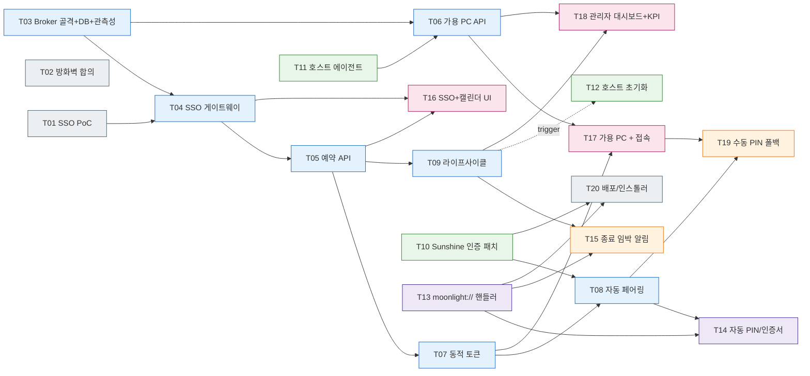

# EXP: SmartClassroom 실행 계획 v0.1

> 입력: PRD.md (v0.1, 2026-05-09) / EXP-instruction.md / PRD-instruction.md
> 작성: ABC社 PM
> 작성일: 2026-05-09
> 분해 기준: (1) 백엔드/프런트엔드/풀스택/기타 분류, (2) 영역 비침범, (3) 의존성 명시, (4) 단일 200K 컨텍스트 내 완료 가능

---

## 0. 분해 결과 한눈에 보기

- 총 20개 태스크. 카테고리: 백엔드 7 / 프런트엔드 3 / 풀스택 2 / 기타(Host·Client·인증·인프라·운영) 8.
- PRD Feature 매핑: F1=T01·T04·T16, F2=T08·T13·T14·T17, F3=T07, F4=T09·T12·T15, F5=T06·T11·T17·T18.
- 크리티컬 패스: T01 → T04 → T05 → T07 → T08 → T14 → T17 (원클릭 접속까지의 최단 경로).

### 0-1. PRD-instruction.md MVP 요구사항 ↔ 태스크

| MVP 요구사항 | 담당 태스크 |
| --- | --- |
| 포털 연동 예약 페이지(추가 로그인 불필요) | T01, T04, T16 |
| 동적 접속 토큰 발급 | T07 |
| 세션 관리 및 자동 차단(10분 전 알림 + 강제 종료) | T09, T15 |
| 호스트 상태 모니터링 대시보드 | T18 |
| 원클릭 접속 버튼 | T13, T14, T17 |
| 백그라운드 인증 연동(서버단 자동 PIN) | T08, T10, T14 |
| 실시간 PC 상태 체커(가용 호스트만 노출) | T06, T11 |
| 세션 강제 종료 및 초기화 | T09, T12 |

### 0-2. PRD KPI ↔ 측정 책임

| KPI | 측정 책임 |
| --- | --- |
| 사용자 입력 값 0개 | T17 (자동 측정 hook) + T14 (자동 페어링 회귀 테스트) |
| 입력 지연 20–50ms | T18 KPI 위젯 (T11 에이전트의 RTT/프레임 메트릭 집계) |
| 자원 점유 +40% / 가동률 균등화 | T18 KPI 위젯 (T05 예약 데이터 + T11 사용 시간 집계) |

---

## 1. 기타 · 인증/인프라 사전작업

### T01. 포털 SSO 연동 사양 조사 + PoC
- 카테고리: 기타 (인증)
- 의존성: 없음
- 완료 조건
  - [ ] 충남대 정보화본부에 외부 연동 신청 절차 확인 (담당 부서, 필요 서류, 소요 일정)
  - [ ] portal.cnu.ac.kr / sso.cnu.ac.kr 의 SSO 프로토콜 공식 확인 (자체 토큰 / SAML / OIDC / CAS 중 어느 것인지)
  - [ ] 토큰/세션 검증용 API 또는 SP 메타데이터 수령
  - [ ] 임시 검증 환경에서 테스트 계정으로 로그인 → 토큰 → 사용자 식별 정보 획득까지 PoC 성공
  - [ ] R1 위험에 대한 폴백 인증(학내 메일 OAuth 등) 전략 결정
- 산출물: SSO 연동 사양서, PoC 스크립트, 폴백 결정 문서

### T02. 네트워크 경로 및 방화벽 정책 합의
- 카테고리: 기타 (인프라)
- 의존성: 없음
- 완료 조건
  - [ ] 외부 클라이언트 → 학내 호스트(47984/47989/RTSP 21/UDP 47998-48010) 접근 정책 합의
  - [ ] Broker(공인망) → Sunshine 호스트(학내망) 제어 채널 합의
  - [ ] WoL 또는 IPMI 등 원격 전원 제어 가능 여부 확정 (A5 가정 검증)
  - [ ] 방화벽 룰셋 문서화 + 운영팀 서명
- 산출물: 네트워크 다이어그램, 방화벽 룰셋 문서

---

## 2. 백엔드 — Broker

### T03. Broker 서비스 골격 + DB 스키마 + 관측성
- 카테고리: 백엔드
- 의존성: 없음
- 완료 조건
  - [ ] 언어/프레임워크 결정 (예: Python FastAPI / Node NestJS / Go) 및 레포 초기화
  - [ ] 핵심 엔티티 스키마: User, Host, Reservation, Session, Token, AuditLog
  - [ ] 마이그레이션 도구 도입(Alembic/Prisma 등) + CI 워크플로 골격
  - [ ] OpenAPI(Swagger) 자동 생성 파이프라인
  - [ ] Healthcheck `/healthz`, `/readyz`
  - [ ] 구조적 로깅(JSON, request-id 트레이싱) + Prometheus `/metrics` 노출 — 모든 후속 백엔드 태스크의 공통 전제
- 산출물: 레포 부트스트랩, ER 다이어그램, OpenAPI 초안, 로깅/메트릭 가이드

### T04. 인증/세션 미들웨어 (SSO 게이트웨이)
- 카테고리: 백엔드
- 의존성: T01, T03
- 완료 조건
  - [ ] T01에서 결정된 프로토콜에 맞춰 SSO 콜백/검증 엔드포인트 구현
  - [ ] Broker 자체 세션 토큰(JWT 또는 서버사이드 세션) 발급
  - [ ] 인증 데코레이터/가드 작성 — 모든 보호 API 적용
  - [ ] 미인증 요청은 SSO 인증 흐름으로 redirect (F1 AC)
  - [ ] 단위 테스트: 유효/만료/위조 토큰 시나리오
- 산출물: 인증 모듈, 통합 테스트, 시퀀스 다이어그램

### T05. 예약 도메인 API
- 카테고리: 백엔드
- 의존성: T03, T04
- 완료 조건
  - [ ] CRUD: `POST/GET/DELETE /reservations`, `GET /reservations?from=&to=&hostId=`
  - [ ] 슬롯 충돌 검증 (동일 호스트·시간 윈도우 중복 불가)
  - [ ] 사용자별 동시 예약/일일 한도 정책 적용 가능 구조
  - [ ] 캘린더 뷰용 집계 엔드포인트 (호스트×일자 매트릭스)
  - [ ] 단위/통합 테스트 (충돌, 권한, 경계값)
- 산출물: 예약 API + 테스트

### T06. 호스트 상태 집계 + 가용 PC 노출 API
- 카테고리: 백엔드
- 의존성: T03, T11
- 완료 조건
  - [ ] T11 에이전트 보고를 받는 ingest 엔드포인트 (`POST /agents/heartbeat`)
  - [ ] 상태 머신: OFFLINE / IDLE / IN_USE / DEGRADED
  - [ ] `GET /hosts/available` — '접속 가능' 호스트만 필터링 (F5 AC)
  - [ ] WebSocket 또는 SSE 채널로 관리자용 실시간 푸시
  - [ ] 부하 메트릭 (CPU/GPU/네트워크) 집계 윈도우 (1m/5m)
- 산출물: 상태 집계 모듈, 실시간 채널

### T07. 동적 접속 토큰 발급/검증
- 카테고리: 백엔드
- 의존성: T04, T05
- 완료 조건
  - [ ] 토큰 = (사용자, 호스트, 시간 윈도우) 바인딩 (F3 AC)
  - [ ] `POST /reservations/{id}/connect` → 일회성 접속 토큰 발급
  - [ ] 시간 윈도우 종료 시 자동 무효화 / 1회 사용 후 무효화 옵션
  - [ ] 위·변조 방지(서명) + Replay 방지 (jti)
  - [ ] 토큰 검증 API (Broker 내부 호출용)
- 산출물: 토큰 모듈, 보안 리뷰 노트

### T08. 자동 페어링 Broker 모듈
- 카테고리: 백엔드
- 의존성: T07, T10
- 완료 조건
  - [ ] Sunshine `/api/pin` 호출로 4자리 PIN 자동 입력 (T10 토큰 인증 사용)
  - [ ] 클라이언트에 전달할 페어링 컨텍스트(IP, PIN, 인증서) 패키징
  - [ ] 실패 시 재시도(지수 백오프) + 최종 실패 시 T19 폴백 트리거
  - [ ] 모든 호출 audit log
- 산출물: 자동 페어링 서비스, 통합 테스트(실 호스트)

### T09. 세션 라이프사이클 매니저
- 카테고리: 백엔드
- 의존성: T05, T08
- 완료 조건
  - [ ] 예약 시작 시각 도래 → 세션 ACTIVE 전환, T08 호출
  - [ ] 종료 10분 전 / 1분 전 알림 디스패치 큐 등록 (T15 채널 사용)
  - [ ] 종료 시각 도래 → 세션 강제 종료 (Sunshine API `/api/apps/close` 또는 RTSP 종료) + T12 초기화 트리거
  - [ ] 잡 스케줄러 (Celery/Quartz/cron) 구성
  - [ ] 단위 테스트: 정시 종료, 조기 종료, 사용자 재접속
- 산출물: 라이프사이클 워커, 운영 런북

---

## 3. 기타 — Sunshine Host 측 커스터마이징

### T10. Sunshine 인증 확장 (Token + 자동 PIN 모드)
- 카테고리: 기타 (Host)
- 의존성: 없음
- 완료 조건
  - [ ] `src/confighttp.cpp` 의 Basic Auth 외에 Bearer Token 인증 경로 추가
  - [ ] Broker 발급 토큰을 검증하는 옵션 (`sunshine.conf` 의 신규 키)
  - [ ] PIN 자동 입력 흐름: 외부에서 `POST /api/pin` 호출 시 사용자 GUI 개입 없이 처리되도록 검증
  - [ ] 업스트림 버전 핀(pinned tag) 명시 + fork 차이를 패치 시리즈로 관리, Win/Linux 빌드 검증
- 산출물: Sunshine 패치셋 + 빌드 산출물(Win/Linux)

### T11. 호스트 상태 보고 에이전트
- 카테고리: 기타 (Host)
- 의존성: 없음
- 완료 조건
  - [ ] 강의실 PC에 설치되는 경량 사이드카 (Sunshine과 별개 프로세스, Windows 서비스 / systemd)
  - [ ] 30초 주기 heartbeat — 전원/세션/CPU/GPU/RTT 메트릭 보고
  - [ ] Broker(T06) 인증 토큰으로 mTLS 또는 JWT 인증
  - [ ] 자동 업데이트 채널
- 산출물: 에이전트 바이너리 + 인스톨러

### T12. 세션 종료 후 호스트 초기화 스크립트
- 카테고리: 기타 (Host)
- 의존성: 없음
- 완료 조건
  - [ ] Windows 사용자 강제 로그아웃 (`shutdown /l` 또는 PowerShell)
  - [ ] 임시 파일/다운로드/클립보드/브라우저 세션 정리
  - [ ] 다음 사용자 환경 프리셋 적용
  - [ ] T11 에이전트가 트리거하는 인터페이스 (CLI 또는 RPC)
  - [ ] 드라이런 모드 + 운영 모드 분리
- 산출물: 정리 스크립트 + QA 체크리스트

---

## 4. 기타 — Moonlight Client 측 커스터마이징

### T13. moonlight:// 커스텀 URL 핸들러 + 인자 주입
- 카테고리: 기타 (Client)
- 의존성: 없음
- 완료 조건
  - [ ] `app/main.cpp` 의 GlobalCommandLineParser 확장 — `--connect-token`, `--host-id` 인자 파싱
  - [ ] OS별 URL 스킴 등록(Windows 레지스트리, macOS Info.plist, Linux .desktop)
  - [ ] `app/backend/computermanager.cpp` 의 moonlight:// 처리 분기 확장: token/auto-pair 파라미터 수용
  - [ ] 인스톨러 단계에서 자동 등록(WiX/dmg/AppImage)
- 산출물: moonlight-qt fork 패치, OS별 인스톨러

### T14. 자동 인증서/PIN 주입 (사용자 입력 0개)
- 카테고리: 기타 (Client)
- 의존성: T13, T08
- 완료 조건
  - [ ] `NvPairingManager` 에 외부 PIN 주입 경로 활성화 + 토큰 기반 인증 옵션 추가
  - [ ] `IdentityManager` 가 Broker 발급 인증서/키를 일회성으로 사용 가능하도록 확장
  - [ ] 페어링 성공 시 사용자 GUI 개입 0회 — 자동으로 Session 진입
  - [ ] 실패 시 T19 폴백 화면으로 분기
- 산출물: 패치, 사용자 입력 0회 회귀 테스트

---

## 5. 풀스택 — 알림 / 폴백

### T15. 종료 임박 알림 채널 (10분/1분 전)
- 카테고리: 풀스택
- 의존성: T09, T13
- 완료 조건
  - [ ] **1차 채택**: Moonlight 클라이언트 토스트 (Sunshine fork 부담 회피). T13 인앱 알림 위젯에 채널 구현
  - [ ] Broker → Moonlight 채널: WebSocket 또는 짧은 폴링, 메시지 페이로드 스펙(JSON) 합의
  - [ ] 표시 검증: 10분 / 1분 전 시각 정확도 ±10초
  - [ ] 알림 ACK 기록 (KPI/감사 목적)
  - [ ] (옵션) Sunshine OSD 채널은 후속 이슈로 분리
- 산출물: 알림 모듈 + UX 검증 영상

### T19. 자동 페어링 실패 → 수동 PIN 폴백
- 카테고리: 풀스택
- 의존성: T08, T17
- 완료 조건
  - [ ] T08 실패 트리거 시 웹 포털에 4자리 PIN 표시 화면
  - [ ] Moonlight 클라이언트는 표준 PIN 입력 화면으로 폴백 (T14 자동 흐름 비활성)
  - [ ] 실패 사유 코드 표준화 + 사용자 가이드 링크
- 산출물: 폴백 흐름, 운영 가이드

---

## 6. 프런트엔드 — SSO 연동 웹 포털

### T16. SSO 진입 + 캘린더 / 예약 UI
- 카테고리: 프런트엔드
- 의존성: T04, T05
- 완료 조건
  - [ ] 프레임워크 결정(예: Next.js / Vue3 + Vite) + 디자인 토큰
  - [ ] 미인증 진입 시 SSO redirect (F1 AC)
  - [ ] 캘린더 뷰: 호스트×시간 슬롯 그리드, 드래그/클릭 예약
  - [ ] 본인 예약 목록 / 취소 / 변경
  - [ ] 접근성 키보드 내비게이션 (NFR Accessibility)
- 산출물: 웹 앱 v1 빌드

### T17. 가용 PC 리스트 + '접속' 버튼
- 카테고리: 프런트엔드
- 의존성: T06, T07
- 완료 조건
  - [ ] `GET /hosts/available` 폴링 또는 SSE 구독
  - [ ] '접속' 버튼 → `POST /reservations/{id}/connect` 호출 → 토큰 수령 → `moonlight://...?token=...` 호출
  - [ ] 핸들러 미등록 OS 감지 시 다운로드 가이드 노출
  - [ ] 사용자 입력 0개 KPI 자동 측정 hook 삽입
- 산출물: 접속 페이지

### T18. 관리자 모니터링 대시보드 + KPI
- 카테고리: 프런트엔드
- 의존성: T06, T09
- 완료 조건
  - [ ] 전 호스트 실시간 카드 뷰(상태, 사용자, 부하, 잔여 시간)
  - [ ] 가동률 통계 차트(시간/일/주) + 표준편차 KPI 노출
  - [ ] 강제 종료 / 점검 모드 / 클라이언트 페어링 해제 액션
  - [ ] 권한: 관리자 ROLE 만 접근
  - [ ] **PRD KPI 위젯**: ① 사용자 입력 값 0개 달성률, ② 입력 지연(p50/p95) 20–50ms 분포, ③ 피크 가용성 +40% 달성도, ④ 호스트별 가동률 표준편차 — 측정값은 T11 메트릭/T05 예약 데이터에서 집계
- 산출물: 관리자 화면 + KPI 대시보드

---

## 7. 기타 — 배포 / 운영

### T20. 배포·인스톨러·문서
- 카테고리: 기타 (운영)
- 의존성: T10, T13
- 완료 조건
  - [ ] Sunshine 패치 빌드 → 강의실 PC 자동 배포 채널 (MSI + 그룹정책 또는 자체 에이전트)
  - [ ] Moonlight 인스톨러(Win/macOS/Linux) — moonlight:// 핸들러 자동 등록 포함
  - [ ] 사용자 가이드 (자택 PC 최초 설치 / 접속 흐름)
  - [ ] 운영자 런북 (호스트 추가, 장애 대응, 폴백 절차)
- 산출물: 인스톨러 3종, 가이드 문서

---

## 8. 의존성 그래프

크리티컬 패스: **T01 → T04 → T05 → T07 → T08 → T14 → T17** — "원클릭 접속(입력 0개)" KPI 달성까지의 최단 경로.

---

## 9. 마일스톤 제안 (참고)

- **M1 (인증·뼈대)**: T01·T02·T03·T04·T16 — F1 부분 동작 확인.
- **M2 (예약·집계)**: T05·T11·T06·T17 — 예약 + 가용 PC 노출.
- **M3 (자동 접속)**: T10·T13·T07·T08·T14·T15·T19·T12 — F2/F3/F4 완성.
- **M4 (운영)**: T18·T09 강화·T20 — F5 + 정식 배포.

---

## 10. MVP Definition of Done

- PRD-instruction.md 8개 MVP 요구사항이 §0-1 매핑대로 모두 통과.
- PRD KPI 4종이 T18 대시보드에서 측정 가능 + 베이스라인 수치 1주 이상 수집.
- "자택 PC → 웹 포털 SSO → 예약 → 원클릭 접속" 사용자 입력 0회 시나리오 영상 1건 확보.
- T15 종료 알림(10분/1분) → T09 강제 종료 → T12 초기화 → T11 IDLE 복귀까지 무인 재현 1회 이상.

---

## 11. 미해결 가정 / 후속 이슈

- **A1 (SSO 승인)**: T01 결과에 따라 일정 영향. 폴백 인증 채택 시 T04 이중 구현 비용 검토.
- **A4/A5 (네트워크/원격 전원)**: T02 결과 기반. WoL 불가 시 T11 상시 가동 PC 가정으로 후퇴.
- **알림 채널 2차안**: T15 1차는 Moonlight 토스트로 확정. Sunshine OSD 패치는 별도 이슈로 분리.
- **fork 유지보수**: Sunshine/moonlight-qt 업스트림 추적 주기·담당자 미정 — T20 운영 런북에 포함 필요.
