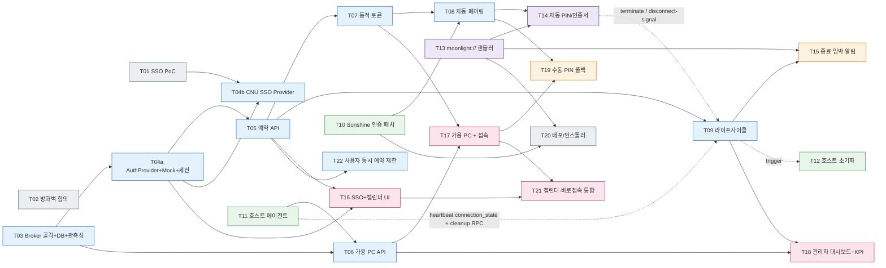

# EXP: SmartClassroom 실행 계획 v0.1

> 입력: PRD.md (v0.1, 2026-05-09) / EXP-instruction.md / PRD-instruction.md
> 작성: ABC社 PM
> 작성일: 2026-05-09
> 분해 기준: (1) 백엔드/프런트엔드/풀스택/기타 분류, (2) 영역 비침범, (3) 의존성 명시, (4) 단일 200K 컨텍스트 내 완료 가능

---

## 0. 분해 결과 한눈에 보기

- 총 22개 태스크. 카테고리: 백엔드 8 / 프런트엔드 4 / 풀스택 2 / 기타(Host·Client·인증·인프라·운영) 8.
- PRD Feature 매핑: F1=T04a·T16(개발) + T01·T04b(운영 전환), F2=T08·T13·T14·T17, F3=T07, F4=T09·T12·T15, F5=T06·T11·T17·T18.
- 크리티컬 패스(개발 트랙): **T03 → T04a → T05 → T07 → T08 → T14 → T17** — Mock 인증 위에서 "원클릭 접속(입력 0개)" KPI 달성까지의 최단 경로. 외부 행정 의존 없음. 진행률 **7/7 완주** (T03/T04a/T05/T07/T08/T14/T17 완료, 2026-05-22) — 크리티컬 패스의 모든 태스크 완료. 비크리티컬 T06·T11·T16 완료(2026-05-15), T21 캘린더·바로접속 통합 완료(2026-05-18).
- 운영 전환 트랙: **T01 → T04b** — CNU SSO 프로토콜 확정 + Provider 통합. T04a 머지 이후 별도 트랙으로 병행, 운영 출시 전 머지 필수.

### 0-1. PRD-instruction.md MVP 요구사항 ↔ 태스크

| MVP 요구사항 | 담당 태스크 |
| --- | --- |
| 포털 연동 예약 페이지(추가 로그인 불필요) | T04a, T04b, T16 (T04b 머지 전까지 Mock 운영, T01은 행정 트랙으로 병행) |
| 동적 접속 토큰 발급 | T07 |
| 세션 관리 및 자동 차단 (cleanup 10분 + 명시/암묵 종료 분류 + grace 최대 10분 — §11 A14) | T09, T15, + T11 후속(셧다운 훅·cleanup RPC) + T14 후속 0012~0016 |
| 호스트 상태 모니터링 대시보드 | T18 |
| 원클릭 접속 버튼 | T13, T14, T17 |
| 백그라운드 인증 연동(서버단 자동 PIN) | T08, T10, T14 |
| 실시간 PC 상태 체커(가용 호스트만 노출) | T06, T11 |
| 세션 강제 종료 및 초기화 (명시 종료 = 사용권 반납·자원 즉시 반환; cleanup 자동 실행) | T09, T12 (cleanup 스크립트·Windows 셧다운 훅) |

### 0-2. PRD KPI ↔ 측정 책임

| KPI | 측정 책임 |
| --- | --- |
| 사용자 입력 값 0개 | T17 (자동 측정 hook) + T14 (자동 페어링·자동 스트림 — 입력 0회 수동 e2e 체크리스트, `client-patches/moonlight-qt/BUILD.md` §5.9) |
| 입력 지연 20–50ms | T18 KPI 위젯 (T11 에이전트의 RTT/프레임 메트릭 집계) |
| 자원 점유 +40% / 가동률 균등화 | T18 KPI 위젯 (T05 예약 데이터 + T11 사용 시간 집계) |

---

## 1. 기타 · 인증/인프라 사전작업

### T01. 포털 SSO 연동 사양 조사 + PoC
- 카테고리: 기타 (인증)
- 의존성: 없음
- 사전 발견 (2026-05-11): `NetworkLog.md`(portal.cnu.ac.kr → cnuit.cnu.ac.kr SSO 트래픽 캡처) 분석 결과 충남대 SSO는 **Penta Security PMI-SSO2** 자체 프로토콜로 확정. 근거 — URL 파라미터 `pmi-sso2` / `pmi-sso-return2`, SP 식별자 `from=gid_*`, 글로벌 세션 쿠키 `kalogin` 및 `_SSO_Global_Logout_url`(둘 다 `Domain=.cnu.ac.kr`). **표준 SAML/OIDC/CAS 클라이언트 라이브러리로는 연동 불가 — Penta 에이전트 키트(JAR/JSP) 수령 필수.**
- 완료 조건
  - [ ] 충남대 정보화본부에 외부 SP 등록 신청 (담당 부서, 필요 서류, 소요 일정 — 통상 2–4주)
  - [ ] **SP 식별자 수령** — `from=gid_<우리시스템>` 값 + SP 등록 증명
  - [ ] **PMI-SSO 에이전트 키트 수령** — Penta 클라이언트 라이브러리(JAR/WAR 또는 JSP 에이전트) + 연동 가이드 PDF + PMI-SSO 버전(v1/v2/v3) 확정
  - [ ] **암호화 자료 수령** — SP 인증서/공개키 또는 PFX, AES 키 등 `pmi-sso2`/`pmi-sso-return2` 암복호화에 필요한 일체
  - [ ] **REST 검증 API 제공 여부 확인** — 있으면 Python에서 직접 호출 → Java 사이드카 생략 가능. 없으면 사이드카 확정
  - [ ] **테스트 IdP 접근권** (`devportal.cnu.ac.kr` 등) + 테스트 계정 2종 이상 수령
  - [ ] **사용자 식별 필드 매핑 명세 수령** — 학번/이름/메일/소속의 키 이름 및 값 포맷(`users.external_id` 매핑 결정 근거)
  - [ ] **Global Logout 체인 등록 절차 확인** — `_SSO_Global_Logout_url` 쿠키에 우리 logout URL 등록 필요 여부 + 절차
  - [ ] **SP 도메인 정책 확인** — 우리 도메인이 `.cnu.ac.kr` 하위가 아닐 경우의 동작 차이(쿠키 자동 공유 X, redirect 흐름은 정상)
  - [ ] **PoC 성공** — Java 사이드카 또는 REST API로 `pmi-sso2` 발급 + 콜백 `pmi-sso-return2` 복호화 → 사용자 식별 정보 획득 1회 통과
  - [ ] R1 위험에 대한 폴백 인증(학내 메일 OAuth 등) 전략 결정
- 산출물: SSO 연동 사양서(PMI-SSO 버전·키트 인벤토리·키 보관 위치), PoC 스크립트(Java 사이드카 또는 REST 직접 호출), 폴백 결정 문서

### T02. 네트워크 경로 및 방화벽 정책 합의
- 카테고리: 기타 (인프라)
- 의존성: 없음
- 완료 조건
  - [ ] 외부 클라이언트 → 학내 호스트(47984/47989/RTSP 21/UDP 47998-48010) 접근 정책 합의
  - [ ] Broker(공인망) → Sunshine 호스트(학내망) 제어 채널 합의
  - [ ] Broker ↔ `sso.cnu.ac.kr` / `portal.cnu.ac.kr` HTTPS 양방향 합의 — 학교 IdP의 SP 화이트리스트에 우리 callback URL(`returl`) 등록 가능 여부 사전 확인 (T01과 동기화)
  - [ ] Broker 서비스 도메인 결정 — `.cnu.ac.kr` 하위 vs 외부 도메인. 외부 도메인이면 `kalogin`/`_SSO_Global_Logout_url` 자동 공유 불가, 표준 SP 흐름은 정상 동작
  - [ ] WoL 또는 IPMI 등 원격 전원 제어 가능 여부 확정 (A5 가정 검증)
  - [ ] 방화벽 룰셋 문서화 + 운영팀 서명
- 산출물: 네트워크 다이어그램, 방화벽 룰셋 문서

---

## 2. 백엔드 — Broker

### T03. Broker 서비스 골격 + DB 스키마 + 관측성
- 카테고리: 백엔드
- 의존성: 없음
- 상태: **완료 (2026-05-12)** — pytest 9 green, ruff + mypy strict pass
- 완료 조건
  - [x] 언어/프레임워크 결정 (Python 3.12 + FastAPI) 및 레포 초기화 (`broker/`)
  - [x] 핵심 엔티티 스키마: User, Host, Reservation, Token, AuditLog (Session은 도메인 컨셉 — `tokens.purpose='session'`로 동일 테이블 재사용)
  - [x] Alembic 도입 (`0001_initial`) + GitHub Actions CI 워크플로(`.github/workflows/ci.yml`) — lint + mypy + pytest
  - [x] OpenAPI 자동 생성 (`EXPOSE_DOCS=true` 게이트, `/docs`·`/openapi.json`)
  - [x] Healthcheck `/healthz`, `/readyz` (`readyz`는 DB ping)
  - [x] 구조적 로깅(structlog JSON + request-id contextvar) + Prometheus `/metrics` 노출 (`ENABLE_METRICS=true`)
- 산출물: 레포 부트스트랩, Alembic 마이그레이션, OpenAPI 초안, 로깅/메트릭 가이드

### T04a. AuthProvider 인터페이스 + Mock 구현 + 세션 미들웨어
- 카테고리: 백엔드
- 의존성: T03 (T01과 무관 — 개발 트랙 unblock 목적)
- 상태: **완료 (2026-05-12)** — pytest 14 green (mock flow 7 + SLO 3 + factory guard 4), ruff + mypy strict pass
- 세션 방식 결정: **서버사이드 opaque 세션** 채택 (JWT 후보 기각). 이유 — SLO(Portal→우리) 즉시 무효화 요구사항. raw cookie는 `secrets.token_urlsafe(32)`로 발급, DB에는 `sha256(raw)`만 `tokens.purpose='session'`로 저장(덤프 유출 시 세션 재현 불가). T03 `tokens` 테이블 재사용을 위해 마이그레이션 `0002_token_host_nullable` 추가(`host_id` NULL 허용).
- 미인증 응답 분기: `/api/*` 경로는 Accept 무관 401 JSON(SPA 친화), 그 외 보호 라우트는 Accept `text/html`이면 302 redirect — T16 캘린더 페이지가 이 분기에 의존.
- 완료 조건
  - [x] `AuthProvider` 인터페이스 정의 (메서드: `initiate_login()`, `verify_callback()`, `fetch_user_identity(token)`) — `broker/app/core/auth.py`
  - [x] `MockAuthProvider` 구현 — Jinja2 폼(`/api/v1/auth/mock/login`) + JSON/form 양쪽 callback. 부팅 가드: `APP_ENV=production` + `AUTH_PROVIDER=mock` → `RuntimeError`
  - [x] Broker 자체 세션 토큰 — 서버사이드 opaque 세션(`broker_session` 쿠키, HttpOnly+SameSite=Lax, TTL 8h)
  - [x] 인증 데코레이터/가드 — `get_current_user` / `get_optional_user` / `require_admin` (`broker/app/api/deps.py`)
  - [x] 미인증 요청 처리 — `UnauthenticatedError` → Accept 분기 핸들러(`/api/*`은 401 JSON, 외부는 302). Provider의 `initiate_login()` 결과를 `login_url`로 전달
  - [x] 단위 테스트 — 유효/만료/회수/위조 4종 + Accept 분기 + production 가드 3종 회귀
  - [x] 감사 로그 훅 — `login_success` / `logout` / (`logout_no_session`) 이벤트, `auth_provider` 식별자 모든 레코드 기록
  - [x] SLO 헬퍼 `revoke_all_sessions_for_user(user_id)` — `broker/app/core/auth_session.py`. T04b의 PMI Global Logout 수신 엔드포인트에서만 호출. audit `slo_triggered` 이벤트 슬롯 예약(T04b 본구현 시 발화)
  - [x] 추가 production 부팅 가드 — ① mock provider 차단, ② `SESSION_SECRET` 약한 값 차단, ③ `SESSION_COOKIE_SECURE=true` 강제 (3종 모두 lifespan에서 `RuntimeError`)
- 산출물: 인증 코어 모듈(`auth.py`/`auth_session.py`/`auth_responses.py`), MockProvider, Jinja 템플릿, AuthSessionMiddleware, 통합 테스트 14건, 개발자 가이드(`docs/auth.md`)

### T04b. CNU SSO Provider 통합 (PMI-SSO2)
- 카테고리: 백엔드
- 의존성: T04a, T01
- 전제: T01에서 식별된 **Penta Security PMI-SSO2** — 표준 라이브러리 연동 불가. Penta 에이전트 키트(JAR) + Java 사이드카(`pmi-sso-bridge`) 사용을 기본 전제로 함. T01에서 REST 검증 API 제공이 확인되면 사이드카는 생략 가능.
- 완료 조건
  - [ ] **`pmi-sso-bridge` 사이드카 서비스 구현** — Spring Boot 컨테이너에 Penta JAR 적재. 2개 엔드포인트만 외부 비노출 내부망에 제공:
    - `POST /pmi/encode-request` → `pmi-sso2` 토큰 + `sinfo` 발급 (SP→IdP 방향)
    - `POST /pmi/decode-callback` → `pmi-sso-return2` 복호화 → user identity JSON (IdP→SP 방향)
    - healthcheck `/healthz` + 구조적 로깅(JSON, request_id 전달) + Prometheus `/metrics`
  - [ ] **`CnuSsoProvider` 구현** — `AuthProvider` 인터페이스 준수, 내부에서 사이드카 HTTP 호출
    - `initiate_login()`: 사이드카 `encode-request` → `https://sso.cnu.ac.kr/sso/pmi-sso2.jsp?pmi-sso2=...&returl=<broker callback>&from=<SP ID>`로 302
    - `verify_callback()`: 콜백 쿼리 `pmi-sso-return2`를 사이드카 `decode-callback`에 전달 → user identity 획득
    - `fetch_user_identity()`: T01 매핑 명세에 따라 `(provider='cnu_sso', external_id=<학번>, display_name, email)`로 정규화
  - [ ] **사이드카 인프라**: docker-compose에 `pmi-sso-bridge` 서비스 추가, Broker → bridge는 컴포즈 내부망 통신, 외부 비노출, healthcheck 포함
  - [ ] **Penta JAR 라이센스/배포** 관리 절차 문서화 — 재배포 범위, 키/인증서 회전 절차, 비밀값(.env) 비커밋
  - [ ] **콜백 라우트** `/auth/cnu-sso/callback` 구현 — `pmi-sso-return2` 수신 + 사이드카 호출 + `users` upsert + Broker 세션 쿠키 발급
  - [ ] **Provider 선택 설정** (`AUTH_PROVIDER=cnu_sso|mock`) 운영 환경 강제값 — T03 부팅 가드(production + mock 차단) 위에 사이드카 헬스체크 게이트 추가
  - [ ] **Global Logout 체인 연동** — `_SSO_Global_Logout_url` 쿠키 정책 준수, 우리 logout URL 학교 등록(T01 절차 결과 반영)
  - [ ] **사용자 upsert 정책** — `users(provider='cnu_sso', external_id=<학번>)` UNIQUE 활용. 우리 도메인이 `.cnu.ac.kr` 외부면 자동 SSO 영향 평가 및 UX 노트
  - [ ] **폴백 인증** 채택 시 `CnuMailOauthProvider`도 동일 `AuthProvider` 인터페이스로 추가 — T01 폴백 결정 결과 따름
  - [ ] **통합 테스트**: 테스트 IdP(devportal.cnu.ac.kr)에서 발급 → 복호화 → 사용자 식별 → Broker 세션 발급까지 e2e 1회. 만료 토큰/위조/키 불일치 회귀 케이스 포함
  - [ ] **운영 전환 체크리스트**: Mock → CNU SSO 스위치, 사이드카 기동 확인, 감사 로그 연속성 검증, Provider 식별자(`auth_provider=cnu_sso`)가 모든 로그에 기록됨
- 산출물: `pmi-sso-bridge` Spring Boot 프로젝트 + 컨테이너 이미지, CnuSsoProvider 패치, docker-compose 업데이트, 운영 전환 런북(PMI-SSO 키 회전 절차 포함)

### T05. 예약 도메인 API
- 카테고리: 백엔드
- 의존성: T03, T04a
- 상태: **완료 (2026-05-12)** — pytest 49 green (T05 신규 26 + 기존 23), ruff + mypy strict pass, 수동 e2e 9단계 검증 완료
- 결정 사항:
  - **슬롯 단위 = 30분 그리드**: `starts_at`/`ends_at`가 `:00` 또는 `:30` boundary가 아니면 422. 캘린더 매트릭스 셀 = 30분.
  - **한도 정책 = env settings**: `config.py`에 5개 키(`reservation_slot_minutes=30`, `max_concurrent_reservations=5`, `max_reservation_hours_per_day=8`, `max_reservation_duration_minutes=240`, `reservation_lookahead_days=14`). DB 정책 테이블·admin API는 후속.
  - **충돌은 DB가 잡고 서비스는 catch**: 0001 마이그레이션의 EXCLUDE GIST 제약(`reservations_no_overlap`)이 `host_id + time_range` overlap을 차단. 서비스는 `IntegrityError → ReservationConflictError(409)`. **user_id 무관 — 같은 host·시간이면 누가 잡았든 차단**(강의실 PC = 단일 자원).
  - **Soft delete**: cancel = `status='CANCELED' + canceled_at=now`. EXCLUDE 제약이 CANCELED 행을 자동 제외하므로 동일 슬롯 재예약은 그냥 됨.
  - **권한 분기 = 404**: 본인 예약이 아니면 404 반환(존재 노출 방지). admin은 모두 200/204 + `user_id` 필터로 임의 사용자 조회 가능.
  - **Host 시드 = pytest fixture만**: T05 자체는 Host 조회만 수행. 운영 등록은 T06/T11/T20으로 위임(§11 A2 참조).
- 완료 조건
  - [x] CRUD: `POST/GET/DELETE /reservations`, `GET /reservations?from=&to=&host_id=` — admin은 `user_id` 필터 추가 노출
  - [x] 슬롯 충돌 검증 — PG EXCLUDE GIST → 409 (수동 e2e 단계 4 + `test_reservation_conflict.py` 4건)
  - [x] 사용자별 동시·일일 한도 정책 적용 가능 구조 — env settings + `_validate_quota` 헬퍼, 429 응답
  - [x] 캘린더 뷰 집계 — `GET /reservations/calendar?from=&to=&host_id=` 30분 grid 매트릭스, 외부 사용자는 `user_id` 마스킹
  - [x] 단위/통합 테스트 26건 — 충돌 4 / 권한 5 / boundary 8 / quota 2 / CRUD 3 / 캘린더 4
- 산출물: `broker/app/services/reservation.py` + `broker/app/api/v1/reservations.py` + `broker/app/api/schemas/reservation.py` + 테스트 6파일 + 도메인 예외 3종(`ReservationConflictError(409)`/`ReservationQuotaError(429)`/`InvalidReservationWindowError(422)`) + audit log 이벤트 `reservation_create`/`reservation_cancel`
- (2026-05-27 영향 — §11 A14) cleanup 구간은 슬롯/길이/quota 정책과 **직교** — `_validate_window`/`_ensure_grid`/`_validate_quota`는 예약 시간 `[starts_at, ends_at)` 전체 기준 그대로. cleanup은 lifecycle(T09) 책임이며 예약 생성 검증에는 영향 없음. 30분 예약 → 실 사용 20분은 의식적 수용(캘린더 모달이 안내). EXCLUDE GIST predicate는 T09 마이그레이션이 `WHERE status = 'CONFIRMED'` 단독으로 보정 — `'COMPLETED'` 의미가 "정상 종료, 자원 반환됨"(A14 P4)으로 재정의되기 때문.

### T06. 호스트 상태 집계 + 가용 PC 노출 API
- 카테고리: 백엔드
- 의존성: T03, T11
- 상태: **완료 (2026-05-15)** — broker pytest 122 green (T06 신규 39: evaluator 17 + monitor 6 + heartbeat status 5 + available 5 + sse 5 + metrics 1 + 기존 83), ruff + mypy strict 모두 pass. T11 ingest 위에 상태 머신 + `/hosts/available` + 관리자 SSE + Prometheus gauge 흡수. §A7/A8 잔존 영역 일괄 해소.
- e2e 검증 (2026-05-15): 사용자 환경(Windows + Docker Desktop + RTX 4070 Ti SUPER + Sunshine 실행)에서 doctor → OFFLINE → IDLE 전이 + audit `host_status_change` 1행 / `GET /hosts/available` IDLE host 노출 / 관리자 SSE `event: ready` + 2s ping + status 변화 라이브 푸시 / agent Ctrl+C → ~50초 안에 monitor가 OFFLINE 자동 전이 + SSE event(reason=heartbeat_stale) / psql INSERT로 NOW 덮는 예약 + doctor → **IN_USE** 전이 (사용자 환경 Sunshine 실행 중) + Prometheus `broker_host_status_info{status="IN_USE"} 1.0` / `broker_host_cpu/mem/gpu_percent` gauge 정상 노출 확인. 가이드 보강 5건: ① `.env.example` → `.env` 복사 누락(`if not exist .env copy .env.example .env`) ② `DATABASE_URL`이 컴포즈 내부 호스트명 `postgres`라 host 직접 실행 시 `socket.gaierror` → `localhost` 치환 필요 ③ cmd `>>` 리다이렉트의 `숫자>>` 함정(`echo X=15>> .env`가 fd 15 redirect로 파싱) — 메모장 / 괄호 / caret 우회 ④ T05의 "starts_at < now 거부" 정책과 T06 IN_USE의 "NOW 덮는 예약 필요" 충돌 — psql INSERT로 정책 우회 (자동 테스트 패턴 동일) ⑤ `prometheus-fastapi-instrumentator`가 `os.environ`을 직접 검사 — pydantic-settings는 `.env`를 Settings 필드로만 로드하고 `os.environ`엔 안 반영 → `set ENABLE_METRICS=true` 등 cmd 명시 주입 필요(아니면 `/metrics` 404). 또한 권장 설정: `agent.yaml`의 30s 주기를 견디려면 `HOST_OFFLINE_AFTER_SECONDS≥45` (15면 status flapping).
- 결정 사항 (2026-05-15):
  - **전이 평가 = Hybrid** — heartbeat 도달 시 즉시 IDLE/IN_USE/DEGRADED 평가(`evaluate_host_status` 순수 함수) + `host_status_monitor` background task(60s tick)가 stale heartbeat → OFFLINE. SSE 푸시는 status 변화 시점에만 트리거. lifespan에서 `asyncio.create_task` 기동 + shutdown에서 stop_event 동기화.
  - **전이 규칙 5행 표** — ① `now - last_heartbeat_at > host_offline_after_seconds` → OFFLINE / ② 활성 예약 + sunshine_running → IN_USE / ③ 활성 예약 + sunshine 미실행 → DEGRADED(예약자 못 접속) / ④ cpu≥`host_degraded_cpu_pct` OR mem≥`host_degraded_mem_pct` → DEGRADED / ⑤ 그 외 → IDLE. 우선순위 OFFLINE > IN_USE > DEGRADED > IDLE.
  - **1m/5m 집계 = Prometheus gauge 위임** — `core/metrics.py`에 `HOST_CPU_PERCENT` / `HOST_MEM_PERCENT` / `HOST_GPU_PERCENT` / `HOST_STATUS_INFO` 4종(label=hostname). heartbeat 수신 시 set, OFFLINE 전이 시 `clear_host_metrics`로 stale 라벨 제거. broker DB는 latest만(`host_metadata.metrics`), 평균 윈도우는 PromQL `avg_over_time`. T18은 Grafana embed 또는 PromQL.
  - **SSE = `sse-starlette` + 단일 broker 인스턴스** — `HostEventBroker`(asyncio.Queue per subscriber, slow consumer drop) + `GET /api/v1/events/hosts` (admin only, EventSourceResponse). 멀티 인스턴스 스케일아웃은 §11 A10(후속 Redis pubsub).
  - **`GET /hosts/available` 시그니처** — 단순 `status='IDLE'` + 옵션 `?from=&to=` 슬롯 모드(반열림 [from, to), 30분 그리드). 슬롯 모드에서는 활성 CONFIRMED 예약 호스트 제외 — T17 가용 PC 화면이 미리 활용. 둘 중 하나만 → 422.
  - **HostEventBroker는 `app.state` 라이프사이클에 묶임** — `get_host_event_broker` 의존성이 lifespan에서 만든 인스턴스 주입. `auth_client`처럼 lifespan 없이 `create_app()`만 부르는 테스트는 `dependency_overrides`로 broker 주입 필요. SSE HTTP 통합은 ASGITransport 스트리밍 한계로 broker 단위 테스트로만 검증.
  - **transition은 순수 함수 + 부수효과 헬퍼 분리** — `evaluate_host_status`(순수, DB I/O 없음, 단위 테스트 17건)와 `transition_host`(UPDATE + audit + SSE publish, 동일 status면 noop). 새 룰 추가는 순수 함수 + 단위 테스트로 시작.
  - **Settings 4종 추가** — `host_offline_after_seconds=90`, `host_degraded_cpu_pct=90.0`, `host_degraded_mem_pct=95.0`, `host_status_monitor_interval_seconds=60`. tests/conftest.py는 짧게(10s/2s) 주입.
  - **마이그레이션 불필요** — 0001_initial의 `hosts.status` / `last_heartbeat_at` / `host_metadata` 컬럼을 그대로 사용. `audit_logs.action='host_status_change'`도 기존 스키마 그대로.
- 완료 조건
  - [x] T11 에이전트 보고를 받는 ingest 엔드포인트 (`POST /agents/heartbeat`) — T11이 raw ingest 부분 선행, T06이 status 전이 통합 흡수
  - [x] 상태 머신: OFFLINE / IDLE / IN_USE / DEGRADED — `evaluate_host_status` + heartbeat 라우터 통합 + monitor task
  - [x] `GET /hosts/available` — '접속 가능' 호스트만 필터링 (F5 AC) + 옵션 슬롯 모드
  - [x] SSE 채널로 관리자용 실시간 푸시 — `GET /api/v1/events/hosts` (`sse-starlette`)
  - [x] 부하 메트릭 (CPU/GPU/네트워크) 집계 윈도우 (1m/5m) — Prometheus gauge + PromQL `avg_over_time` 위임
- 산출물: `services/host_status.py` + `host_status_monitor.py` + `host_events.py`(broker), `api/v1/host_events.py` + `api/v1/agents.py`(heartbeat 통합) + `api/v1/hosts.py`(/available), `api/schemas/host.py::HostAvailable`, `api/deps.py::get_host_event_broker`, `core/metrics.py`(Gauge 4종 + helper), `core/config.py`(Settings 4종), `services/reservation.py::get_active_reservation_for_host` 헬퍼, `main.py` lifespan(broker init/dispose + monitor task), 테스트 5파일(evaluator 17 + monitor 6 + available 5 + sse 5 + metrics 1) + 기존 `test_agents_heartbeat.py` 5건 보강

### T07. 동적 접속 토큰 발급/검증
- 카테고리: 백엔드
- 의존성: T04a, T05
- 상태: **완료 (2026-05-12)** — pytest 63 green (T07 신규 14건 + 기존 49), ruff + mypy strict pass, 수동 e2e 핵심 흐름 확인 (예약 → connect 발급 201 + token/host 임베딩 + DB jti=sha256 적재 / admin verify consume 200). 시간 게이트(too_early·expired_window)·재발급 시 이전 토큰 자동 revoke·audit 종합 조회는 pytest 14건이 회귀 보장.
- 결정 사항:
  - **토큰 모델 = 서버사이드 opaque + sha256(raw)**: 신규 마이그레이션 없음 — 0001/0002 tokens 테이블 + ix_tokens_active_expires 부분 인덱스 재사용. purpose='connect'로 세션과 분리. JWT 후보 기각 (§11 A1″ 일관).
  - **재사용성 = 1회 소비 + 재발급 허용**: consumed_at으로 1회 소비 마킹, 재발급 시 같은 reservation의 활성 connect 토큰을 일괄 revoke (replay 차단 강화).
  - **발급 게이트 = starts_at - 60s ~ ends_at**: 60s grace는 `Settings.connect_token_grace_seconds` (env-driven, T05 reservation_* 5종과 일관). expires_at = reservation.ends_at으로 박아 예약 종료 = 토큰 자동 무효.
  - **응답 페이로드 = 토큰 + HostConnectionInfo 임베딩**: T17 한 번의 API call로 moonlight URL 조립 완결.
  - **검증 API 인증 = admin 임시**: T08 구현 시 X-Internal-Token 헤더 또는 mTLS로 교체 예정 (§11 A6).
- 완료 조건
  - [x] 토큰 = (사용자, 호스트, 시간 윈도우) 바인딩 — Token.user_id/host_id/reservation_id + expires_at = ends_at
  - [x] POST /reservations/{id}/connect → ConnectTokenResponse (token + host 접속정보)
  - [x] 시간 윈도우 종료 자동 무효화 (expires_at 컬럼) + 1회 사용 후 무효화 (consumed_at)
  - [x] 위·변조 방지 = sha256(raw) + jti UNIQUE; replay 방지 = 재발급 시 이전 활성 토큰 일괄 revoke
  - [x] 검증 API POST /tokens/verify (Broker 내부, 일단 require_admin)
- 산출물: token_service.py + tokens.py 라우터 + token 스키마 + audit 이벤트 4종(token_issue/consume/verify_failure/revoke_previous) + Settings.connect_token_grace_seconds + 테스트 3파일 + 도메인 예외 InvalidConnectWindowError(422)
- (2026-05-27 영향 — §11 A14 P6) `expires_at = reservation.ends_at - reservation_cleanup_minutes` (= `cleanup_starts_at`)로 변경. 발급 게이트도 `starts_at - connect_token_grace_seconds ~ cleanup_starts_at`. **단 grace 구간(T09 관리)에는 이미 발급된 토큰의 verify 통과 유지** — `verify_connect_token`이 `(token.expires_at < now)` 단순 비교가 아니라 `(now <= expires_at) OR (T09 grace_state가 활성이고 token이 그 reservation에 속함)`로 확장. cleanup 시작 시 `revoke_active_tokens_for_reservation` 호출 — 그 이후 verify는 revoked 분기로 실패. 명시 종료(T09 `POST /terminate`) 시에도 즉시 revoke.

### T08. 자동 페어링 Broker 모듈
- 카테고리: 백엔드
- 의존성: T07, T10
- 상태: **완료 (2026-05-22)** — Broker 백엔드. connect 토큰 + 클라이언트가 생성한 4자리 PIN을 받아 예약 호스트의 Sunshine `/api/pin`으로 중계. `POST /api/v1/pairing` 신설 + `services/pairing_service.py` + `/tokens/verify` 내부 인증(X-Internal-Token) 정비. 테스트 통과: pairing 12종(httpx MockTransport 가짜 Sunshine) + internal auth 3종 + 회귀 146종.
- 결정 사항 (2026-05-22):
  - **PIN 방향 = client→broker (A1)** — 페어링 PIN은 프로토콜상 Moonlight(클라이언트)가 생성한다(`computermanager.cpp::generatePinString()`). 클라이언트가 PIN 생성 + 페어링 핸드셰이크를 *먼저* 시작한 뒤 Broker에 `{connect_token, pin}`을 넘기고, Broker가 그 PIN을 Sunshine `/api/pin`으로 중계. 클라이언트가 먼저 시작하므로 Sunshine 페어링 세션이 이미 존재 → 타이밍 레이스 없음(지수 백오프는 짧은 레이스·일시 오류용 보험). 완료조건 2의 "PIN을 클라이언트에 전달"은 프로토콜 이해 전 표현 — 실제 방향은 반대.
  - **`/pairing` 인증 = connect 토큰 자체** — 별도 세션/admin 없이 connect 토큰으로 인증(verify만, 소비는 스트림 시작 시점). Moonlight는 브라우저가 아니라 세션 쿠키가 없으므로 토큰이 곧 인증 수단.
  - **내부 인증 = X-Internal-Token (§11 A6 해소)** — `/tokens/verify`의 임시 `require_admin`을 `X-Internal-Token` 헤더 공유 비밀로 교체(`require_internal_token` 의존성 + `Settings.internal_api_token` + production 부팅 가드). mTLS 대신 공유 비밀 — v1 단순성.
  - **confighttp 포트 = 47990 고정** — Sunshine confighttp(`/api/pin`)는 스트리밍 포트(`hosts.sunshine_port`, 기본 47984)와 별개. `Settings.sunshine_config_port`. 자가서명 HTTPS라 `verify=False`(`sunshine_tls_verify`) — 캠퍼스 LAN 전제, cert pinning은 후속 강화.
  - **`broker_api_token` = 호스트별 컬럼** — `hosts.sunshine_broker_token`(nullable). Sunshine `sunshine.conf`의 `broker_api_token`과 짝. Broker가 raw로 제시해야 하므로 해시 불가 — 평문 저장, 응답 스키마·로그·audit에 미노출.
  - **v1 = 백엔드 전용** — T08 머지 시점엔 T14(Moonlight 측 자동화)·T09(라이프사이클)가 미구현이라 엔드포인트는 MockTransport 통합테스트 + 실호스트 수동 e2e로 검증, 실제 Moonlight 배선은 T14에 위임했다. **T14는 2026-05-22 완료** — `ScBrokerClient`가 `POST /api/v1/pairing`를 호출하는 Moonlight 측 배선이 들어왔다(T09는 여전히 미구현). Sunshine→Broker `/tokens/verify` 콜백은 범위 밖(필요 시 `host-patches/sunshine/` 후속 패치).
  - **Broker 우회 경계** — T08은 *새 페어링*을 Broker 독점 경로로 만든다(PIN 주입 크리덴셜을 학생이 못 가짐). 1차 자물쇠는 강의실 PC Sunshine 웹UI 비밀번호 — 강력·비밀·PC별 고유로 설정(T20 배포 요건; 학생이 47990 로그인 페이지 도달 자체는 막을 수 없다고 가정). *기존 페어링* 재사용 차단(예약 종료 후 직접 재접속)은 세션 종료 시 클라이언트 인증서 un-pair = T09/T12 몫.
- 완료 조건
  - [x] Sunshine `/api/pin` 호출로 4자리 PIN 자동 입력 (T10 Bearer 토큰 인증 사용)
  - [x] 페어링 컨텍스트 패키징 — `PairingResponse`(status + 호스트 접속정보). PIN은 client→broker 방향이라 "클라이언트가 제시", 인증서는 프로토콜이 핸드셰이크에서 자동 교환(Broker 미관여) — 완료조건 원문을 A1로 정정.
  - [x] 실패 시 재시도(지수 백오프) + 최종 실패 시 dict-detail `fallback: manual_pin`로 T19 폴백 신호
  - [x] 모든 호출 audit log — 결과 1행(`pairing_succeeded`/`pairing_failed`)
- 산출물: `services/pairing_service.py` + `api/v1/pairing.py` + `api/schemas/pairing.py` + `hosts.sunshine_broker_token` 컬럼(마이그레이션 `0003`) + `PUT /hosts/{id}/sunshine-token` + `require_internal_token` 의존성 + `Settings` 신규 6종(internal_api_token, sunshine_config_port/tls_verify/request_timeout/pair_max_attempts/pair_backoff) + 테스트 2파일(test_pairing 12 / test_internal_auth 3). 실호스트 수동 e2e 절차는 plan 검증절 참조.

### T09. 세션 라이프사이클 매니저 (cleanup / grace / 명시-암묵 종료 분류)
- 카테고리: 백엔드
- 의존성: T05, T08, T11 후속(heartbeat `connection_state` + `agent.execute_cleanup` RPC), T14 후속(Moonlight 신호 라우트 0012~0016)
- 상태: 미시작
- 정책 출처: §11 A14 (cleanup 10분 / grace 최대 10분 / 명시-암묵 분류 / 명시 종료 = 사용권 반납). 수치·정의는 A14가 진실이며 본문은 구현 구조만 다룬다.
- 결정 사항:
  1. **예약 phase 상태 머신**: `SCHEDULED → ACTIVE → (GRACE) → CLEANUP → ENDED`. phase는 별도 컬럼이 아닌 **시각 기반 파생 계산** (`now` + `reservation.starts_at`/`ends_at`/`explicit_terminated_at` + Broker가 관리하는 grace 타이머 상태). 마이그레이션 최소화 — 시각이 진실. UI/감사용으로만 `services/reservation_lifecycle.py::compute_phase(reservation, now, grace_state)` 헬퍼.
  2. **이벤트 분류 규칙 (Broker 단독 판정)**: explicit 종료 = Moonlight가 `POST /reservations/{id}/terminate {reason: "user_modal"|"shortcut"|"host_shutdown"}` 호출한 경우 **만**. 그 외 disconnect 신호(T11 heartbeat의 `session.connection_state="disconnected"`, Moonlight `/disconnect-signal`, sunshine 프로세스 down, heartbeat 누락) = 암묵. **기본값 안전** = Broker가 explicit를 못 받았으면 무조건 암묵 → grace.
  3. **신규 라우트 2종** (모두 connect token bearer 인증, 사용자 본인 or admin):
     - `POST /reservations/{id}/terminate` — explicit 종료 트리거. body: `{reason: "user_modal"|"shortcut"|"host_shutdown"}`. 동작: cleanup 즉시 시작 + token revoke + audit `reservation_terminate_explicit`. 응답: `{phase: "cleanup", cleanup_starts_at, ends_at_adjusted}`.
     - `POST /reservations/{id}/disconnect-signal` — Moonlight가 비정상 disconnect 감지 시 best-effort 신호. 동작: grace 타이머 시작(이미 시작됐으면 noop). 응답: `{phase: "grace", grace_start, grace_end}`.
  4. **암묵 종료 감지 채널 (Broker 측 다중 경로)** — Moonlight 신호가 도착하지 않는 경우에도 grace를 시작해야 함:
     - T11 heartbeat의 `session.connection_state="disconnected"` 수신 → 활성 예약 있으면 grace 시작.
     - T11 heartbeat의 `session.sunshine_running=false` 지속(2회 연속) → 활성 예약 있으면 grace 시작.
     - heartbeat 자체 누락 → T06 monitor가 호스트를 OFFLINE 전이할 때 활성 예약이 있으면 grace 시작.
     세 경로가 동일 grace 타이머를 공유(idempotent — 이미 시작된 grace는 재시작하지 않음, P2 의 분 단위 올림 기준 `t_disc`를 첫 신호 시각으로 고정).
  5. **스케줄러 = APScheduler in-process** (단일 broker 인스턴스 가정 — §11 A10 따름). 작업 종류 3종:
     - (a) `cleanup_starts_at` 도달 시 Moonlight에 명시 종료 모달 push 신호 (T14 후속 0014가 클라이언트 측 타이머도 동시 구현 — 이중 안전망).
     - (b) grace 만료 시 cleanup 시작 (자동 cleanup 전이).
     - (c) cleanup 만료 시 `status='COMPLETED'` + `ends_at=now` 단축 + 호스트 IDLE 전이 + token revoke + T12 호출 결과 audit.
     멀티 인스턴스 스케일아웃 시 외부 큐(Celery/Redis 등) 도입 — §11 A10과 같은 시점에 검토.
  6. **Cleanup 실행 = T11 agent RPC**. `agent.execute_cleanup(reason: str) → {success: bool, details: dict}` (T11 후속이 인터페이스 제공). Broker가 호출 후 결과를 audit (`cleanup_succeeded` / `cleanup_failed`). 실패해도 `status='COMPLETED'` 전이는 진행하되 audit·관리자 SSE로 alert.
  7. **DB 변경 (마이그레이션 필요)**:
     - **EXCLUDE GIST predicate 변경**: 현행 `WHERE status IN ('CONFIRMED','COMPLETED')` → `WHERE status = 'CONFIRMED'`. COMPLETED는 "정상 종료된 예약"(A14 P4)이므로 다른 사용자의 즉시 사용을 차단하면 안 됨. 마이그레이션은 제약 drop & recreate (CONFIRMED 그룹만 GIST 색인). 0001 `reservations_no_overlap` 제약 보정.
     - 신규 컬럼 `reservations.explicit_terminated_at TIMESTAMPTZ NULL` (명시 종료 시각, audit/디버그·phase 계산에 사용).
     - 신규 컬럼 `reservations.grace_started_at TIMESTAMPTZ NULL` (암묵 종료 시 분 단위 올림 시각 = P2의 `t_grace_start`, 첫 신호 시각으로 고정).
     - `status` 도메인에 `'COMPLETED'`는 이미 존재 — 의미만 재정의(사용처 없던 enum 값을 정상 종료에 할당).
  8. **호스트 상태 전이 = T06과 통합**: cleanup 시작 시 호스트 status는 그대로 IN_USE(사용자 작업물·세션이 아직 살아있을 수 있어 다음 사용자가 못 들어옴 — phase가 차단 책임), cleanup 만료 시 IDLE 전이(`transition_host` 기존 헬퍼 호출, reason=`cleanup_completed`). DEGRADED/OFFLINE 전이는 T06 룰 그대로(메트릭·heartbeat 주도).
  9. **Token revoke 시점 = 두 경계**: ① cleanup 시작(grace 만료 자동 cleanup 또는 명시 종료) — `revoke_active_tokens_for_reservation`. ② grace 중에는 토큰 verify 통과 유지 (T07 후속 보정 참조 — P6).
  10. **외부 큐 도입은 보류**: APScheduler in-process가 단일 인스턴스 한계와 정확히 일치. 멀티 인스턴스가 필요해지면 §11 A10과 같은 PR에서 함께 교체.
- 완료 조건
  - [ ] `POST /reservations/{id}/terminate` 라우트 — 422/409/403/200 매트릭스 테스트 (잘못된 reason · 이미 cleanup · 본인 아님 · 정상)
  - [ ] `POST /reservations/{id}/disconnect-signal` 라우트 — grace 타이머 시작 + idempotent 검증
  - [ ] APScheduler integration + 3종 job (`cleanup_starts_at` push / grace expiry / cleanup expiry) + lifespan 기동/종료
  - [ ] 마이그레이션 — EXCLUDE GIST predicate 보정 (`status = 'CONFIRMED'` 단독) + `explicit_terminated_at` / `grace_started_at` 컬럼 추가
  - [ ] grace 구간 token verify 통과 / cleanup 시점 자동 revoke 검증
  - [ ] T11 RPC `agent.execute_cleanup` 호출 + 결과 audit (`cleanup_succeeded` / `cleanup_failed`)
  - [ ] 호스트 상태 — cleanup 만료 시 자동 IDLE 전이 + 다음 사용자 즉시 사용 가능 (자원 즉시 반환 — A14 P4)
  - [ ] 단위 테스트: 분 단위 올림 (P2) / grace cap (cleanup 침범 금지) / 명시 종료 후 즉시 사용 가능 / heartbeat `sunshine_running=false` → grace 시작 / heartbeat 누락 OFFLINE → grace 시작
  - [ ] 통합 테스트: 정시 명시 종료 / 조기 명시 종료(자원 즉시 반환) / 암묵 종료 grace 만료 자동 cleanup / grace 중 재접속 성공
- 산출물: `broker/app/services/reservation_lifecycle.py` (compute_phase + grace_state + scheduler 인터페이스), APScheduler 설정, `api/v1/reservations.py` 신규 라우트 2종, `services/host_status_monitor.py`에 OFFLINE 전이 시 grace 트리거 연동, `services/token_service.py`에 verify 시 grace 상태 고려 로직, 마이그레이션 (`0004_*` 가칭 — EXCLUDE predicate + 2개 컬럼), `agent/` 측 cleanup RPC 인터페이스 (T11 후속과 공동 산출), 운영 런북 (cleanup 실패 시 수동 복구 절차)

---

## 3. 기타 — Sunshine Host 측 커스터마이징

### T10. Sunshine 인증 확장 (Token + 자동 PIN 모드)
- 카테고리: 기타 (Host)
- 의존성: 없음
- 상태: **완료 (2026-05-20)** — Sunshine 포크(`D:/Hongsun/Sunshine`, `KITOHSY/Sunshine`)에 코드 변경 + 패치 시리즈 export 완료. `src/` 4파일 +50줄/−1줄(`config.h`/`config.cpp` `broker_api_token` 키, `confighttp.cpp` `authenticate()` Bearer 경로 + 상수시간 비교 헬퍼, `input.cpp` toolchain 호환 가드). 패치 브랜치 `smartclassroom/t10-token-pin`(태그 `v2025.628.4510` 기준), `git format-patch` 4건 → `host-patches/sunshine/`. **MSYS2 UCRT64 빌드·런타임 검증 완료**: `ninja -C build` 통과, `POST /api/pin` 런타임 curl 3건 통과(정상 토큰→`200`, 잘못된/없는 토큰→`401`). 빌드 중 컴파일 에러 2건 발견·수정 — ⓐ `config.cpp`의 `sunshine_t` aggregate initializer가 패치 0001의 신규 멤버 슬롯을 누락(0001 결함, 패치 0003으로 보정), ⓑ `input.cpp`의 MinGW `HSYNTHETICPOINTERDEVICE` 수동 선언이 최신 UCRT64 `winuser.h`와 중복(toolchain 호환, 패치 0004). 검증 전제(설치본 `SunshineService` 포트 점유 해제, 관리자 자격증명 1회 설정 — `authenticate()`가 Bearer 검사 전 `username` 미설정 시 `/welcome` 리다이렉트)는 `BUILD.md §5`에 기록.
- 결정 사항 (2026-05-19):
  - **인증 모델 = 정적 호스트별 시크릿 (A안)** — `sunshine.conf`의 신규 키 `broker_api_token`에 Broker가 호스트마다 발급한 정적 시크릿을 두고, 들어온 `Authorization: Bearer <token>`을 상수시간 비교. 네트워크 콜백 없음 → "T10 의존성: 없음"과 일치, Broker 장애와 무관. T11 `agent.yaml` agent 토큰과 같은 프로비저닝 모델(인스톨러 주입). 키 미설정 시 Bearer 경로 비활성 → 기존 Basic Auth 100% 유지. IP-origin 게이트는 Bearer에도 그대로 적용.
  - **예약별 connect 토큰의 동적 검증은 T08 위임** — Sunshine이 받은 토큰을 Broker `POST /tokens/verify`로 되묻는 콜백 방식(B안)은 Broker 의존 + `/tokens/verify` 내부 인증(§11 A6, 현재 `require_admin`) 선결이 필요 → T08(자동 페어링)이 호출자가 될 때 같은 패치 시리즈에 후속 패치로 추가. A·B는 상호 배타 아님.
  - **PIN 자동 입력 = Bearer 인증으로 자연 해소 (Level 1)** — `savePin()`(`POST /api/pin`)은 `authenticate()`만 통과하면 머신 호출 가능 → Bearer 경로가 곧 헤드리스 호출 능력. `/api/pin` 핸들러 자체는 무변경. 페어링 introspection API·시스템 트레이 알림 억제는 비범위(필요 시 T08). 알려진 v1 한계: `nvhttp::pin()`은 `map_id_sess` 첫 엔트리만 대상 → 호스트당 동시 페어링 1건만 정확(강의실 PC 1대=Sunshine 1개라 수용).
  - **핀 태그 = `v2025.628.4510`** — 현 체크아웃 최근접 업스트림 릴리스 태그. fork 차이는 `host-patches/sunshine/`의 번호 붙은 `.patch` 시리즈로 관리(`client-patches/` T13/T14와 대칭). 업스트림 추적 주기·담당자는 §11 "fork 유지보수"/T20.
- 완료 조건
  - [x] `src/confighttp.cpp` 의 Basic Auth 외에 Bearer Token 인증 경로 추가
  - [x] Broker 발급 토큰을 검증하는 옵션 (`sunshine.conf` 의 신규 키 `broker_api_token`)
  - [x] PIN 자동 입력 흐름: Bearer 인증으로 `POST /api/pin` 헤드리스 호출 가능 (런타임 curl 검증은 `BUILD.md` §5 — 사용자 빌드 후)
  - [x] 업스트림 버전 핀(`v2025.628.4510`) 명시 + fork 차이를 패치 시리즈로 관리
  - [x] Windows(MSYS2 UCRT64) 빌드 + 런타임 curl 검증 완료 (2026-05-20). Linux 빌드는 v1 범위 밖(`BUILD.md`).
- 산출물: Sunshine 포크 패치 브랜치 `smartclassroom/t10-token-pin` (커밋 `590f7c8a` config 키, `96ce0ea7` Bearer 경로, `96f7f757` initializer 보정, `f07470c5` toolchain 가드) + `host-patches/sunshine/`(패치 4건 + `README.md` + `BUILD.md`). 빌드 산출물(Win/Linux)은 사용자 환경.

### T11. 호스트 상태 보고 에이전트
- 카테고리: 기타 (Host)
- 의존성: 없음
- 상태: **완료 (2026-05-14)** — `agent/` 디렉터리 신설(Python 3.12 + uv, 자체 루트), broker 측 부분 선행(§11 A7 패턴): `POST /api/v1/hosts` admin enrollment + `POST /api/v1/hosts/{id}/agent-token` 회전 + `POST /api/v1/agents/heartbeat` ingest. broker pytest 83 green(T11 신규 16 + 기존 67), agent pytest 34 green, ruff + mypy strict 양쪽 모두 pass. 마이그레이션 불필요 — `tokens.purpose='agent'`로 T07 패턴 재사용 + `hosts.last_heartbeat_at`/`host_metadata` JSONB는 0001_initial에 이미 존재. CI `agent` job 신규 등록.
- e2e 검증 (2026-05-15): 사용자 환경(Windows + Docker Desktop + RTX 4070 Ti SUPER)에서 admin mock 로그인 → `POST /hosts` 201 + raw agent_token 수령 → `agent.yaml` 주입 → `doctor` 1회 heartbeat 200 OK → DB `hosts.last_heartbeat_at` + `metadata` JSONB(NVIDIA GPU 메트릭 + `system`/`session`/`agent_self_rtt_ms`) 갱신 확인 → Sunshine 미실행/실행 토글로 `sunshine_running` boolean 정확히 분기. 가이드 보강 3건: 단계 1에 `.env SESSION_COOKIE_SECURE=false` 누락(curl Secure cookie 미전송), 단계 1에 `uv run alembic upgrade head` 누락(uvicorn 단독 기동은 alembic 자동 실행 안 함 — 컴포즈 entrypoint에만 있음), 단계 5 컬럼명 `host_metadata` → `metadata`(ORM 속성명과 DB 컬럼명 불일치 — `Base.metadata` 충돌 회피로 `mapped_column("metadata", JSONB, ...)` 매핑).
- 결정 사항 (2026-05-14):
  - **언어 = Python 3.12 + uv (agent/ 자체 루트)** — broker 일관, psutil 즉시 사용. 강의실 PC 배포는 v1에서 manual install (PyInstaller 자동화는 T20).
  - **인증 = `tokens.purpose='agent'` Bearer** — T07 token_service 패턴(sha256(raw) opaque + `ix_tokens_active_expires` 부분 인덱스 + revoke 헬퍼) 재사용. mTLS는 T20 운영 트랙으로 위임. user_id는 발급한 admin 기록(audit trail), host_id는 해당 호스트, 1회 소비 안 함(다회 사용).
  - **Enrollment = admin 사전 등록 + secret 인스톨러 주입** — admin이 `POST /hosts`로 hostname/display_name 등록과 동시에 agent_token(raw) 1회 응답 수령 → 인스톨러 config(`agent.yaml`)에 주입. §11 A2(Host 운영 시드 부재)도 본 흐름으로 해소. bootstrap enrollment 엔드포인트는 v1 비범위.
  - **자동 업데이트 = T20 위임** — v1은 heartbeat에 `agent_version`만 실어 보고. 코드 서명/서명 검증/롤백은 T20 운영 트랙(GPO/SCCM 또는 후속 폴링).
  - **ingest 부분 선행 (§11 A7)** — T11 v1은 `POST /agents/heartbeat`만 broker에 박는다. 상태 머신(OFFLINE/IDLE/IN_USE/DEGRADED 전이) + `/hosts/available` 필터 + 실시간 SSE 푸시는 T06 본구현이 흡수. cpu/gpu 수치는 `hosts.host_metadata.metrics` JSONB에 저장(컬럼 분리는 T06 판단).
  - **메트릭 source = psutil + nvidia-smi shell-out** — NVML 바인딩은 GPU 메트릭 SLA가 필요해질 때. nvidia-smi 미설치/실패 시 빈 리스트 반환 — heartbeat 계속.
  - **서비스 패키징 = NSSM 안내 + systemd unit 생성** — v1 `install-service` 명령은 OS별 NSSM 명령 문자열 또는 systemd unit content를 stdout 출력. pywin32 ServiceFramework 직접 통합은 후속.
- 완료 조건
  - [x] 강의실 PC에 설치되는 경량 사이드카 (Sunshine과 별개 프로세스, NSSM 등록 안내 / systemd unit 헬퍼)
  - [x] 30초 주기 heartbeat — 시스템(CPU/메모리/uptime) / 세션(Sunshine 프로세스+활성 사용자) / GPU(nvidia-smi) / 자기-RTT
  - [x] Broker 인증 토큰 (`tokens.purpose='agent'` Bearer)
  - [-] 자동 업데이트 채널 — **T20 운영 트랙으로 위임** (v1은 agent_version 보고만)
- 산출물: `agent/` 디렉터리 일체(`smartclassroom_agent/` 패키지 + tests 34건), `broker/app/services/agent_token_service.py`, `broker/app/api/v1/agents.py`(heartbeat ingest), `broker/app/api/v1/hosts.py` 확장(POST/rotate), `broker/app/api/schemas/agent.py`+`host.py` 확장, `broker/app/api/deps.py::get_agent_host`, `broker/app/core/errors.py` HTTPException dict-detail 일반화, `Settings.agent_token_ttl_days`, broker 테스트 3파일(token_service 5 + hosts_admin 6 + agents_heartbeat 5), CI `agent` job
- (2026-05-27 정책 변경 후속 — §11 A14, T09 의존) — agent v1 위에 다음 책임을 더한다. v1 코드는 변경 없고 새 모듈만 추가:
  - ✅ **Heartbeat 페이로드에 `session.connection_state: "active"|"disconnected"|"unknown"` 필드 추가** (2026-05-28 완료) — agent가 Sunshine **`/serverinfo`** (port 47989, 무인증, XML)를 폴링해 `<state>SUNSHINE_SERVER_BUSY|FREE</state>`로 판정. `/api/clients`는 paired clients 목록(영구)이라 active 신호 없음 → `/serverinfo`로 변경. **Finding**: `/serverinfo`는 client 단위 아닌 **launch session 단위** — Moonlight client disconnect 후에도 Sunshine launch session이 살아있는 동안 `state=BUSY` 유지. 따라서 `connection_state` 단독으론 즉시 disconnect 감지 불가, T09 결정 #4의 다중 신호(heartbeat 누락·OFFLINE 등)와 함께 평가해야 정확. agent 코드는 `/serverinfo` 응답 충실히 변환 — `_query_sunshine_serverinfo` (`agent/smartclassroom_agent/collectors/session.py`).
  - **신규 RPC `agent.execute_cleanup(reason: str) → {success, details}`** — T12 cleanup 스크립트 실행 + 결과를 다음 heartbeat에 포함하여 Broker T09에 보고. agent 측은 in-process 핸들러; Broker → agent 호출은 polling/long-poll 또는 별도 채널(설계 옵션 — T09 결정 사항 #6에서 일괄 결정).
  - **Windows shutdown 훅** — hidden window + `WM_QUERYENDSESSION` 인터셉트 + Broker `POST /agents/shutdown-intent` 호출 + 활성 예약 보유 시 차단 유지 / 없으면 즉시 통과. 상세는 T12 결정 사항 #2.
  - 산출물 (connection_state 부분 완료): `agent/smartclassroom_agent/config.py`(Sunshine 폴링 필드 2개), `agent/smartclassroom_agent/collectors/session.py`(SessionSnapshot 확장 + `_query_sunshine_serverinfo` + async 마이그레이션), `agent/smartclassroom_agent/heartbeat.py`+`cli.py`(cfg 전달), `broker/app/api/schemas/agent.py`(SessionInfo Literal 필드), agent 테스트 8건 + broker 테스트 3건 신규. 나머지 산출물(`lifecycle/` 셧다운 훅 + cleanup RPC)은 T09/T12 진행 시.

### T12. 세션 종료 후 호스트 초기화 스크립트
- 카테고리: 기타 (Host)
- 의존성: T11 (RPC 인터페이스), T09 (호출자)
- 상태: 미시작
- 정책 출처: §11 A14 (cleanup phase에 실행되는 실제 정리 동작 — A14 P3 명시 종료 트리거 ③ 호스트 OS 셧다운 인터셉트 포함)
- 결정 사항:
  1. **호출 인터페이스 = T11 agent의 in-process RPC** `agent.execute_cleanup(reason: str) → {success: bool, details: dict}`. agent가 cleanup 스크립트를 subprocess로 실행하고 결과를 다음 heartbeat에 포함하여 Broker T09에 보고. 별도 CLI 명령 (`smartclassroom_agent cleanup --reason X`)도 동봉 — 수동 복구/QA용.
  2. **Windows 셧다운 훅 (A14 P3 트리거 ③)** — T11 agent 프로세스가 hidden window를 띄워 `WM_QUERYENDSESSION` 메시지를 수신. 수신 시 셧다운을 **일시 차단** (메시지에 `FALSE` return + `ShutdownBlockReasonCreate`로 사용자에게 차단 사유 표시) + Broker `POST /agents/shutdown-intent {host_id}` 호출 → Broker가 활성 예약 보유 시 Moonlight에 명시 종료 모달 push. 모달에서 "종료" → cleanup 정상 흐름 → cleanup 완료 후 agent가 `ShutdownBlockReasonDestroy` + `shutdown /s` 재발행으로 시스템 종료 진행. 모달에서 "취소" → Moonlight 측에서 명시 종료 신호 안 보냄 → agent는 차단을 유지하고 사용자에게 "취소 후 다시 셧다운하시려면 시작 메뉴 → 전원 → 종료를 다시 누르세요" 안내(`ShutdownBlockReason` 메시지 갱신). 활성 예약이 없는 경우(점검 등) Broker가 `200 {action: "proceed"}` 응답 → agent 즉시 차단 해제.
  3. **스크립트 동작 (cleanup 본체)** — `cleanup-host.ps1` (또는 동등한 Python 모듈):
     - (a) Sunshine `/api/apps/close` 호출로 활성 스트림 강제 종료 (T10 broker_api_token 사용).
     - (b) Windows 사용자 강제 로그아웃 — `shutdown /l` 또는 `logoff <session_id>` (활성 사용자가 없으면 skip).
     - (c) `%TEMP%` / `%USERPROFILE%\Downloads` / 브라우저 캐시(Chrome/Edge/Firefox) / 클립보드 (`Clear-Clipboard` 또는 `Set-Clipboard -Value $null`) 정리.
     - (d) 다음 사용자 환경 프리셋 복원 — 빈 바탕화면, 최근 문서 목록 초기화, OneDrive 로그아웃.
  4. **드라이런 모드** — env `SC_CLEANUP_DRYRUN=1` 또는 agent CLI `--dryrun` 시 실제 삭제·로그아웃 없이 "수행할 작업" 로그만 출력. QA 체크리스트에서 사용.
  5. **실패 처리** — 스크립트가 일부 단계 실패 시(예: 사용자가 응답 없는 앱 보유로 로그아웃 지연) `partial_failure` 분류로 `details`에 단계별 결과 포함. Broker가 audit `cleanup_failed` + 관리자 SSE alert로 노출 (T18 후속), 호스트 status는 그래도 IDLE 전이(다음 사용자가 진입하면 추가 위험 가능성 — T18 admin UI에서 수동 점검 옵션 제공).
  6. **언어 = PowerShell 5.1 + Python 호출 헬퍼** — Windows 10/11 기본 탑재 PowerShell이 (a)~(d) 모두 가능. Python (T11 agent)이 subprocess로 `pwsh -File` 호출. PowerShell이 stdout JSON으로 결과 반환.
- 완료 조건
  - [ ] `agent.execute_cleanup(reason)` RPC 인터페이스 — T11 agent 측 구현 + Broker T09 측 호출
  - [ ] `cleanup-host.ps1` (또는 동등 모듈) — (a)~(d) 단계 + 드라이런 + JSON 결과
  - [ ] Windows `WM_QUERYENDSESSION` 후킹 — hidden window + 차단/해제 + Broker `/agents/shutdown-intent` 호출 + 모달 push 흐름 (활성 예약 보유 시) / 즉시 통과 (활성 예약 없음)
  - [ ] 드라이런 모드 / 운영 모드 분리 + QA 체크리스트
  - [ ] 실패 시 audit `cleanup_failed` + 관리자 alert + 호스트 IDLE 전이 (정책상 진행)
- 산출물: `agent/smartclassroom_agent/cleanup/` 모듈(스크립트 + RPC 핸들러 + 셧다운 훅), `cleanup-host.ps1`, `Broker` 측 `POST /api/v1/agents/shutdown-intent` 라우트 (T09 산출에 포함), QA 체크리스트, 운영 가이드 (수동 cleanup CLI 사용법)

---

## 4. 기타 — Moonlight Client 측 커스터마이징

### T13. moonlight:// 커스텀 URL 핸들러 + 인자 주입
- 카테고리: 기타 (Client)
- 의존성: 없음
- 상태: **완료 (2026-05-20, e2e 검증 2026-05-21)** — Moonlight 포크(`D:/Hongsun/moonlight-qt`, `KITOHSY/moonlight-qt`)에 코드 변경 + 패치 시리즈 export 완료. 업스트림 태그 `v6.1.0` (commit `f786e94c`) 기준, 패치 브랜치 `smartclassroom/t13-url-handler`, **8개 커밋 (기능 6 + 빌드보정 2)**: ① `connect` 서브커맨드 CLI 파서(`app/cli/commandlineparser.{h,cpp}`) ② `moonlight://` URL 핸들러 + URL→CLI 확장 + `QLocalServer/QLocalSocket` 단일 인스턴스 forward(`app/main.cpp`) ③ `ComputerManager::requestConnect` + `NvComputer::pendingConnectToken/pendingHostId` 비-영속 멤버(`app/backend/`) ④ Windows WiX `HKCR\moonlight` URL Protocol 등록(`wix/Moonlight/Product.wxs`) ⑤ macOS `Info.plist` `CFBundleURLTypes`(`app/Info.plist`) ⑥ Linux `.desktop` `MimeType=x-scheme-handler/moonlight;`(`app/deploy/linux/`) ⑦ `setUrlHandler` Qt6 시그니처 빌드보정 ⑧ forward declaration 빌드보정. `git format-patch v6.1.0..HEAD -o client-patches/moonlight-qt -- app/ wix/` 8건 export 완료.
- e2e 검증 (2026-05-21): 사용자 환경(Windows + Qt 6.7.3 `msvc2019_64` + VS 2026 BuildTools MSVC v144 + jom)에서 `qmake`+`jom` 빌드 통과 → `app\release\Moonlight.exe` 생성. URL 시나리오 4종 모두 통과 — ① 미등록 IP `moonlight://connect?...` → URL→CLI 확장 + `addNewHost` ② 단일 인스턴스 forward(두 번째 창 안 뜸 + `T13: dispatching` 로그) ③ 페어링된 호스트 → `T13: stamped pending connect on known host` 즉시 stamp ④ 미페어링 호스트 → 표준 PIN 입력 폴백 + polling resolve 후 `T13: stamped ... after polling resolved it`. 빌드 중 발견·보정 2건: **0007**(`QDesktopServices::setUrlHandler`에 lambda 전달이 Qt 6 시그니처 `(scheme, QObject*, slot)`와 불일치 → MSVC C2660), **0008**(0007이 옮긴 호출이 함수 정의보다 앞 → C3861, forward declaration로 해소). 가이드 보강: ⓐ 사용자 환경이 Qt 6.11 MinGW뿐이라 v6.1.0 CI 매트릭스(`appveyor.yml` `QTDIR: C:\Qt\6.7` + `msvc2019_64`)에 맞춰 Qt 6.7.3 msvc2019_64 flavor 추가 설치 — non-LTS라 MaintenanceTool "Archive" 옵션 필요 ⓑ submodule init 선행 ⓒ `qmake`+`jom`은 exe만 생성 — `windeployqt` + `libs/windows/lib/x64` 11개 DLL + `AntiHooking.dll` + `gamecontrollerdb.txt` deploy 단계 필요 ⓓ MSI 없이 검증 시 URL 스킴은 HKCU `reg add`로 임시 등록(`.reg` import가 cmd 백슬래시 이스케이프 함정 회피) ⓔ exe 직접 실행 시 Windows Defender Firewall 경고가 페어링 라운드트립을 보류 — 허용 필요(정식 MSI는 `Product.wxs`의 `FirewallException`이 자동 처리). 검증 절차는 `client-patches/moonlight-qt/BUILD.md`. v1.1 후속: macOS QFileOpenEvent receiver(`setUrlHandler` Qt6 시그니처용 Q_OBJECT 클래스), macOS/Linux 인스톨러 검증.
- 결정 사항 (2026-05-20):
  - **인증 모델 = 토큰 보관 후 T14로 위임** — T13은 URL을 받아 `NvComputer::pendingConnectToken/pendingHostId`(비-영속 멤버)에 stamp까지만. T13만 머지된 상태에서는 페어링된 호스트는 통상 stream, 미페어링 호스트는 표준 PIN 입력 화면으로 fall-through — KPI("입력 0개") 미충족이지만 회귀 없음. **(→ T14 완료, 2026-05-22)** — T14는 T13 시점에 예상한 "NvHTTP `Authorization: Bearer` 헤더 주입" 설계를 **채택하지 않았다**: connect 토큰은 Sunshine이 아니라 Broker로 가고(PIN-relay 모델), Sunshine 인증은 표준 페어링이 교환하는 클라이언트 인증서(mTLS)가 담당. 상세는 아래 T14.
  - **URL 스키마는 프런트 선계약 그대로** — `moonlight://connect?token=<raw>&host-id=<id>&host=<ip>&port=<port>`. `frontend/src/lib/moonlight.ts::buildMoonlightUrl`가 조립. T13 fork가 URL→CLI 확장(`scT13ExpandMoonlightConnectUrl`)으로 `moonlight connect <host> --port <port> --connect-token <token> --host-id <hostId>` 형태로 변환 후 표준 dispatch.
  - **단일 인스턴스 메커니즘 = `QLocalServer/QLocalSocket`** — 업스트림에 없는 메커니즘이라 직접 도입. named pipe `Moonlight-SingleInstance-v1`. 두 번째 인스턴스가 URL을 보면 첫 인스턴스에 forward 후 `return 0`. 첫 인스턴스가 받은 URL은 `QDesktopServices::openUrl`로 자체 핸들러 재진입 → 일관된 디스패치 경로. CLI 인자(URL 아닌) forward는 v1.1 후속 — KPI 경로는 URL.
  - **fork 모델 = T10 Sunshine 답습** — `client-patches/moonlight-qt/` 디렉터리(`host-patches/sunshine/`와 형제). `KITOHSY/moonlight-qt` push, `git am *.patch` 적용, `git format-patch -- app/ wix/`로 재생성. 업스트림 추적 주기는 §11 fork 유지보수 / T20.
  - **빌드 toolchain = Qt 6.7.3 `msvc2019_64` + MSVC v143/v144 (Qt online installer)** — 업스트림 v6.1.0 CI 매트릭스(`appveyor.yml` `QTDIR: C:\Qt\6.7` + `msvc2019_64`)와 일치. Qt 6.7 binary는 `msvc2019_64` flavor지만 MSVC v143(VS2022)/v144(VS2026 BuildTools)와 ABI 호환이라 최신 BuildTools로 빌드 가능 — 2026-05-21 e2e는 VS 2026 BuildTools(v144)로 빌드 성공. Sunshine T10의 MSYS2 UCRT64와는 다른 체인. v1 검증은 Windows 우선 — macOS/Linux 인스톨러 패치는 머지하되 검증은 v1.1 후속.
  - **NvComputer pendingConnect 멤버 = 영속 안 함** — raw token 디스크 노출 + reservation 만료 후 stale 회피. `isEqualSerialized()` / `serialize()` path에서 제외.
  - **ComputerManager 부트스트랩 정적 스태시** — `main.cpp`의 `ConnectRequested` switch arm은 QML이 ComputerManager 싱글톤을 만들기 *전에* 실행됨 → `static QList<PendingConnect> s_StashedConnects` + `static QPointer<ComputerManager> s_ActiveInstance` 패턴으로 처리. 생성자가 active slot 차지 + 스태시 큐 flush, 소멸자가 slot 해제. 이후 호출은 직접 dispatch.
- 완료 조건
  - [x] `app/main.cpp` 의 GlobalCommandLineParser 확장 — `--connect-token`, `--host-id` 인자 파싱 (0001 + 0002)
  - [x] OS별 URL 스킴 등록(Windows 레지스트리, macOS Info.plist, Linux .desktop) (0004 + 0005 + 0006)
  - [x] `app/backend/computermanager.cpp` 의 moonlight:// 처리 분기 확장: token/auto-pair 파라미터 수용 (0003)
  - [x] 인스톨러 단계에서 자동 등록(WiX/dmg/AppImage) (0004 + 0005 + 0006). dmg는 Info.plist 변경만으로 LaunchServices 자동 인덱싱, AppImage는 첫 실행 후 `xdg-mime default ...` 수동 단계 안내(`BUILD.md`).
- 산출물: Moonlight 포크 패치 브랜치 `smartclassroom/t13-url-handler` (커밋 `ba30e49e` CLI 파서, `4e350df8` URL handler+single instance, `46fe3fc4` ComputerManager 진입점, `53d83db8` WiX URL Protocol, `61193bc4` macOS Info.plist, `064635c6` Linux .desktop, `bf478dbf` setUrlHandler 빌드보정, `e4ce4b5e` forward declaration 빌드보정) + `client-patches/moonlight-qt/`(패치 8건 + `README.md` + `BUILD.md`). 빌드 산출물(Win/macOS/Linux)은 사용자 환경.

### T14. 자동 인증서/PIN 주입 (사용자 입력 0개)
- 카테고리: 기타 (Client)
- 의존성: T13, T08
- 상태: **완료 (2026-05-22)** — moonlight-qt 포크(`smartclassroom/t13-url-handler`)에 T13 8커밋 위로 T14 2커밋 추가: `25a429ac`(ScBrokerClient), `e4b04a18`(자동 연결 본체 — broker URL 파라미터 + 헤드리스 페어링 + 자동연결 orchestration). 빌드 보정 없이 첫 빌드 통과(Qt 6.7.3 `msvc2019_64` + MSVC). `git format-patch v6.1.0..HEAD -o client-patches/moonlight-qt -- app/ wix/` → 패치 10건(T13 0001–0008 + T14 0009/0010) export. SmartClassroom 측 `frontend/src/lib/moonlight.ts::buildMoonlightUrl`에 URL `broker` 파라미터 추가(+테스트).
- 완료조건 정정 (T08 criterion 2와 같은 류 — 프로토콜 이해 전 표현):
  - **criterion 1** "`NvPairingManager` 외부 PIN 주입 + 토큰 기반 인증" → 실체: 페어링 PIN은 클라이언트(Moonlight)가 생성하고 `NvPairingManager::pair(pin)`이 이미 받는다. "외부 주입"의 실체 = 그 PIN이 *Sunshine 호스트*에 **Broker 경유**로 도달하는 것 — `ScBrokerClient`가 `POST /api/v1/pairing`로 Broker에 넘기면 T08이 Sunshine `/api/pin`에 relay. `NvPairingManager`에 실제로 더한 건 헤드리스 경로 phase-1(`getservercert`)의 **bounded timeout**(PIN 미도달 시 무한 hang 방지). connect 토큰은 `NvPairingManager`가 아니라 Broker 호출의 인증으로 쓰인다.
  - **criterion 2** "`IdentityManager`가 Broker 발급 인증서 일회성 사용" → **폐기**. T08은 PIN-relay 모델이라 표준 페어링 핸드셰이크가 클라이언트 인증서를 자동 교환(Sunshine 신뢰 저장소 등록)한다. Broker는 인증서를 발급하지 않는다. `IdentityManager`의 per-install 자가서명 인증서를 그대로 쓴다.
- 완료 조건
  - [x] (정정) `NvPairingManager` phase-1 bounded timeout + Broker PIN-relay 경로(`ScBrokerClient`) — 외부 PIN이 Broker 경유로 Sunshine에 도달
  - [x] (폐기) ~~`IdentityManager` Broker 발급 인증서~~ — PIN-relay 모델이라 불필요, 표준 핸드셰이크가 인증서 교환
  - [x] 페어링 성공 시 사용자 GUI 개입 0회 — `ComputerManager` 자동연결 상태머신이 헤드리스 페어링 → "Desktop" 앱 탐색 → `Session` 생성, `main.qml`이 `StreamSegue`로 자동 진입
  - [x] 실패 시 폴백 — `autoConnectFailed` → 진행 팝업 닫고 에러 다이얼로그 + 표준 PcView 수동 UI (T19 클라이언트 측 폴백)
- 결정 사항 (2026-05-22):
  - **PIN-relay 모델 — connect 토큰은 Broker로** — T14는 새 암호화·인증서 발급이 아니라 기존 조각(T13 토큰 보관 / `ComputerManager::pairHost` / T08 Broker PIN relay / 업스트림 스트림 경로)을 순서대로 배선한 오케스트레이션. 페어링 PIN은 클라이언트가 만들고 Broker가 Sunshine에 중계 — 토큰은 Broker 호출 인증으로만.
  - **`CliStartStream::Launcher` 미재사용** — 업스트림 CLI-stream 런처는 `initialView`+context-property 결합이라 *이미 실행 중인* Moonlight에 URL이 forward되는 경우를 못 다룬다. 그래서 런처 대신 `StreamSegue.qml`+`Session` 핸드오프 패턴만 재사용하고, 자동연결 상태머신은 `ComputerManager` 내부 시그널 구동으로 두 진입 경로(새 실행 / forwarded)를 일관 처리.
  - **헤드리스 완료는 별도 채널** — `PendingPairingTask`에 `headless` 플래그를 둬 자동 페어링 완료가 공용 `pairingCompleted` 시그널을 안 타게 함. `ComputerModel`/CLI pair가 중복 에러 다이얼로그를 띄우는 것 방지.
- e2e 검증 (2026-05-24, 단일 PC — host·Broker·Sunshine·Moonlight 한 PC): 4종 시나리오 전부 통과 — ① 미페어링 호스트 원클릭 자동 페어링→스트림(클릭→스트림 ~4s, **입력 0회 KPI 달성**), ② 이미 페어링됨 `(already paired)` 페어링 건너뛰고 바로 스트림(~3s), ③ Broker 미도달 `broker_unreachable` 폴백(~6s, hang 없음), ④ 페어링 실패(잘못된 `sunshine_broker_token`) `sunshine_unauthorized` 폴백(~1s, hang 없음). 같은 PC loopback이라 스트림 화면은 검정(`BUILD.md` §7) — 정상. e2e 중 발견한 T14 버그 1건(broker URL percent-encoding 디코딩 누락 — `main.cpp` 두 곳 `queryItemValue("broker", QUrl::FullyDecoded)`)은 보정 커밋(`fa743449`) + 패치 **0011-T14-decode-percent-encoded-broker-URL-param.patch**로 분리.
- 산출물: 패치 0009/0010/0011 (`client-patches/moonlight-qt/`), `BUILD.md` §5.9 입력 0회 수동 e2e 체크리스트.
- (2026-05-27 정책 변경 후속 — §11 A14, 패치 시리즈 0012~ 예정) — 자동 페어링·자동 스트림 위에 종료 모달과 명시/암묵 종료 신호 라우트를 더한다. 패치 번호 0012부터 순차, 빌드 toolchain (Qt 6.7 `msvc2019_64` + MSVC v143/v144) 동일:
  - **0012 종료 모달 컴포넌트** — QML 모달, 카피는 §11 A14 P5 ("예약 시간 종료 전 종료하시면 사용권이 반납됩니다 …"). "종료" / "취소" 두 버튼. 단축키 0013·자동 타이머 0014·OS 셧다운 0016가 모두 이 모달을 공유.
  - **0013 단축키 인터셉트** — 업스트림 `Ctrl+Alt+Shift+Q` (즉시 종료)를 0012 모달 표시로 변경. 모달 "종료" 클릭 시 기존 종료 경로 + 명시 종료 신호(0015).
  - **0014 `cleanup_starts_at` 자동 타이머** — `ScBrokerClient`가 connect 응답의 `ends_at` (+ A14 P1 cleanup 길이)를 보관, `cleanup_starts_at = ends_at - 10min` 시점에 로컬 타이머 fire → 0012 모달. 서버 측 T09 push와 이중 안전망. 사용자가 모달 "종료" 클릭 안 해도 cleanup_starts_at 도달 시 Broker T09가 자동 cleanup 시작.
  - **0015 Broker 신호 라우트 통신** — Moonlight 측 `ScBrokerClient::reportExplicitTermination(reservationId, reason: "user_modal"|"shortcut"|"host_shutdown")` → `POST /api/v1/reservations/{id}/terminate`. `ScBrokerClient::reportDisconnect(reservationId)` → `POST /api/v1/reservations/{id}/disconnect-signal` (best-effort, 비정상 disconnect 감지 시).
  - **0016 호스트 셧다운 모달 push 수신** — Broker → Moonlight 채널이 필요(호스트 측 OS 셧다운 인터셉트는 T11 agent가 감지, T11 → Broker → Moonlight 경로). 채널 옵션 (T14 후속 설계에서 일괄 결정):
    - 옵션 A: agent가 호스트 filesystem(예: `%TEMP%/sc-modal-trigger.json`)에 신호 파일을 두고 Moonlight 클라이언트(같은 PC가 아닐 수 있음 — 학생 PC)는 폴링 불가 → **부적합**.
    - 옵션 B: Broker가 Moonlight에 별도 channel (WebSocket / SSE). T15(종료 임박 알림)과 같은 채널 통합 가능.
    - 옵션 C: Moonlight가 Broker에 `GET /reservations/{id}/notifications` 짧은 폴링(예: 5s). 단순하지만 비효율.
    옵션 B가 1순위 — T15와 합쳐 단일 채널.
- (2026-05-27 정책 변경 후속 — Broker 측 결합 책임) — Broker는 T08 PIN-relay 모델 그대로지만, T14의 0015 라우트 호출이 Broker T09 신규 라우트와 직결. 라우트 계약은 T09 결정 사항 #3 참조.

---

## 5. 풀스택 — 알림 / 폴백

### T15. 종료 임박 알림 채널 (10분/1분 전)
- 카테고리: 풀스택
- 의존성: T09, T13
- 정책 출처: §11 A14 — 10분 전 시점은 **`cleanup_starts_at`과 일치**(A14 P1). 그 시점의 노출은 T14 후속 0014가 띄우는 **명시 종료 모달**과 같은 사건 — T15 알림과 모달은 같은 push 채널을 공유(T14 후속 0016 옵션 B와 결합). 1분 전 알림은 cleanup 진행 중임을 알리는 추가 토스트.
- 완료 조건
  - [ ] **1차 채택**: Moonlight 클라이언트 토스트 (Sunshine fork 부담 회피). T13 인앱 알림 위젯에 채널 구현
  - [ ] Broker → Moonlight 채널: WebSocket 또는 짧은 폴링, 메시지 페이로드 스펙(JSON) 합의 — T14 후속 0016과 단일 채널로 통합
  - [ ] 표시 검증: 10분 / 1분 전 시각 정확도 ±10초 (10분 전 = `cleanup_starts_at` 명시 종료 모달, 1분 전 = cleanup 진행 토스트)
  - [ ] 알림 ACK 기록 (KPI/감사 목적)
  - [ ] (옵션) Sunshine OSD 채널은 후속 이슈로 분리
- 산출물: 알림 모듈 + UX 검증 영상

### T19. 자동 페어링 실패 → 수동 PIN 폴백
- 카테고리: 풀스택
- 의존성: T08, T17
- 완료 조건
  - [ ] T08 실패 트리거 시 웹 포털에 4자리 PIN 표시 화면
  - [ ] Moonlight 클라이언트는 표준 PIN 입력 화면으로 폴백 (T14 자동 흐름 비활성)
  - [ ] 실패 사유 코드 표준화 + 사용자 가이드 링크
- 산출물: 폴백 흐름, 운영 가이드

---

## 6. 프런트엔드 — SSO 연동 웹 포털

### T16. SSO 진입 + 캘린더 / 예약 UI
- 카테고리: 프런트엔드
- 의존성: T04a, T05 (Provider 추상화 위에서 동작 — 실제 SSO redirect는 T04b 머지 시 자동 활성)
- 상태: **완료 (2026-05-12)** — `frontend/` 트리(38 코드 + 7 test 파일) 신설, 백엔드 차단 요소(`GET /api/v1/hosts`) 부분 선행 추가, pytest 67 green (T16 신규 4건 + 기존 63), ruff + mypy strict pass. 사용자 환경 e2e 검증 완료: Node 20 + pnpm 9 설치 → `pnpm install` → `pnpm typecheck` + `pnpm lint`(0e/0w) + `pnpm test` 35/35 + `pnpm build`(gzip ~131KB) 모두 통과 + 브라우저 e2e 로그인/캘린더 동작 확인. e2e 도중 발견된 두 fix: ① `kstEndOfDay`가 23:59:59 반환해 백엔드 30분 그리드 422 → 다음날 00:00 KST(반열림 `[from, to)`)로 수정, ② `/me` 응답에 `id` 필드 누락으로 admin "내 예약" 화면이 전체 예약 노출 → `/me`에 내부 PK `id` 추가 + 프런트가 `?user_id=me.id` 명시 필터(캘린더 본인 셀 강조도 함께 활성화).
- 추가 (2026-05-18, T17 작업 중 파생): 캘린더 호스트 행 헤더에 T06 status 배지 표시 — `components/HostStatusBadge.tsx`(IDLE 🟢 대기 중 / IN_USE 🔵 사용 중 / DEGRADED 🟠 점검 중 / OFFLINE 🔴 오프라인, 미지값 회색 fallback). `GET /hosts`가 이미 `status`를 반환해 백엔드 변경 없음. 부하·사용자·SSE 실시간은 T18 범위로 분리. 테스트 `HostStatusBadge.test.tsx` 5 + `CalendarGrid.test.tsx` 배지 1.
- 결정 사항:
  - **프레임워크 = React 18 + Vite + TypeScript (strict, `exactOptionalPropertyTypes`)** — TanStack Query v5 + axios + Tailwind + Vitest/RTL/MSW. SSR 없음(SPA + 백엔드 세션 쿠키). `pnpm@9` / `Node 20`.
  - **호스트 메타 = `GET /api/v1/hosts` (read-only) 부분 선행 (§11 A7)** — T06 본구현 전까지 캘린더 host 축 라벨링 차단 요소만 풀기. ingest/상태머신/필터/SSE는 T06이 흡수.
  - **CORS dev = 5173** — `Settings.cors_origins` 기본값에 `http://localhost:5173` 추가, `.env.example` 갱신. Vite proxy(`/api → :8000` + `cookieDomainRewrite: localhost`)로 dev에서 쿠키 흐름 보장.
  - **세션 401 글로벌 처리 = `auth:unauthenticated` 커스텀 이벤트** — axios interceptor가 React Hook 컨텍스트 밖이라 `window.dispatchEvent` 후 router level에서 navigate 변환. `QueryCache`/`MutationCache` 양쪽 onError에 fallback.
  - **드래그 영역 선택은 stretch goal로 분리** — 1차는 단일 클릭만. 키보드 내비(arrow/Home/End/PageUp/PageDown/Enter/Esc, roving tabindex)는 모두 구현.
  - **EXP §11 A2 (Host 운영 시드 부재)는 본 v1에도 동일 적용** — e2e 시 psql INSERT. T06/T11/T20에서 정식 해결.
  - **Mock 폼 production 가드 = 프런트 `/login`에 TODO(T04b) 마커** — backend가 production+mock 차단하므로, 프런트도 향후 `VITE_AUTH_PROVIDER` 분기로 SSO redirect로 교체.
  - **`/me` 응답에 내부 PK `id` 노출 (2026-05-12, e2e 발견 후 추가)** — 프런트가 admin 본인 user_id를 알 방법이 없어 "내 예약" 화면이 admin에게 전체 노출됐던 버그 해소. `?user_id=me.id` 명시 필터 + 캘린더 본인 셀 강조 활성화. 보안 영향 미미(본인 ID만 노출). 기존 `test_auth_mock_flow.py`에 회귀 assert 1줄 추가.
  - **캘린더 `to` 파라미터는 반열림 `[from, to)`** — 백엔드 `_ensure_grid`는 30분 그리드(`:00`/`:30`)만 허용해 23:59:59는 422. 프런트 `kstEndOfDay`가 다음날 00:00 KST 반환하도록 수정 (e2e 발견).
- 완료 조건
  - [x] 프레임워크 결정(React+Vite+TS strict) + 디자인 토큰(Tailwind brand 컬러)
  - [x] 미인증 진입 시 SSO redirect (F1 AC) — `/api/v1/auth/me` 401 → `RequireAuth`가 `<Navigate to="/login">` 변환. T04b 머지 시 절대 URL `login_url` 흐름으로 자동 활성
  - [x] 캘린더 뷰: 호스트×시간 슬롯 그리드 (30분), 클릭 예약 (드래그는 후속 stretch)
  - [x] 본인 예약 목록 / 취소 / "변경=취소+새 예약" UX 안내
  - [x] 접근성 키보드 내비게이션 (`role=grid` + roving tabindex + arrow/Home/End/PageUp/PageDown/Enter/Esc + 모달 focus trap)
- 산출물: `frontend/` 디렉터리 일체(트리 38 + test 7 + msw 인프라), `broker/app/api/v1/hosts.py` + `schemas/host.py` + `tests/test_hosts_list.py`(T06 부분 선행), `Settings.cors_origins` 기본값 `localhost:5173` 추가, `.github/workflows/ci.yml` `frontend` job 신설(pnpm + lint + typecheck + test + build), README/CLAUDE.md frontend 가이드 추가
- (2026-05-27 정책 변경 후속 — §11 A14 P5) `ReservationModal`에 2줄 안내 카피 추가: ① "실 사용 시간: HH:MM ~ HH:MM" (= `starts_at` ~ `ends_at - 10min`) ② "마지막 10분(HH:MM ~ HH:MM)은 개인정보 보호를 위한 자동 정리 시간입니다." 컴포넌트 변경만이며 캘린더 그리드·시간 헬퍼는 변경 없음. T21이 흡수한 모달도 동일 카피 적용(`pages/CalendarPage.tsx`의 `ReservationModal` 인스턴스).

### T17. 가용 PC 리스트 + '접속' 버튼
- 카테고리: 프런트엔드
- 의존성: T06, T07
- 상태: **완료 (2026-05-18)** — frontend Vitest 49 green (T17 신규 14: moonlight 5 + AvailableHostsPage 6 + MyReservationsPage 접속 3), typecheck + lint + build 통과. broker pytest 129 green (T17 신규: test_instant_reservation 6 + test_token_issue 회귀 1, `ip_address` 노출로 test_hosts_list 페이로드 assert 보정), ruff + mypy strict pass. 마이그레이션 불필요. Playwright 실브라우저 e2e로 로그인 → 가용 PC → 즉시 사용 → moonlight 폴백 → 윈도우 cap까지 검증.
- 결정 사항 (2026-05-18):
  - **접속 버튼 = 예약 단위, `/reservations` 카드에 통합** — `POST /reservations/{id}/connect`가 예약 단위라 호스트가 아닌 예약 카드에 `[접속]`을 단다. 별도 페이지 대신 `MyReservationsPage`에 흡수. 접속 가능 판정은 프런트 `status==='CONFIRMED' && now < ends_at`.
  - **SSE 불가 → 15초 폴링** — `/api/v1/events/hosts` SSE는 admin 전용이라, 일반 사용자 화면인 T17은 `GET /hosts/available`을 15초 폴링.
  - **즉시 사용 = `POST /reservations/instant` 신설** — 가용 PC 현황(`AvailableHostsPage`)에서 `[즉시 사용]` 클릭 시 `starts_at=now`, `ends_at=min(floor_30min(now+2.5h)+30min, 다음 예약 시작)` 윈도우로 즉시 예약 + connect 토큰을 한 응답(`ConnectTokenResponse`)으로 반환. 30분 그리드 시작 제약(`_validate_window`)은 우회하되 quota·EXCLUDE 충돌·IDLE 가드는 그대로. audit `reservation_create.detail.instant=true`.
  - **`/hosts/available` 무파라미터 모드 = 즉시 사용 가능 호스트 + `available_until`** — `list_instant_available_hosts`가 `status='IDLE' AND 현재 시각 덮는 활성 예약 없음`인 호스트와 각 호스트의 `available_until`(= 즉시 사용 윈도우 끝, 다음 예약이 가까우면 거기서 잘림)을 반환. 프런트가 "지금부터 약 N분/시간 사용 가능"으로 표시. 다음 예약 직전까지의 짧은 윈도우(예: 15분)도 노출 — 예약 직전 자투리 시간 활용. `?from=&to=` 슬롯 모드는 기존 그대로(`available_until`은 null).
  - **moonlight:// URL 스키마** — `moonlight://connect?token=<raw>&host-id=<id>&host=<ip>&port=<sunshine_port>`. T13 커스텀 URL 핸들러의 `--connect-token`/`--host-id` 인자 계약 — T13 머지 전까지 이 스키마가 프런트↔클라이언트 계약.
  - **핸들러 감지 = 휴리스틱** — 커스텀 스킴 핸들러 등록 여부를 동기 확인하는 API가 없어, URL 이동 후 1.8초 안에 페이지가 hidden/blur 되면 동작으로 추정. 미동작 추정 시 `MoonlightInstallGuide`(OS별 다운로드 안내) 노출. false라도 실제 동작했을 수 있는 한계 존재.
  - **KPI hook = `token_issue` audit `detail.client`** — connect 호출이 `{client}` body(`'connect_page'` | `'instant_use'`)를 보내고 엔드포인트가 `token_issue` audit detail에 합친다. 별도 probe 없음(접속 화면엔 입력 요소가 없어 측정값이 상수라 과한 설계). T18이 audit_logs에서 비율 집계.
  - **`HostRead`/`HostAvailable`에 `ip_address` 추가** — IP 미등록 호스트는 moonlight URL 조립 불가라 카드 단계에서 `[접속]`/`[즉시 사용]` 버튼 비활성. 기존 `Host` ORM 컬럼 그대로, 스키마 필드만 노출.
- 완료 조건
  - [x] `GET /hosts/available` 폴링 또는 SSE 구독 — 15초 폴링 (`AvailableHostsPage`)
  - [x] '접속' 버튼 → `POST /reservations/{id}/connect` 호출 → 토큰 수령 → `moonlight://...?token=...` 호출 — `MyReservationsPage` `[접속]` + `AvailableHostsPage` `[즉시 사용]`(instant 엔드포인트)
  - [x] 핸들러 미등록 OS 감지 시 다운로드 가이드 노출 — `launchMoonlight` 휴리스틱 + `MoonlightInstallGuide`
  - [x] 사용자 입력 0개 KPI 자동 측정 hook 삽입 — `token_issue` audit `detail.client`
- 산출물: `frontend/` — `pages/AvailableHostsPage.tsx`(신규) + `pages/MyReservationsPage.tsx`(접속 버튼) + `api/connect.ts` + `api/hosts.ts`/`api/reservations.ts` 확장 + `lib/moonlight.ts` + `components/MoonlightInstallGuide.tsx` + `hooks/useMoonlightConnect.ts` + `routes`/`Layout` 갱신 + `test/msw/handlers.ts` 확장 + 테스트 3파일. `broker/` — `api/v1/reservations.py`(`POST /reservations/instant` + connect 선택적 body + `_issue_connect_token_response` 공용 헬퍼) + `api/v1/hosts.py`(`/available` 무파라미터 모드) + `services/reservation.py::create_instant_reservation`/`_instant_window`(다음 예약 cap)/`list_instant_available_hosts`/`_next_reservation_start` + `api/schemas`(`ConnectTokenRequest`/`InstantReservationRequest`/`ip_address`/`HostAvailable.available_until`) + 테스트(test_instant_reservation 6 + test_token_issue 회귀 1)
- (2026-05-27 영향 — §11 A14) cleanup 정책이 즉시 사용에도 적용 — `_instant_window`의 `ends_at` 계산 로직은 그대로지만 **사용 가능 시간 = `ends_at - 10min`**. 예: 즉시 사용 윈도우 `[14:00, 16:30)` → 사용 가능 `[14:00, 16:20)`, cleanup `[16:20, 16:30)`. `available_until`(`HostAvailable`)도 `cleanup_starts_at` 기준으로 조정 — 프런트 부분 바·"N분/시간 사용 가능" 표시가 사용 가능 시간만 노출. 다음 예약 cap 로직(`_next_reservation_start`)은 `ends_at`(원시) 기준 그대로 (EXCLUDE GIST가 `[)` 반열림이라 경계 일치 OK). 30분짜리 자투리 즉시 사용은 사용 가능 20분.

### T18. 관리자 모니터링 대시보드 + KPI
- 카테고리: 프런트엔드
- 의존성: T06, T09
- 완료 조건
  - [ ] 전 호스트 실시간 카드 뷰(상태, 사용자, 부하, 잔여 시간)
  - [ ] 가동률 통계 차트(시간/일/주) + 표준편차 KPI 노출
  - [ ] 강제 종료 / 점검 모드 / 클라이언트 페어링 해제 액션
  - [ ] 권한: 관리자 ROLE 만 접근
  - [ ] **PRD KPI 위젯**: ① 사용자 입력 값 0개 달성률, ② 입력 지연(p50/p95) 20–50ms 분포, ③ 피크 가용성 +40% 달성도, ④ 호스트별 가동률 표준편차 — 측정값은 T11 메트릭/T05 예약 데이터에서 집계
- 산출물: 관리자 화면 + KPI 대시보드

### T21. 캘린더·바로 접속 화면 통합
- 카테고리: 프런트엔드
- 의존성: T16, T17
- 상태: **완료 (2026-05-18, e2e 후속 보정 2026-05-19)** — frontend Vitest 74/74 green (T21 신규: `time` +6 · `CalendarGrid` +5 · `CalendarPage` 신규 3 · `ReservationModal` +2, `AvailableHostsPage` 테스트 삭제 — 이후 2026-05-19 e2e 후속 보정으로 드래그 cap·과거/예약불가 호스트 차단·날짜별 자동 스크롤 등 +9), typecheck + lint(0e) + build 통과. 백엔드는 e2e 후속으로 호스트 상태 일관성 전이만 추가(아래) — 그 외 T17 API·헬퍼를 표현 계층만 재설계해 재사용.
- 배경: T17이 `/connect`(바로 접속)를 독립 페이지로 구현했으나 캘린더(T16, `/`)와 정보가 분리돼 사용자가 두 화면을 오간다. 캘린더 한 화면에서 예약 현황 + 즉시 사용을 함께 처리하도록 통합한다. 화면 구조 재설계라 별도 태스크로 분리. T16에서 stretch goal로 미뤘던 '드래그 영역 선택'도 같은 `CalendarGrid` 재설계 범위라 본 태스크에 흡수한다(그리드를 두 번 갈아엎지 않기 위함).
- 결정 사항 (2026-05-18):
  - **`/connect` 완전 제거** — `AvailableHostsPage`·라우트·"바로 접속" 네비 삭제, `*` catch-all이 `/connect`를 `/404`로 보낸다. 북마크 redirect는 두지 않음(사용자 결정).
  - **2일(48시간·96칸) 윈도우** — 캘린더를 `selectedDate` 00:00부터 48시간으로 렌더(`kstWindowEnd(date, 2)`, `kstEndOfDay` 대체). 슬롯이 연속 인덱스라 드래그가 자정 경계를 별도 분기 없이 가로질러 23:00~익일 02:00 같은 예약을 한 동작으로 선택한다. 하루 경계 컬럼에 굵은 디바이더 + 날짜 헤더.
  - **즉시 사용 윈도우 강조 = 부분 바 (호버=초록 미리보기 / 확정=파랑)** — 기본은 색 없음. `[즉시 사용]` 버튼 호버/포커스 시 그 행 셀에 `[now, available_until)` 겹침 구간을 emerald 반투명 `position:absolute` 부분 바(`pointer-events-none`)로 미리보기한다. 클릭하면 같은 부분 바가 **즉시 파란(blue 반투명) 확정 바**로 바뀐다 — `confirmedInstant` 낙관적 상태라 네트워크/refetch를 기다리지 않아 회색 깜빡임이 없다(실패 시 롤백). 확정 바가 덮는 셀은 배경을 회색으로 둬 `now`가 슬롯 중간이어도 첫 칸이 슬롯 통째가 아닌 부분 폭으로 정확히 그려진다. 확정 바는 `sessionStorage`(`sc.confirmedInstant`)에 저장돼 **새로고침 후에도** 윈도우가 끝날 때까지 유지된다 — 안 그러면 reload 후 캘린더 refetch가 슬롯을 통째 OCCUPIED로 다시 칠한다. 저장 항목에 `reservationId`(onSuccess 시점 기록)를 함께 담아, 그 예약이 취소돼 캘린더 슬롯에서 사라지면 검증 effect가 확정 바를 자동 해제한다(취소 후 stale 바 방지). 확정 바 상태는 **호스트별 다중 추적**(`confirmedInstants` 배열) — 여러 호스트를 연달아 즉시 사용해도 각 호스트가 자기 부분 바를 유지한다(단건 추적 시 두 번째 즉시 사용이 첫 호스트 바를 덮어쓰던 현상 수정, 2026-05-19 e2e). 단 다중 호스트 즉시 사용 자체는 T22에서 정책상 차단 예정인 임시 대응. `내 예약` 셀 색은 `bg-blue-500`→`bg-blue-200` 파스텔로 통일. 초안은 항상 칠하는 방식이었으나 산만하다는 사용자 피드백(2026-05-18 e2e)으로 호버 트리거 + 확정 색 분리로 변경.
  - **호스트 상태 일관성 (백엔드 — T21 e2e 후속 보정)** — `POST /reservations/instant`가 예약 생성 후 호스트를 `transition_host(IN_USE)`로 전이하고, 대칭으로 `DELETE /reservations/{id}`가 취소 후 활성 예약이 없고 IN_USE면 `transition_host(IDLE)`로 복귀시킨다. 정상 경로는 다음 heartbeat가 status를 평가하지만, 상태 배지가 클릭/취소 직후 즉시 반영되도록 양방향 모두 전이. 즉시 사용은 IDLE 호스트만 허용하므로 IDLE↔IN_USE는 T06 룰 ②(활성 예약)의 정상 전이이며 다음 heartbeat가 재확인/보정한다. DEGRADED/OFFLINE은 메트릭·heartbeat 주도라 건드리지 않는다. 프런트는 `hostsQuery`(`['hosts']`)를 15초 폴링해 타 사용자의 점유/취소가 상태 배지에 ~15초 내 반영되게 하고, `instantMutation` 409 시 `['hosts']`/`['calendar']`를 무효화해 stale 화면을 즉시 보정한다. 정규 예약 생성(`onReservationCreated`)도 `['hosts']`를 무효화 — 새 예약이 그 호스트의 `available_until`을 줄이므로, 안 하면 즉시 사용 호버의 초록 미리보기 바가 stale하게 새 예약(파란) 셀까지 덮는다. 캘린더 탭 복귀 시에는 세 쿼리(`hosts`/`hosts·available`/`calendar`)에 `refetchOnMount: 'always'`를 둬 staleTime 무관 1회 강제 갱신한다. 실시간 SSE는 후속(T18 관리자 대시보드와 함께 검토). 초기 계획의 "백엔드 변경 없음"에서 벗어나는 예외 — e2e 피드백(2026-05-18)으로 추가.
  - **드래그 → 확인 모달** — 셀 `mousedown`→`mouseenter`→window `mouseup`. 앵커에서 연속 OPEN 셀까지 클램핑 → `spanMinutes`(최대 240)를 결정. 단일 클릭·키보드 Enter는 `spanMinutes` 미지정 → 30분. 제출은 `POST /reservations`라 30분 그리드 정렬 유지. 드래그 강조와 커밋은 동일한 `effectiveDragSpan`(앵커에서 연속 OPEN·8칸=240분 cap)을 공유해 "보이는 파란 범위 = 실제 예약 범위" — 4시간 초과분/비-OPEN 너머는 강조도 안 된다. 드래그 범위 셀은 `hover:` 회색을 끄므로 커서 아래 셀도 파랑을 유지한다. `mouseup` 후 `ReservationModal`이 열려 있는 동안에도 강조가 유지된다 — `selectedCell`에서 파생한 `selectedRange`가 `dragRange`를 이어받아(`isHighlighted` = 드래그 범위 ∪ 모달 선택 범위), 모달이 닫히면 자동 해제.
  - **예약 모달은 길이 고정 표시(드롭다운 제거)** — `ReservationModal`은 드래그/클릭으로 정해진 길이(`durationMinutes` prop)를 읽기 전용 텍스트로만 보여주고 `[취소]`/`[예약]`만 둔다. 길이 `<select>`·zod `formSchema` 제거 — 길이는 드래그 span(또는 클릭 30분)으로 이미 확정. 강조 = 실제 예약 길이가 항상 일치.
  - **과거 시각 셀 차단** — `minReservableCol = nowColIndex+1`(오늘 뷰; now가 슬롯 중간이라 현재 슬롯도 `starts_at<now`라 불가). 그 미만 컬럼은 `cursor-not-allowed`, `mousedown`/키보드 Enter 시 `onBlockedAttempt('past')`로 "과거 시간으로는 예약할 수 없습니다" 토스트(백엔드 422를 기다리지 않음). `effectiveDragSpan`도 `minReservableCol`에서 클램프 — 미래에서 과거로 끌어도 now 경계에서 멈춘다.
  - **예약 불가 호스트 차단 (프런트 게이트)** — 호스트 `status`가 DEGRADED/OFFLINE이거나 `ip_address`가 없으면(접속 정보 미등록) 그 행 전체가 예약 불가 — 셀 클릭/드래그/키보드 Enter 차단 + `cursor-not-allowed` + 토스트. 사유는 `hostBlockedReason()` 헬퍼가 판정: 점검중·오프라인 → `onBlockedAttempt('host-unreservable')`("점검 중·오프라인 상태의 PC는 예약할 수 없습니다"), IP 미등록 → `onBlockedAttempt('host-no-ip')`("접속 정보가 등록되지 않은 PC는 예약할 수 없습니다"). 상태가 IP 미등록보다 우선. 과거 시각 차단과 콜백(`onBlockedAttempt(reason)`)을 공유. 캘린더가 유일한 예약 경로라 프런트 게이트만으로 충분 — `create_reservation` 백엔드 검증은 도입 보류(테스트 `host` 픽스처가 OFFLINE로 시드돼 정규 예약 테스트 9+개에 광범위 영향, 또 미래 슬롯을 *현재* 호스트 상태로 막으면 일시적 오프라인 PC 사전 예약 불가라는 부작용). 즉시 사용의 IDLE 가드는 "지금 사용"이라 백엔드 검증 유지 — 정규 예약과는 성격이 다름.
  - **셀 폭 축소 + 날짜별 자동 스크롤** — 데이터 컬럼 60px→44px. 날짜 윈도우가 바뀔 때(`firstColStart`=첫 컬럼 시각이 식별자) 1회 스크롤: 오늘이면 now 셀 안의 **현재 시각 지점**(슬롯 시작이 아니라 슬롯 내 경과 비율 `frac` 반영, `scrollLeft = (nowColIndex + frac) × 44`)이 sticky 호스트 헤더 바로 오른쪽에 오도록, **다른 날짜면 `scrollLeft = 0`(그 날 00:00)**. 같은 윈도우의 재렌더(15초 폴링 등)에는 재스크롤하지 않아 사용자 수동 스크롤을 보존. `[즉시 사용]` 호버/포커스 시에도 now 컬럼으로 스크롤. 셀에 키보드 포커스는 주지 않는다 — 호버 후 잔류 포커스 링·버튼 탭 시 포커스 탈취 방지(2026-05-18 e2e 피드백).
  - **즉시 사용 UI는 오늘 뷰 한정** — `availableHostsQuery`는 `enabled: isToday`로 15초 폴링, `instantByHost`도 `isToday` gate. 다른 날짜 선택 시 버튼·부분 바·자동 스크롤 모두 숨김.
- 완료 조건
  - [x] `/connect`(`AvailableHostsPage`) 폐기 — 내용을 `CalendarPage`/`CalendarGrid`로 흡수, 라우트·네비 제거 (`*`→`/404`)
  - [x] 캘린더 페이지가 `getCalendar` + `listHosts` + `listAvailableHosts`(15초 폴링)를 한 화면에서 통합 fetch
  - [x] 호스트 행 헤더에 즉시 사용 가능 호스트는 `[즉시 사용]` 버튼 + 잔여 사용 가능 시간 표시 (`listAvailableHosts`가 IDLE·현재 비어있는 호스트만 반환 → OFFLINE/IN_USE 행은 자동으로 버튼 없음)
  - [x] 즉시 사용 가능 구간 `[now, available_until)`을 `[즉시 사용]` 호버/포커스 시 해당 호스트 행 셀에 부분 바로 하이라이트
  - [x] `[즉시 사용]` 버튼 호버 시 캘린더 포커스/스크롤을 now 셀로 이동
  - [x] "오늘" 뷰에서만 즉시 사용 UI 노출 (다른 날짜 선택 시 숨김)
  - [x] 캘린더 셀 **드래그로 예약 시간 범위 선택** — 드래그로 만든 예약은 `POST /reservations`를 거쳐 30분 그리드 정렬 유지
  - [x] T17 백엔드/API(`/hosts/available`+`available_until`, `POST /reservations/instant`, `lib/moonlight.ts`, `useMoonlightConnect`, `MoonlightInstallGuide`)는 그대로 재사용 — 표현 계층만 재설계, 백엔드 변경 없음
- 산출물: `frontend/` — `pages/CalendarPage.tsx`(즉시 사용/2일 윈도우 통합) + `components/CalendarGrid.tsx`(96칸·44px·부분 바·드래그·자동 스크롤 재설계) + `components/ReservationModal.tsx`(`initialDurationMinutes` 프리필) + `lib/time.ts`(`formatAvailableWindow` 이전 + `kstWindowEnd`, `kstEndOfDay` 제거) + `components/Layout.tsx`/`routes/index.tsx`(`/connect` 제거) + `pages/AvailableHostsPage.tsx`·테스트 삭제 + `pages/CalendarPage.test.tsx` 신규 + `CalendarGrid`/`ReservationModal`/`time` 테스트 보강
- (2026-05-27 정책 변경 후속 — §11 A14 P5) 캘린더 그리드는 변경 없음 (예약 시간 = 30분 슬롯 단위 그대로). 모달 카피만 T16 후속에서 다룬다. 그리드 셀 안에 cleanup 구간을 음영으로 시각화하는 옵션은 v1 범위 외 — 후속 UX 결정이 필요해지면 §11에 항목 신설. T09가 명시 종료한 예약은 `status='COMPLETED'`로 캘린더에서 즉시 사라지므로(EXCLUDE 보정 후) 다른 사용자의 즉시 사용 가능 호스트로 다시 노출됨 — `hostsQuery`/`calendarQuery` 폴링이 ~15초 내 반영, T09 호스트 IDLE 전이 SSE가 추가되면 즉시 반영.

### T22. 사용자 동시 예약 1건 제한 (자기 예약 겹침 금지)
- 카테고리: 백엔드 (예약 도메인 / T05 정책)
- 의존성: T05
- 상태: **대기** (2026-05-18 신설 — T21 e2e 중 사용자 제안으로 분리)
- 배경: 현재 `reservations`의 EXCLUDE 제약(`host_id WITH =, time_range WITH &&`)은 **동일 호스트**의 시간 겹침만 막고 `user_id`는 보지 않는다. 그래서 한 사용자가 호스트 A·B를 같은 시간대에 동시 예약/즉시 사용할 수 있다(T21 e2e에서 demo-pc-01·pc-lab-02를 연달아 즉시 사용 → 둘 다 점유 가능 확인). "한 사용자는 같은 시각에 PC 1대만 사용" 정책을 도입해 자원 독점을 막는다.
- 완료 조건
  - [ ] 예약 생성 시 본인의 기존 CONFIRMED 예약과 시간대가 겹치면 거부 — `create_reservation` + `create_instant_reservation` 양쪽에 적용
  - [ ] 서비스 계층 검증(`services/reservation.py`) — 본인 활성 예약 겹침 조회 후 도메인 예외 raise. DB EXCLUDE를 `user_id` 기준으로 추가할지(마이그레이션) vs 서비스 검증으로 둘지 결정
  - [ ] 전용 도메인 예외 + HTTP 매핑(409 권장, `reservation_conflict`와 구분되는 `error` 코드)
  - [ ] 프런트: 해당 4xx를 캘린더/즉시 사용 양쪽에서 친화 메시지로 분기
  - [ ] 테스트 — 본인 겹침 예약 거부, 다른 사용자 겹침은 기존대로 호스트별 EXCLUDE가 처리
- 미해결 설계 포인트: 즉시 사용은 starts_at=now라 항상 "지금"과 겹침 — 이미 사용 중인 사용자는 즉시 사용도 차단되는지(권장: 차단). 관리자 예외 여부.

---

## 7. 기타 — 배포 / 운영

### T20. 배포·인스톨러·문서
- 카테고리: 기타 (운영)
- 의존성: T10, T13, T04b
- 완료 조건
  - [ ] Sunshine 패치 빌드 → 강의실 PC 자동 배포 채널 (MSI + 그룹정책 또는 자체 에이전트)
  - [ ] Moonlight 인스톨러(Win/macOS/Linux) — moonlight:// 핸들러 자동 등록 포함
  - [ ] Broker + `pmi-sso-bridge` 사이드카 컨테이너 배포 파이프라인 — 이미지 빌드, healthcheck, 롤백 절차, Penta JAR 라이센스/키 회전 매뉴얼 포함
  - [ ] Provider 스위치 런북 — `AUTH_PROVIDER=mock|cnu_sso` 전환 + 사이드카 기동 검증 + 감사 로그 연속성 점검 체크리스트
  - [ ] 사용자 가이드 (자택 PC 최초 설치 / 접속 흐름)
  - [ ] 운영자 런북 (호스트 추가, 장애 대응, 폴백 절차)
- 산출물: 인스톨러 3종, 사이드카 배포 매니페스트, 가이드 문서

---

## 8. 의존성 그래프

크리티컬 패스(개발 트랙): **T03 → T04a → T05 → T07 → T08 → T14 → T17** — Mock 인증 위에서 "원클릭 접속(입력 0개)" KPI 달성까지의 최단 경로. 외부 행정 의존 없음.

운영 전환 트랙: **T01 → T04b** (T04a 머지 후 별도 트랙으로 병행). 운영 출시 전 T04b 머지 + Provider 스위치 필수.

---

## 9. 마일스톤 제안 (참고)

- **M1 (인증 뼈대 + Mock)**: T03·T04a·T16 — Mock 인증 위에서 F1 단독 동작. **3/3 완료 (2026-05-12)** — T16 v1까지 도달, 자택 PC에서 Mock 로그인 → 캘린더 → 예약까지 사용자 입력 0회 시나리오 가능. T01·T02는 행정 트랙으로 병행 시작.
- **M2 (예약·집계)**: T05·T11·T06·T17 — 예약 + 가용 PC 노출 (T04a 위에서 작동). **4/4 완료 (2026-05-18)** — 예약 + 가용 PC 노출 + 원클릭 접속/즉시 사용까지 동작.
- **M3 (자동 접속)**: T10·T13·T07·T08·T14·T15·T19·T12 — F2/F3/F4 완성. T12·T15·T19는 §11 A14 정책 반영 필요(M3 시작 시점에 A14 확정 완료).
- **M4 (운영 전환)**: T04b·T01·T02·T18·**T09 (§11 A14 본구현 — cleanup/grace/명시-암묵 분류, 신규 task 없이 흡수)** + T11 후속 (셧다운 훅·`agent.execute_cleanup` RPC·heartbeat `connection_state`) + T14 후속 패치 0012~0016 (Moonlight 종료 모달·단축키 인터셉트·broker 신호 라우트) · T20 (+ `pmi-sso-bridge` 사이드카 배포) — CNU SSO swap-in을 운영 컷오버 마일스톤으로 명시. F5 + 정식 배포 + 라이프사이클 정책 완성.

---

## 10. MVP Definition of Done

- PRD-instruction.md 8개 MVP 요구사항이 §0-1 매핑대로 모두 통과.
- PRD KPI 4종이 T18 대시보드에서 측정 가능 + 베이스라인 수치 1주 이상 수집.
- "자택 PC → 웹 포털 SSO → 예약 → 원클릭 접속" 사용자 입력 0회 시나리오 영상 1건 확보.
- 예약 라이프사이클 무인 재현 1회 이상 (§11 A14 정책 기준):
  - **정시 명시 종료**: `cleanup_starts_at` 자동 모달 push → 사용자 "종료" → cleanup 즉시 시작 → T12 cleanup 완료 → 호스트 IDLE 즉시 복귀.
  - **암묵 종료 grace 자동 cleanup**: 사용 중 네트워크 끊김 / Moonlight 강제 종료 / sunshine 종료 중 하나 → grace 시작(분 단위 올림) → grace 만료 후 cleanup 자동 시작 → IDLE 복귀.
  - **호스트 OS 셧다운 인터셉트**: 강의실 PC "시작→전원→시스템 종료" → 셧다운 일시 차단 + Moonlight에 명시 종료 모달 push → "종료" → cleanup → 시스템 종료 진행.
  - 위 3종 시나리오 모두 T15 종료 임박 알림(10분/1분 전)이 모달로 노출됨을 동시 검증.

---

## 11. 미해결 가정 / 후속 이슈

- **A1 (SSO 승인)**: T04a/MockAuthProvider 도입으로 개발 트랙 unblock 완료(2026-05-12 머지). T04b 머지 전까지 운영 출시 불가.
- **A1″ (세션 방식 결정, 2026-05-12)**: 서버사이드 opaque 세션 채택(JWT 기각). 이유 — SLO 즉시 무효화. T04b의 PMI Global Logout 수신 엔드포인트는 `revoke_all_sessions_for_user`만 호출. JWT 재논의 시 SLO 대안(짧은 TTL + denylist) 필요.
- **A1′ (PMI-SSO2 확인, 2026-05-11)**: `NetworkLog.md` 분석 결과 충남대 SSO는 **Penta Security PMI-SSO2** 자체 프로토콜로 확정. 표준 SAML/OIDC/CAS 라이브러리 연동 불가 — Penta 에이전트 키트(JAR) 수령 + **Java 사이드카(`pmi-sso-bridge`) 도입 필수**. T04b 작업량 약 2–3배 증가 추정. T01에서 학교가 REST 검증 API를 제공하는 경우에 한해 사이드카 생략 가능. T04b 의존성 추가(T20).
- **Mock-first 운영 가드**: `APP_ENV=production`일 때 `MockAuthProvider` 활성화 차단을 CI/CD 및 부팅 시 강제. 감사 로그에 활성 Provider 식별자 기록 — T20 운영 런북에 Provider 스위치 절차 포함.
- **A2 (Host 운영 시드, 2026-05-12)**: T05는 pytest fixture만으로 충분하지만 운영 환경의 `hosts` 테이블 시드 메커니즘이 없음 — 단독 실행 시 psql 직접 INSERT가 임시방편. T06 가용 PC API + T11 호스트 에이전트 자동 등록 / T20 admin 절차로 정식 해결 예정. 또한 admin Host CRUD API 도입을 T18 관리자 대시보드 시점에 재검토.
- **A4/A5 (네트워크/원격 전원)**: T02 결과 기반. WoL 불가 시 T11 상시 가동 PC 가정으로 후퇴.
- **알림 채널 2차안**: T15 1차는 Moonlight 토스트로 확정. Sunshine OSD 패치는 별도 이슈로 분리.
- **fork 유지보수**: Sunshine/moonlight-qt 업스트림 추적 주기·담당자 미정 — T20 운영 런북에 포함 필요.
- **A6 (검증 API 내부 인증) — 해소 (2026-05-22, T08)**: `/tokens/verify`의 임시 `require_admin` 가드를 `X-Internal-Token` 헤더 인증으로 교체 완료 — `require_internal_token` 의존성(`api/deps.py`) + `Settings.internal_api_token` + production 부팅 가드(`_enforce_production_guards`). mTLS 대신 공유 비밀 — v1 단순성. `tokens.py`의 `TODO(T08)` 마커 제거. Sunshine→Broker `/tokens/verify` 콜백(B안)은 여전히 미구현 — 필요 시 `host-patches/sunshine/` 후속 패치.
- **A7 (Host 메타 부분 선행, T16 결정, 2026-05-12 → T06 본구현으로 흡수 완료 2026-05-15)**: T16 캘린더 host 축 라벨링 차단 요소를 풀기 위해 `GET /api/v1/hosts` (read-only, 인증 필수)를 부분 선행. ingest(`POST /agents/heartbeat`) / 상태머신 / `/hosts/available` 필터 / 실시간 SSE는 T06 본구현이 흡수.
- **A8 (T11 enrollment + ingest, 2026-05-14 → T06 본구현으로 흡수 완료 2026-05-15)**: T11 호스트 에이전트 v1이 broker에 박은 라우트는 `POST /api/v1/hosts`(admin, Host 생성 + agent_token raw 1회 응답) + `POST /api/v1/hosts/{id}/agent-token`(회전) + `POST /api/v1/agents/heartbeat`(Bearer agent token, last_heartbeat_at + host_metadata.metrics 갱신) 셋. 상태 머신(OFFLINE/IDLE/IN_USE/DEGRADED 전이 룰), `/hosts/available` 필터, SSE 푸시는 T06 본구현이 흡수. T11이 §A2(Host 시드 부재)도 enrollment 라우트로 정식 해소.
- **A9 (HTTPException dict detail 일반화, 2026-05-14)**: `core/errors.py::_http_exc` 핸들러가 `exc.detail`이 dict면 `error`/`message` 키를 풀어 `ErrorResponse`에 반영, 나머지는 `detail`로 보존. 기존 라우터(string detail) 동작은 무변경. 신규 라우터(hosts.py admin)에서 정식 사용 — 라우트별 의미 에러를 도메인 예외 신설 없이 표현 가능.
- **A10 (T06 SSE 단일 broker 인스턴스 가정, 2026-05-15)**: `HostEventBroker`(`services/host_events.py`)는 in-process asyncio.Queue per subscriber 구조 — broker 인스턴스가 1개일 때만 모든 admin 클라이언트가 publish를 받을 수 있다. 멀티 broker 인스턴스 스케일아웃 시 같은 호스트의 status 변화 이벤트가 일부 인스턴스에만 fan-out되는 문제 발생. 후속 해소: ① Redis pubsub broker 도입(현행 인터페이스 그대로 유지하고 publish/subscribe 백엔드만 교체), ② nats/Redpanda 등 message broker 채택, ③ sticky session으로 admin 클라이언트를 단일 인스턴스에 고정. 운영 트래픽이 멀티 인스턴스를 강제할 때까지 단일 인스턴스(uvicorn worker 1개) 유지.
- **A11 (T17 "끊으면 IDLE 복귀" 범위 외, 2026-05-18)**: 사용자가 moonlight↔sunshine 스트리밍을 종료해도 ① 웹/접속 페이지는 스트림 종료를 감지할 채널이 없고(`moonlight://` 실행 후 브라우저는 세션에서 이탈), ② 호스트는 활성 예약 + sunshine 프로세스 생존이 유지되는 한 T06 룰상 IN_USE로 남으며(`sunshine_running`은 "프로세스 생존"이지 "스트림 활성"이 아님), ③ 상태만 IDLE로 바꿔도 CONFIRMED 예약 행이 EXCLUDE GIST 슬롯을 계속 점유한다. 따라서 "끊으면 IDLE 복귀"는 스트림 종료 자동 감지(T10 Sunshine fork 또는 T11 에이전트가 스트림 활성/프로세스 생존을 구분) + 예약 조기 종료(예약 도메인)의 조합이며 T09(세션 라이프사이클 매니저)가 일괄 처리한다. connect 토큰은 연결 종료와 무관 — `expires_at = reservation.ends_at`로 예약 윈도우에 묶여 있다(현행 유지).
- **A13 (`sunshine_port` 시멘틱 어긋남, 2026-05-24 발견 — 기록만, 미해결)**: Broker `HostCreate.sunshine_port`의 스키마 기본값(`broker/app/api/schemas/host.py:47`)이 `47984`(Sunshine HTTPS 스트리밍 포트)인데, 프런트 `buildMoonlightUrl`이 이 값을 그대로 `moonlight://...&port=`에 싣고 moonlight-qt 측은 그 값을 **HTTP 폴링 포트**(47989)로 해석한다 — `ComputerManager::requestConnect`가 `addNewHost(NvAddress(address, port))`로 받아 `NvHTTP::getServerInfo`를 HTTP로 보내므로. e2e(2026-05-24)에서 호스트를 기본값으로 등록하니 Moonlight가 `127.0.0.1:47984`에 HTTP로 요청해 "지정된 PC에 연결할 수 없습니다" 폴백. **임시방편**: 호스트 등록 시 `sunshine_port=47989` 명시. **정식 해결 후보** ① `HostCreate` 기본값을 47989로 변경 + 명명 명확화(예: `sunshine_http_port`), ② 프런트 `buildMoonlightUrl`이 변환(`port = host.sunshine_port - 5`), ③ schema에 HTTP/HTTPS 포트 컬럼을 분리. v1 deployment에서는 ①이 가장 단순 — Sunshine 기본값들이 HTTP 47989/HTTPS 47984로 5 차이 고정이라 단일 포트 필드로 충분하고 의미만 통일하면 됨. 별도 정리 태스크.
- **A12 (모델↔마이그레이션 drift, 2026-05-22 발견 — 기록만, 미해결)**: `alembic check`가 잡는 기존 drift 3건. T08/T13과 무관하며 `0001`/`0002`(2026-05-11)부터 존재 — 별도 정리 태스크로 다룬다. ① **`id` 컬럼 타입**: 마이그레이션은 전 테이블 `id`가 `BigInteger`인데 모델 `domain/_mixins.py::IdMixin.id`는 `mapped_column(primary_key=True, ...)`로 타입 미지정 → SQLAlchemy가 `Mapped[int]`에서 32비트 `Integer`로 추론. FK 컬럼들은 명시적 `BigInteger`라 일치 — PK만 어긋남. ② **`server_default`**: 마이그레이션은 `users.role`/`hosts.status`/`reservations.status`/`sessions.state`에 문자열 `server_default`를 두는데 모델은 Python-side `default=`만 선언(예외: `hosts.host_metadata`는 `server_default="{}"` 명시 → 일치). ③ **`tokens.host_id` nullable**: `0002`가 컬럼을 nullable로 변경했으나 모델 `domain/token.py`는 여전히 `Mapped[int]` + `nullable=False`. 셋 다 autogenerate 사각지대(EXCLUDE/JSONB default/부분 인덱스/GIN·GIST)가 **아니라** `alembic check`가 정상적으로 잡은 drift — DB(마이그레이션)가 진실이므로 수정은 모델 3곳을 마이그레이션에 맞추는 것(동작 무변경). T08의 `sunshine_broker_token`(`0003`↔`domain/host.py`)은 drift 없음. ruff format도 `broker/app/api/v1/reservations.py`에 기존 포맷 drift가 보고됨 — 같은 정리 태스크에 포함.
- **A14 (예약 cleanup / grace / 명시-암묵 종료 정책, 2026-05-27 결정)**: 예약 시간을 사용 구간 + cleanup 구간으로 분할하고, 종료 이벤트를 명시(explicit)/암묵(implicit)으로 분류한다. 이 정책의 **단일 출처(single source of truth)** — T09/T12/T11/T14 후속/T07/T17/T16 보정은 모두 본 항목을 참조하며 수치를 본문에 중복 정의하지 않는다.
  - **P1. Cleanup = 예약 종료 직전 10분 (고정)**. env `reservation_cleanup_minutes=10`. `cleanup_starts_at = reservation.ends_at - 10min`. 실 사용 시간 = `ends_at - 10min`. 예: `[14:00, 15:00)` 예약 → 사용 가능 `[14:00, 14:50)`, cleanup `[14:50, 15:00)`. 30분 슬롯 1칸 예약도 동일 규칙(사용 20분) — 의식적 수용.
  - **P2. Grace period = 암묵 종료에 한정, 최대 10분, cleanup 침범 금지**. env `reservation_grace_max_minutes=10`. `t_disc`(암묵 종료 시각)를 분 단위 올림한 `t_grace_start = ceil_minute(t_disc)`, `grace_end = min(t_grace_start + 10min, cleanup_starts_at)`. `grace_end <= t_grace_start` 이면 grace 0초(이미 cleanup 안에서 끊긴 경우). grace 구간 동안은 같은 사용자가 같은 connect token으로 **재접속 가능**(P6).
  - **P3. 종료 이벤트 분류 (3개 명시 트리거)**: ① 접속 후 예약 종료 10분 전(= `cleanup_starts_at` 도달) — Moonlight 자체 타이머 자동 모달, ② 사용 중 `Ctrl+Alt+Shift+Q` — Moonlight 인터셉트, ③ 호스트 "시작→전원→시스템 종료" 클릭 — T11 agent가 `WM_QUERYENDSESSION` 후킹 → Broker 통해 Moonlight에 모달 push. 세 경우 모두 같은 모달, "종료" 클릭 시점이 명시 종료, "취소"는 세션 유지. **Broker가 explicit 신호를 받지 않은 모든 disconnect는 암묵 종료**(기본값 안전). 분류 판정 주체 = Broker.
  - **P4. 명시 종료 = 사용권 반납 (자원 즉시 반환)**. cleanup 즉시 시작(`cleanup_starts_at`가 동적으로 `now`로 당겨짐). cleanup 완료 시 `reservation.ends_at = now`, `status = 'COMPLETED'`. EXCLUDE GIST predicate를 `WHERE status = 'CONFIRMED'`로 변경(현재 `IN ('CONFIRMED','COMPLETED')` — 마이그레이션 필요) → 호스트 즉시 IDLE, 다른 사용자가 즉시 사용으로 잡을 수 있음. 본인 재이용은 새 예약 또는 즉시 사용.
  - **P5. 캘린더 UX — 예약 확인 모달 카피만**. 캘린더 그리드는 기존 30분 슬롯 단위(`ends_at` 기준) 그대로. `ReservationModal`에 2줄 추가: "실 사용 시간: 14:00 ~ 14:50" / "마지막 10분(14:50 ~ 15:00)은 개인정보 보호를 위한 자동 정리 시간". 명시 종료 모달 카피: "예약 시간 종료 전 종료하시면 사용권이 반납됩니다. 재이용은 새 예약 또는 빈 PC 즉시 사용으로 가능합니다. 저장하지 않은 파일은 자동 삭제됩니다."
  - **P6. Connect token expiry = `cleanup_starts_at`**. cleanup 시작 시 `revoke_active_tokens_for_reservation` 호출. **단 grace 구간 동안은 이미 발급된 토큰의 verify 통과 유지** — grace는 T09가 관리. 명시 종료 시 token 즉시 revoke. 발급 게이트도 `starts_at - grace_seconds ~ cleanup_starts_at`으로 조정.
  - **구현 분담 (신규 task 없음)**: T09(상태 머신·이벤트 분류·grace 타이머·cleanup 트리거·신규 라우트 2종·마이그레이션) / T12(cleanup 스크립트·Windows 셧다운 훅·드라이런) / T14 후속 패치 0012~(Moonlight 모달·단축키 인터셉트·broker 통신 라우트) / T11 후속(agent 셧다운 훅·`agent.execute_cleanup` RPC·heartbeat `connection_state` 필드) / T07·T17·T16·T21은 본문 1~2줄 후속 보정만.
  - **CLAUDE.md 갱신은 T09 본구현 머지 PR에서 함께** — 코드 없는 상태에서 "예정" 항목을 카탈로그에 넣으면 신호/잡음 비율이 떨어진다. EXP.md/PRD.md만 선반영.
